# PKS PKS Networking & Security for Planespotter

**Contents:**

- [1.0 Review Planespotter Networking]()
  - [1.1 Review NSX-T Network Infrastructure for PKS & K8s]()
  - [1.2 Review Planespotter Manifest & NSX-T Implementation]()
- [2.0 Apply & Review Planespotter Security Policy]()

## Introduction

In this lab, you will review the networking & security configuration for PKS and K8s with NSX-T. Next we will review the networking aspects of the planespotter application, first by examining the planespotter architecture and kubernetes manifests, and also through the NSX-T User Interface and Tools.

### Prerequisites

To complete this lab you will need a running pks ninja lab environment with NSX-T, PKS and Harbor installed and with a K8s cluster provisioned. 

## 1.0 Review Planespotter Networking

1.0.1 **If you have already launched the planspotter application, please skip ahead to section 1.1**

1.0.2 From the control center desktop, open a putty connection to `cli-vm`. If you have not already cloned the planespotter repository to `cli-vm` , please clone it with the following commands:

```bash
mkdir ~/Forked
cd ~/Forked
git clone https://github.com/CNA-Tech/planespotter.git
```

<details><summary>Screenshot 1.0.2 </summary>

</details>
<br/>

1.0.3 From the `cli-vm` prompt, enter the following commands to deploy the planespotter application:

```bash
cd ~/Forked/planespotter/kubernetes/
kubectl create ns planespotter
kubectl config set-context my-cluster --namespace planespotter
kubectl create -f storage_class.yaml
kubectl create -f mysql_claim.yaml
kubectl create -f mysql_pod.yaml
kubectl create -f frontend-deployment_all_k8s.yaml
kubectl create -f app-server-deployment_all_k8s.yaml
kubectl create -f redis_and_adsb_sync_all_k8s.yaml
```

<details><summary>Screenshot 1.0.3 </summary>
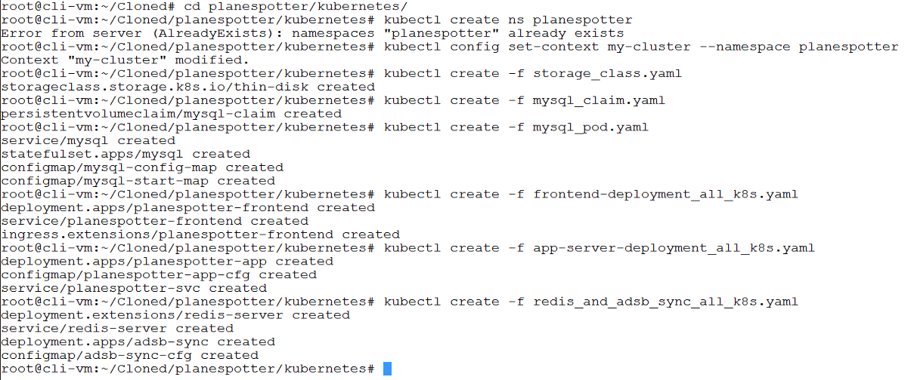
</details>
<br/>

1.0.4 From the Main Console (ControlCenter) desktop, click the windows button, enter the value `dns` in the search box, and select the top result `DNS` as shown in the following screenshot to open DNS Manager.

<details><summary>Screenshot 1.0.4</summary>
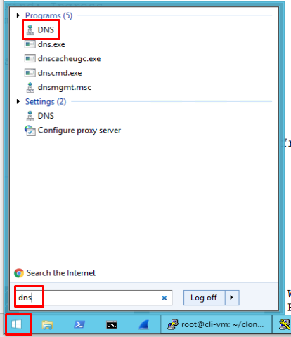
</details>
<br/>

1.0.5 In DNS Manager, expand `ControlCenter > Forward Lookup Zones`, right click on `corp.local`, and select `New Host (A or AAAA)...`

<details><summary>Screenshot 1.0.5</summary>

</details>
<br/>

1.0.6 In the `New Host` window, enter the following values to create an dns A record for planespotter.corp.local:

- Name: `planespotter`
- *Please be sure to use the ip address from your deployment from the output of `kubectl get ingress` in the preceeding steps*
- IP Address: `10.40.14.36`
- Uncheck `Create associated pointer (PTR) record
- Click `Add Host` to add the new dns record for `planespotter.corp.local`

<details><summary>Screenshot 1.0.6</summary>
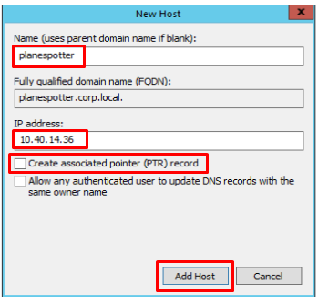
</details>

1.0.7 From the Main Console (ControlCenter) desktop, open a https browser session to `http://planespotter.corp.local` to see the planespotter frontend page.

<details><summary>Screenshot 1.0.7</summary>

</details>
<br/>

### 1.1 Review NSX-T Network Infrastructure for PKS & K8s

1.1.1 Login to the vSphere web client using the windows session credentials checkbox to authenticate, Navigate to `Hosts and Clusters`, and verify that the `nsxt-manager`, `nsxc-1` and `nsxedge-1.corp.local` virtual machines are powered on. View the summary screen of each VM to ensure there are no error messages and overall VM health appears good

<details><summary>Screenshot 1.1.1 </summary>

</details>
<br/>

1.1.2 Login to the NSX Manager UI with `username: Admin` `password: VMware1!` and Navigate to the `Dashboard`. The dashboard makes it easy to identify any faults that NSX Manager is aware of and enable drilling down as needed by clicking on the displayed object

<details><summary>Screenshot 1.1.2 </summary>

</details>
<br/>

1.1.3 From the NSX Manager `Dashboard` page in the `System` section, click on `Manager Nodes` and observe the details provided

<details><summary>Screenshot 1.1.3 </summary>

</details>
<br/>

1.1.4 From the NSX Manager `Dashboard` page in the `System` section, click on `Controller Nodes` and observe the details provided

<details><summary>Screenshot 1.1.3 </summary>

</details>
<br/>

1.1.5 From the NSX Manager `Dashboard` page, Click on the header of the `Fabric` section to view the associated objects

<details><summary>Screenshot 1.1.5 </summary>

</details>
<br/>

1.1.6 From the NSX Manager `Nodes > Hosts` page, change the value of `Managed by` to `vCenter-Compute-Manager`, expand the datacenter and each cluster and observe the details provided. Ensure the `Deployment Status` for each esxi host is `NSX Installed`, the controller and manager connectivity are `Up` and a transport node is defined for each host entry.

<details><summary>Screenshot 1.1.6.1 </summary>

</details>

<details><summary>Screenshot 1.1.6.2 </summary>

</details>
<br/>

1.1.7 From the NSX Manager `Nodes` page, select the `Edges` tab and verify the status of `nsxedge-1.corp.local`. Ensure the `Deployment Status` is `Node Ready`, the controller and manager connectivity are `Up`.

<details><summary>Screenshot 1.1.7 </summary>

</details>
<br/>

1.1.8 From the NSX Manager `Nodes` page, select the `Edge Clusters` tab and verify `edge-cluster-1` exists and has an assigned transport node

<details><summary>Screenshot 1.1.8</summary>

</details>
<br/>

1.1.9 From the NSX Manager `Nodes` page, select the `Transport Nodes` tab and observe the details provided. Verify the `Configuration State` is `Success`, the `Status` is `Up`. The edge transport node should connect to both the `overlay-tz` and `vlan-tz` transport zones, and the esxi hosts should each be connected to the `overlay-tz` transport zone

<details><summary>Screenshot 1.1.9</summary>
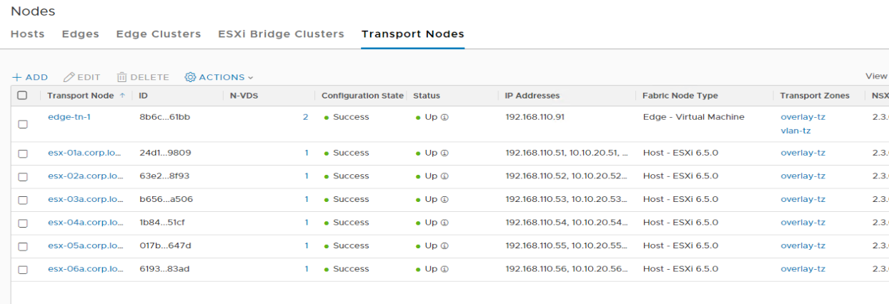
</details>
<br/>

1.1.10 From the control center desktop, SSH and login to `nsxmgr-01a.corp.local` with username `admin` password `VMware1!`. Enter the command `get management-cluster status` to validate control-plane health

<details><summary>Screenshot 1.1.10</summary>

</details>
<br/>

1.1.11 From the SSH connection to `nsxmgr-01a.corp.local`, list all nodes registered with NSX-T manager with the command `get nodes`. Ensure that the NSX manager, edge, controller, and all 6 esx hosts are listed

<details><summary>Screenshot 1.1.11</summary>

</details>
<br/>

1.1.12 From the control center desktop, SSH and login to the nsx edge at its IP address `192.168.110.91` with username `admin` password `VMware1!`. Display the edge cluster status with the command `get edge-cluster status`.   Verify the service status are all up.

<details><summary>Screenshot 1.1.12</summary>

</details>
<br/>

1.1.13 From the control center desktop, ssh to the nsx controller at its IP address `192.168.110.31` with username `admin` password `VMware1!`. Verify the control cluster health with the command `get control-cluster status`

As you have deployed a single-node controller topology, the controller it should be master, in majority and have the status `active` as in the following screenshot

Close the SSH connection to the nsx controller

<details><summary>Screenshot 1.1.13</summary>
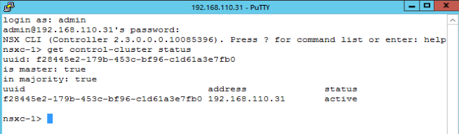
</details>
<br/>

1.1.14 From the control center desktop, ssh to the nsx edge at its IP address `192.168.110.91` with username `admin` password `VMware1!`. Verify the edge cluster health with the command `get edge-cluster status`

Close the SSH connection to the nsx edge

<details><summary>Screenshot 1.1.14</summary>

</details>
<br/>

### 1.2 Review Planespotter App & NSX-T Implementation

1.2.1 From the control center desktop use putty to connect to `cli-vm` and from the prompt enter the following commands to view the uuid for the my-cluster kubernetes cluster

```bash
pks login -a pks.corp.local -u pksadmin -k -p VMware1!
pks get-credentials my-cluster
pks cluster my-cluster
```

<details><summary>Screenshot 1.2.1</summary>
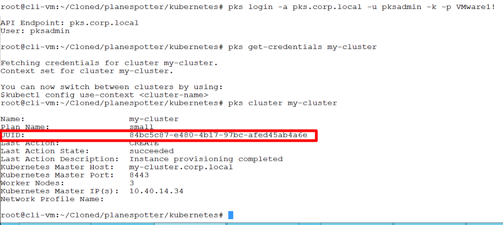
</details>
<br/>

1.2.2 Login to the NSX Manager UI with `username: Admin` `password: VMware1!` , navigate to the `Networking > Load Balancing` page, click on pks load balancer, click on the `Virtual Servers` tab and click the `pks-84bc5c87-e480-4b17-97bc-afed45ab4a6e-http`virtual server and observe the details, including the IP address and port number.

<details><summary>Screenshot 1.2.2.1</summary>
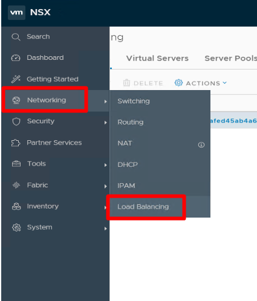
</details>

<details><summary>Screenshot 1.2.2.2</summary>
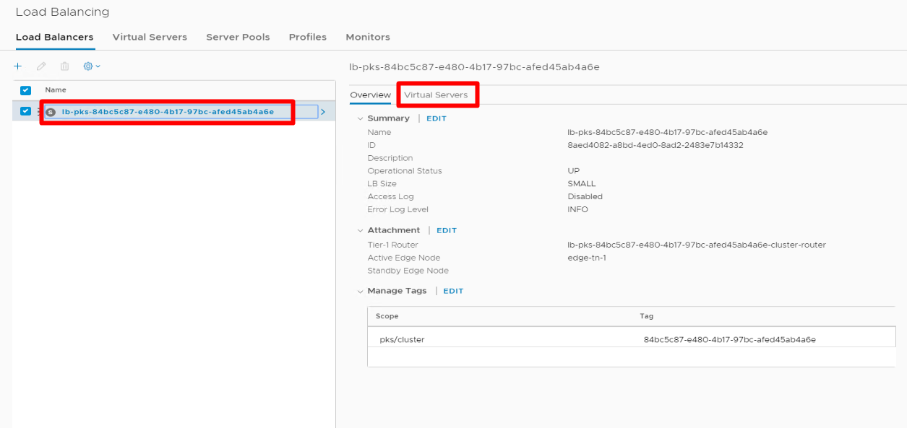
</details>

<details><summary>Screenshot 1.2.2.3</summary>
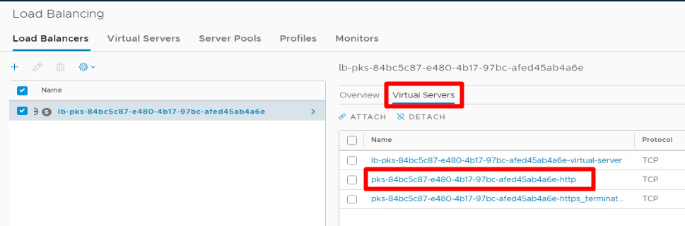
</details>

<details><summary>Screenshot 1.2.2.4</summary>
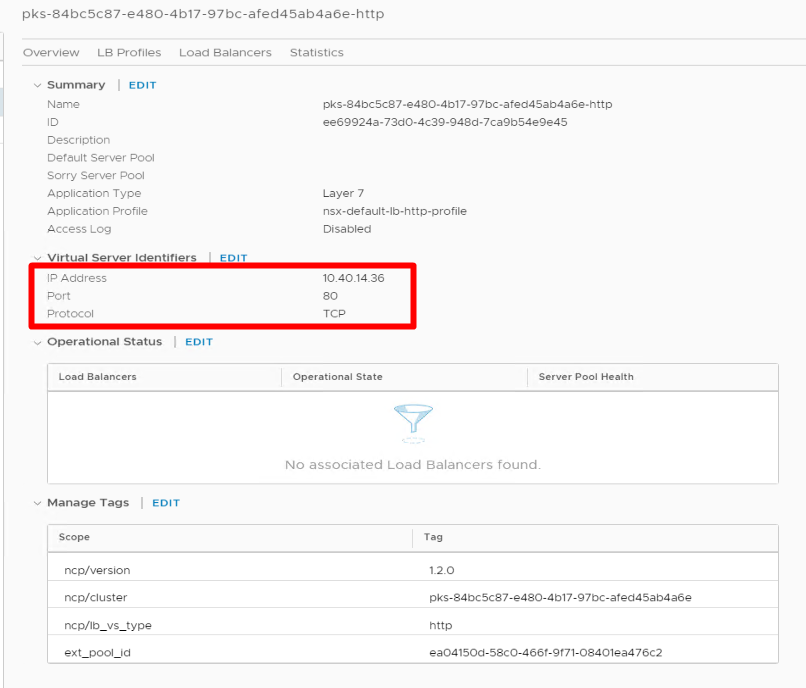
</details>
<br/>

1.2.3 From the NSX Manager UI `Networking > Load Balancing` page, click the `Server Pools` tab, click the planspotter-frontend load balancer and observe the details. Click on the `Pool Members` tab and observe that both of the planespotter frontend pods are listed.

<details><summary>Screenshot 1.2.3.1</summary>
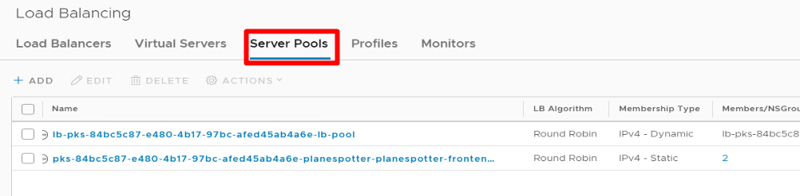
</details>

<details><summary>Screenshot 1.2.3.2</summary>
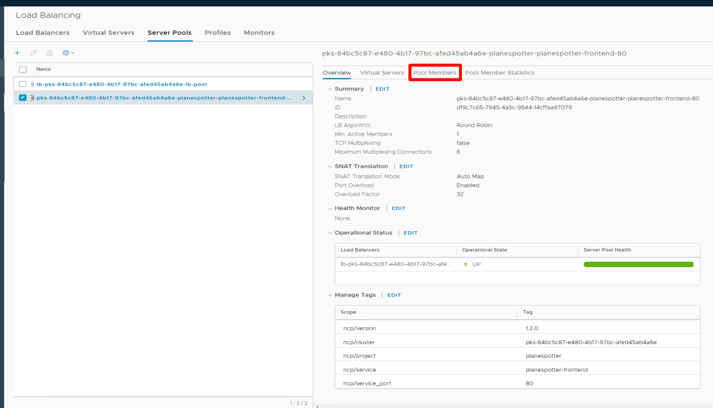
</details>

<details><summary>Screenshot 1.2.3.3</summary>

</details>
<br/>

1.2.4 From the control center desktop use putty to connect to `cli-vm` and from the prompt, view the kubernetes ingress controller you deployed for planespotter with the command `kubectl get ingress`. Observe that the first IP address listed for the planespotter-frontend ingress corresponds to the ip address of your NSX-T load balancer

<details><summary>Screenshot 1.2.4 </summary>
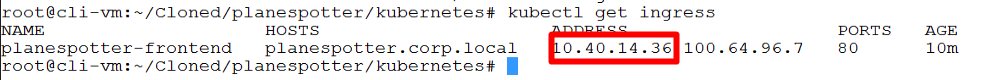
</details>
<br/>

1.2.5 From the `cli-vm` prompt, view the kubernetes pods in the planespotter namespace (your kubectl context should be currently set to the planespotter namespace) `kubectl get pods`.

From the output, copy the name of one of the planespotter-frontend pods and enter the command `kubectl describe pod nameOfYourPod | grep "IP"`, replacing the string 'nameOfYourPod' with the name of your first planespotter-frontend pod to observe the IP address assigned to the pod. Observe that this corresponds to the IP of one of the pool members in the NSX-T load balancer server pool.

Repeat this step using the name of your second planespotter-frontend pod and observe that the ip address matches the other pool member listed in the server pool.

<details><summary>Screenshot 1.2.5 </summary>
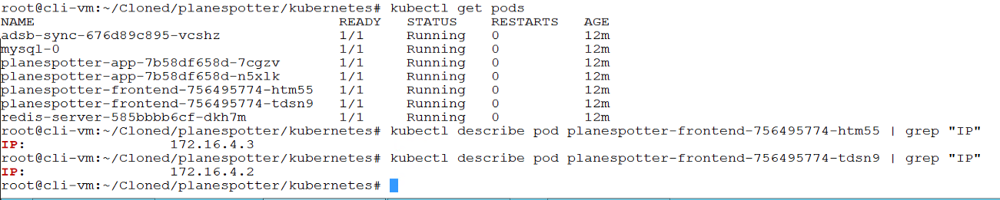
</details>
<br/>

1.2.6 From the NSX Manager UI, navigate to the `Networking > Routing` page and expand the `Logical Router` field so you can see the full names of the logical routers. Observe the logical router with a name that includes the uuid of your cluster and ends with "planespotter". This was created automatically when you created the namespace. Click on the router for the planespotter namespace and expand each of the sections on the summary page for your review

<details><summary>Screenshot 1.2.6.1</summary>
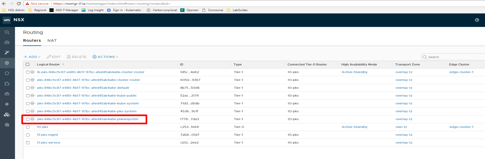
</details>

<details><summary>Screenshot 1.2.6.2</summary>
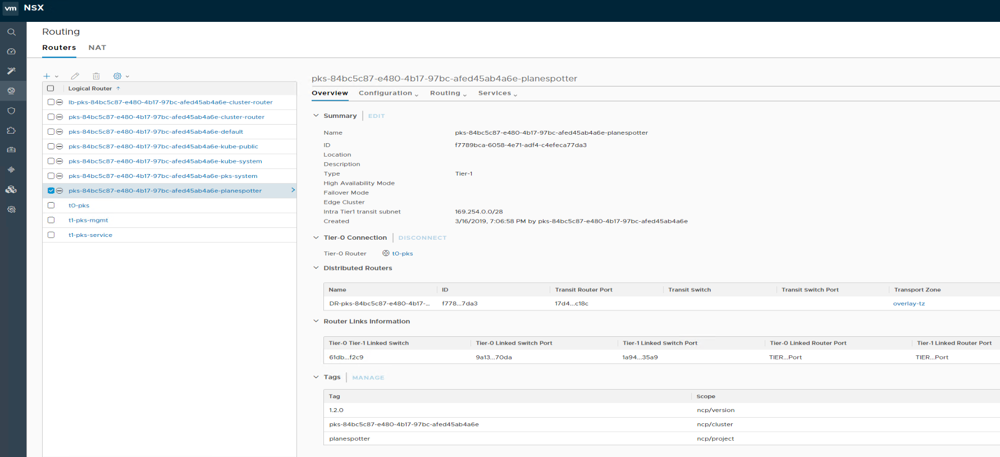
</details>
<br/>

1.2.7 From the NSX Manager UI, navigate to the `Networking > Switching` page and expand the `Logical Switch` field so you can see the full names of the logical switches. Observe the logical switch with a name that includes the uuid of your cluster and ends with "planespotter-0". This was created automatically when you created the namespace. Click on the logical switch for the planespotter namespace and expand each of the sections on the summary page for your review

<details><summary>Screenshot 1.2.7.1</summary>
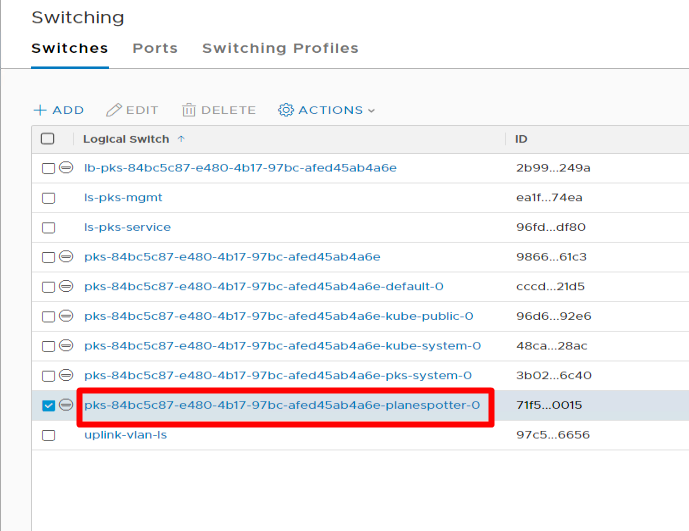
</details>

<details><summary>Screenshot 1.2.7.2</summary>
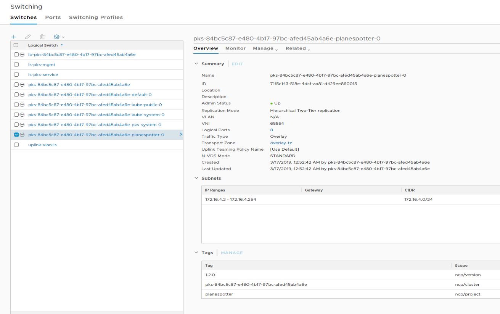
</details>
<br/>

1.2.8 From the NSX Manager UI, navigate to the `Networking > Switching > pks-yourClusterUUID-planespotter-0` page, click on the `Related` pulldown menu and click `Ports`. Observe that all of the pods deployed to the planespotter namespace are listed.

<details><summary>Screenshot 1.2.8.1</summary>
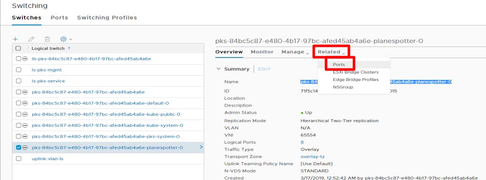
</details>

<details><summary>Screenshot 1.2.8.2</summary>
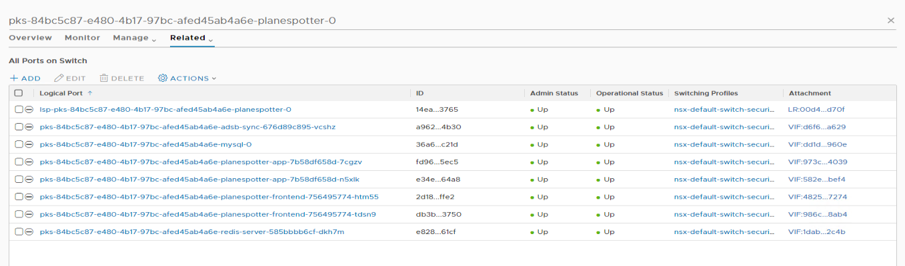
</details>
<br/>

1.2.9 From the NSX Manager UI, navigate to the `Tools > Traceflow` page, Set the Source Type to `Logical Port`, click on the `Port` field and scroll down until you see a port that includes the string `planespotter-app` and select it.

For `Destination` set the type as `Logical Port`, click on the `Port` field and scroll down until you see a port that includes the string `planespotter-frontend`, select it and click `Trace`, observe the results.

<details><summary>Screenshot 1.2.9.1</summary>

</details>

<details><summary>Screenshot 1.2.9.2</summary>
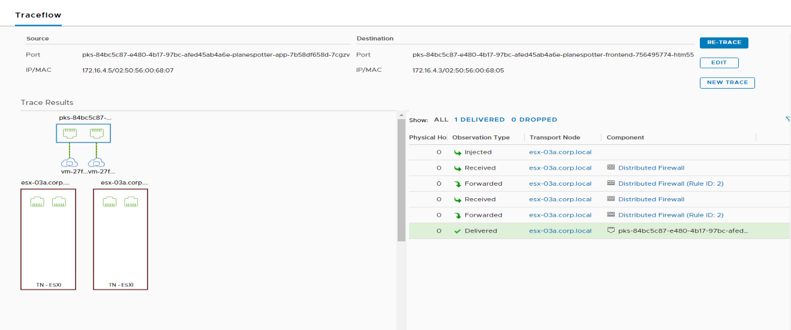
</details>
<br/>

## 2.0 Apply & Review Planespotter Security Policy

2.0.1 From the NSX Manager UI `Security > Distributed Firewall` page and observe the rules listed, note there are currently no rules applied specific to planespotter application security

<details><summary>Screenshot 2.0.1</summary>
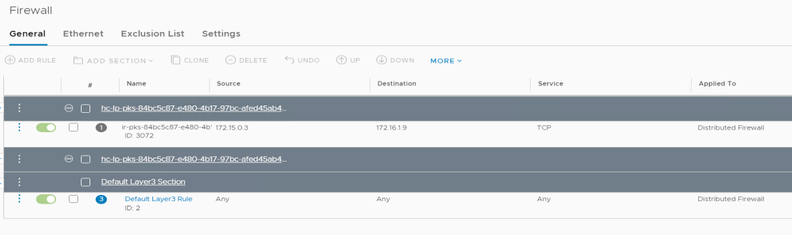
</details>
<br/>

2.0.2 From the control center desktop use putty to connect to `cli-vm` and from the prompt, view the manifest for the planespotter kubernetes network security policy with the following commands:

```bash
cd ~/Forked/planespotter/kubernetes
cat network-policy.yaml | more
```

In this guide, we will not go through the details of kubernetes networking security policy. If you would like to explore kubernetes network policies, you can review the documentation here: [https://kubernetes.io/docs/concepts/services-networking/network-policies/](https://kubernetes.io/docs/concepts/services-networking/network-policies/)

<details><summary>Screenshot 2.0.2.1</summary>
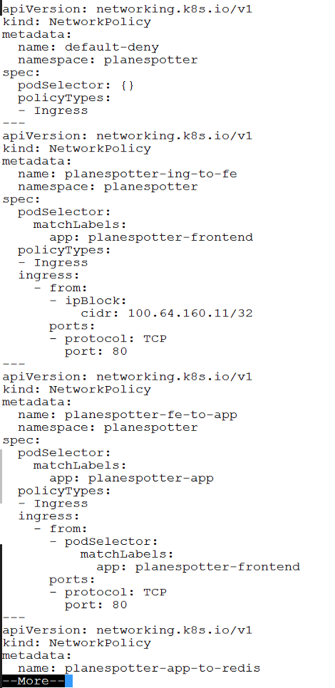
</details>

<details><summary>Screenshot 2.0.2.2</summary>
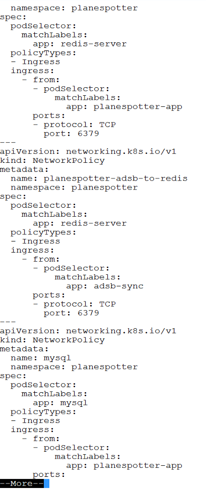
</details>

<details><summary>Screenshot 2.0.2.3</summary>
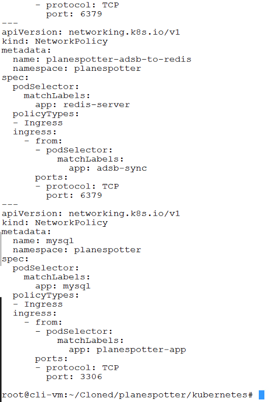
</details>
<br/>

2.0.3 From the `cli-vm` prompt, apply the planespotter networking policy and review the applied policy with the following commands:

```bash
kubectl apply -f network-policy.yaml
kubectl get networkpolicy
```

<details><summary>Screenshot 2.0.3</summary>

</details>
<br/>

2.0.4 From the NSX Manager UI `Security > Distributed Firewall` page and observe the rules listed, note that you can now see the firewall rules that were automatically created in the NSX-T distributed firewall when you applied the kubernetes network policy.

Take a few moments to go through the different firewall rules that were created.

<details><summary>Screenshot 2.0.4</summary>
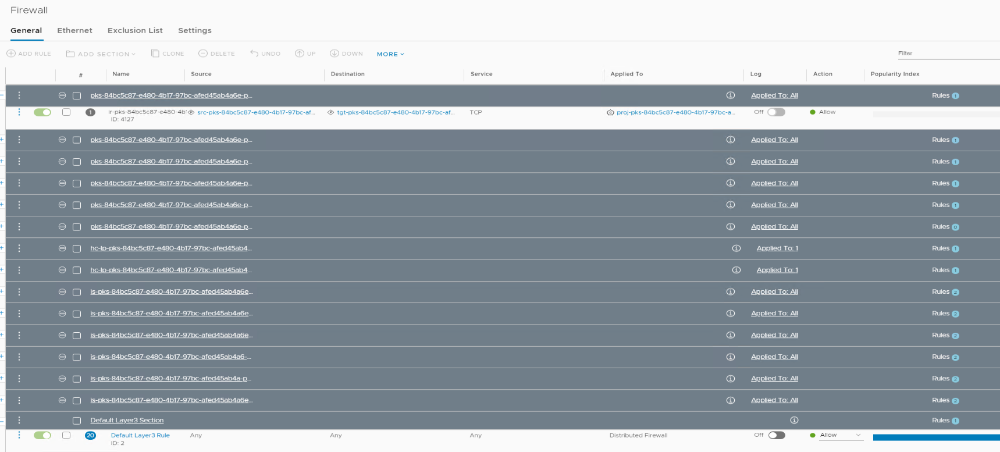
</details>
<br/>

2.0.5 From the `cli-vm` prompt, clean up your planespotter deployment with the following commands:

```bash
cd ~/Forked/planespotter/kubernetes
kubectl delete -f frontend-deployment_all_k8s.yaml
kubectl delete -f mysql_pod.yaml
kubectl delete -f storage_class.yaml
kubectl delete -f mysql_claim.yaml
kubectl delete -f app-server-deployment_all_k8s.yaml
kubectl delete -f redis_and_adsb_sync_all_k8s.yaml
kubectl delete ns planespotter
```

<details><summary>Screenshot 2.0.5</summary>
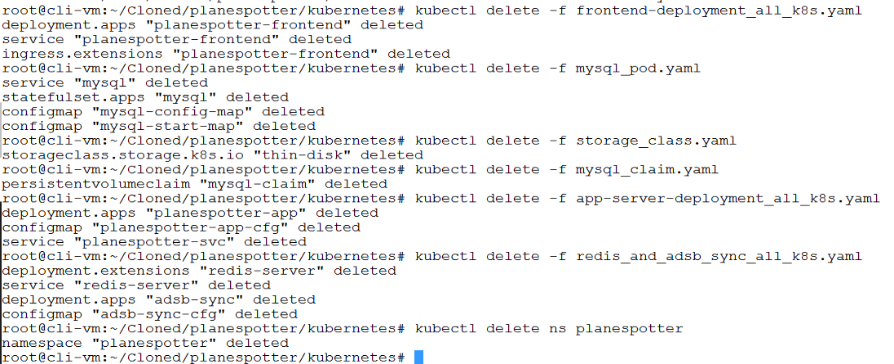
</details>
<br/>

**Thank you for completing the PKS PKS Networking & Security for Planespotter LabGuide!**
