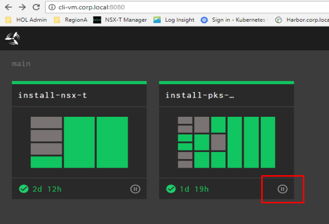
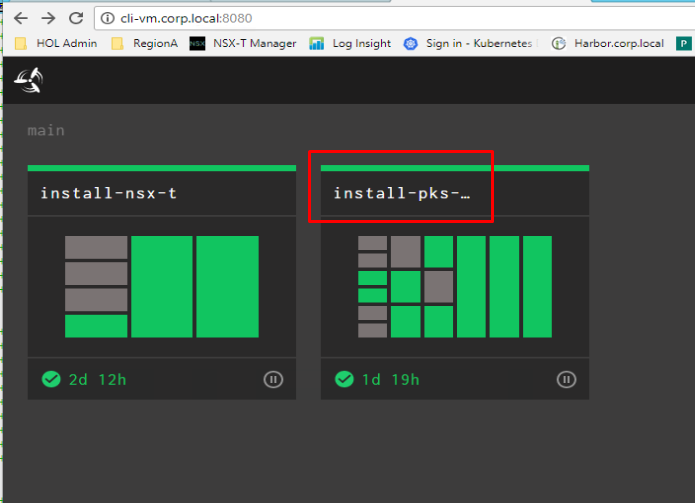
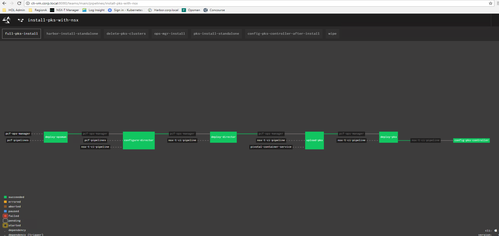

# Lab 10 - PKS Pipeline Install

## PKS Pipeline Kickoff

In this guide you will add the PKS Installation Pipeline to Concourse and start the pipeline

***With the current version of PKS Concourse Pipeline, the pipeline will fail at deploy-pks stage***

**Temporary Workaround:**
_____________________________________________________________________
Within your lab session, open a new browser window and go to: https://github.com/nvpnathan/nsx-t-ci-pipeline/tree/master/tasks

0.1 Replace config-pks task script with workaround version

Using Putty, login to the `cli-vm`and navigate to config pks directory
`cd ~/nsx-t-ci-pipeline/tasks/config-pks/`

Remove the existing task.sh file
`rm task.sh`
Create new `task.sh` and copy in workaround script
`nano task.sh`

Go back to the github page and click on `task.sh` to open it, copy this entire file and paste it into open `task.sh` file in your `cli-vm`.
-Save the file `ctrl o`
-Exit the file `ctrl x`

0.2 Replace the config-pks task configuration file with workaround version
Remove the existing task.yml file
`rm task.yml`
Create new `task.yml` and copy in workaround script
`nano task.yml`

Go back to the github page and click on `task.yml`, copy this entire file and copy into open `task.yml` file in your `cli-vm`.
Save the file `ctrl o`
Exit the file `ctrl x`

0.3 Remove the existing config-pks script file `rm config-pks-1.1.sh`
Create new `config-pks-1.1.sh` and copy in workaround script
`nano config-pks-1.1.sh`

Go back to the github page and click on `config-pks-1.1.sh`, copy this entire file and copy into open `config-pks-1.1.sh` file in your `cli-vm`.
Save the file `ctrl o`
Exit the file `ctrl x`

0.4 Edit the pipeline configuration to skip PKS Syslog
Within the `cli-vm`, change directory to `~/nsx-t-ci-pipeline/pipelines/`
`cd ~/nsx-t-ci-pipeline/pipelines/`

Open the `install-pks-pipeline.yml` file within a text editor
`nano install-pks-pipeline.yml`

Scroll down until you see 7 variables beginning with `PKS_SYSLOG...`
Ensure each of these variables is commented out by placing a `#` in front of it
Save the file `ctrl o`
Exit the file `ctrl x`

*Continue with the instructions below to complete the PKS installation*
________________________________________________________
1.1 From the `cli-vm` prompt, Import the PKS pipeline using the `fly` cli command on the cli-vm.

`cd ~/nsx-t-ci-pipelines/pipelines`

`source pks-setup.sh`

`fly-s`

- confirm the parameters file import with `y`

Screenshot 1.1.1

Screenshot 1.1.2

 

1.2 Using a web browser navigate to the concourse URL

`http://cli-vm.corp.local:8080`

Screenshot 1.2

1.3 In the upper right-hand corner login to Concourse

- Username: nsx
- Password: vmware

Screenshot 1.3

 

1.4 Confirm that the pipeline has imported and hit the **Play** button

Screenshot 1.4

Note: The image below will look slightly different than yours as the pipline was already run on the reference system

 

1.5 Click on `install-pks-with-nsx`

Screenshot 1.5

Note: The image below will look slightly different than yours as the pipline was already run on the reference system

 

1.6 Verify that the pipeline is not in an *errored* state.

- You will see Maroon colored boxes if the pipline is errored out.
  - If it is in an errored state perform a `fly-d` and `fly-s` to destory and re-import the pipeline on the cli-vm.

Screenshot 1.6

Note: The image below will look slightly different than yours as the pipline was already run on the reference system

 

1.7 Click on the **deploy-opsman**

Screenshot 1.7

Note: The image below will look slightly different than yours as the pipline was already run on the reference system

 

1.8 Execute the pipeline with the **Plus** button in the upper right-hand corner

Screenshot 1.8

Note: The image below will look slightly different than yours as the pipline was already run on the reference system

 

1.9 Grab some coffee and watch the magic happen!

1.10 After coffee :coffee: and around ~150-200 minutes all the boxes in the pipeline should be green

Note: If the pipline fails, you can click the job that failed and click the + sign to restart the failed task and the pipeline will resume

Screenshot 1.10

