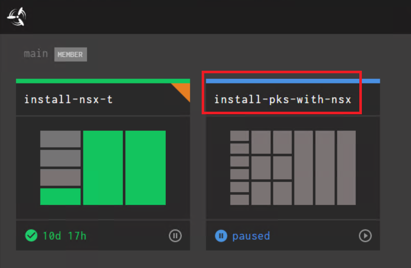
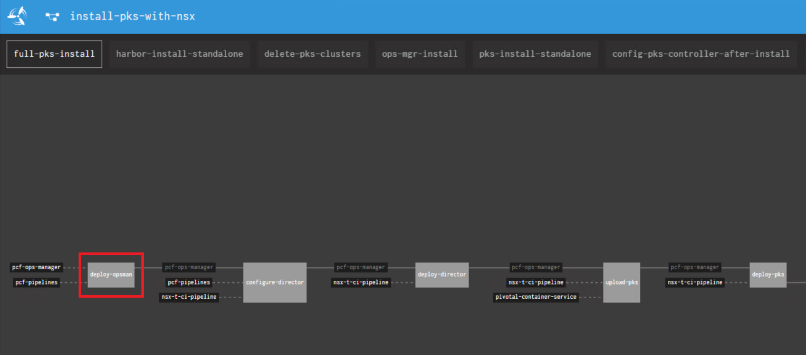
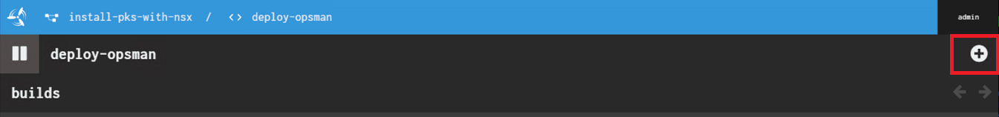
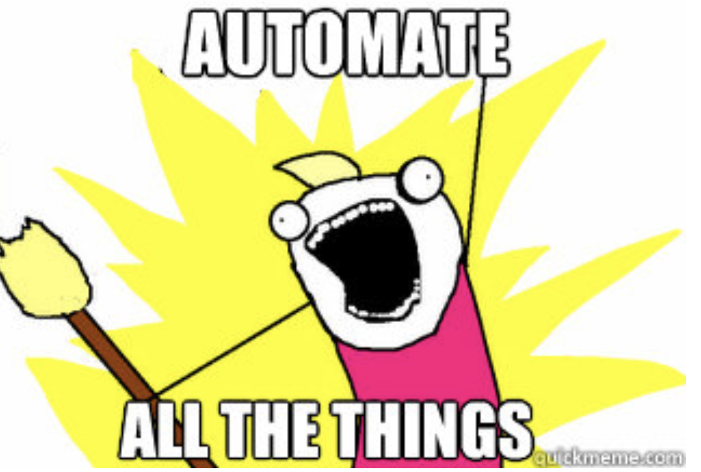

# Lab 10 - PKS Pipeline Install

## PKS Pipeline Kickoff

In this guide you will add the PKS Installation Pipeline to Concourse and start the pipeline

1.1 From the `cli-vm` prompt, Import the PKS pipeline using the `fly` cli command on the cli-vm.

```bash
cd ~/nsx-t-ci-pipeline/pipelines
source pks-setup.sh
fly-s
```

- confirm the parameters file import with `y`

<details><summary>Screenshot 1.1.1</summary>

</details>

<details><summary>Screenshot 1.1.2</summary>

</details>
<br/>

1.2 Using a web browser navigate to the concourse URL

`http://cli-vm.corp.local:8080`

<details><summary>Screenshot 1.2</summary>

</details>

1.3 In the upper right-hand corner login to Concourse

- Username: admin
- Password: VMware1!

<details><summary>Screenshot 1.3</summary>

</details>
<br/>

1.4 Confirm that the pipeline has imported and hit the **Play** button

<details><summary>Screenshot 1.4</summary>

</details>
<br/>

1.5 Click on `install-pks-with-nsx`

<details><summary>Screenshot 1.5</summary>

</details>
<br/>

1.6 Verify that the pipeline is not in an *errored* state.

- You will see Maroon colored boxes if the pipeline is errored out.
  - If it is in an errored state perform a `fly-d` and `fly-s` to destroy and re-import the pipeline on the cli-vm.

<details><summary>Screenshot 1.6</summary>

</details>
<br/>

1.7 Click on the **deploy-opsman**

<details><summary>Screenshot 1.7</summary>
Note: The image below will look slightly different than yours as the pipeline was already run on the reference system

</details>
<br/>

1.8 Execute the pipeline with the **Plus** button in the upper right-hand corner

<details><summary>Screenshot 1.8</summary>

</details>
<br/>

1.9 Grab some coffee and watch the magic happen!



1.10 After coffee :coffee: and around ~150-200 minutes all the boxes in the pipeline should be green

Note: If the pipeline fails, you can click the job that failed and click the + sign to restart the failed task and the pipeline will resume

<details><summary>Screenshot 1.10</summary>

</details>
