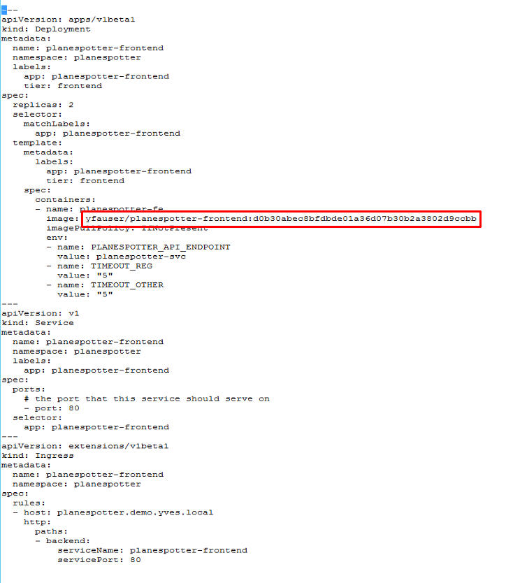
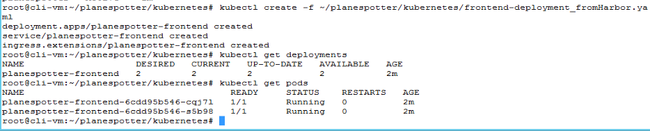
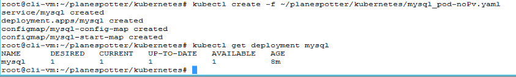

# PKS Storage and Persistence 1

This lab guide focuses on examining and deploying persistent volume services using the Planespotter applications MySQL service as an example

This guide is part of a sequence, please complete the [Deploy Planespotter without Persistence](https://github.com/CNA-Tech/PKS-Ninja/tree/Pks1.4/LabGuides/DeployPlanespotter-DP6539) lab guide prior to continuing

## PKS & Kubernetes Storage and Persistence Overview

Although it is relatively easy to run stateless Microservices using container technology, stateful applications require slightly different treatment. There are multiple factors which need to be considered when handling persistent data using containers, such as:

- Kubernetes pods are ephemeral by nature, so the data that needs to be persisted
    has to survive through the restart/re-scheduling of a pod.
- When pods are re-scheduled, they can die on one host and might get scheduled
    on a different host. In such a case the storage should also be shifted and made
    available on the new host for the pod to start gracefully.
- The application should not have to worry about the volume & data. The
    underlying infrastructure should handle the complexity of unmounting and
    mounting.
- Certain applications have a strong sense of identity (e.g.; Kafka, Elastic) and the
    disk used by a container with certain identity is tied to it. It is important that if a
    pod with a certain ID gets re-scheduled for some reason then the disk associated
    with that ID is re-attached to the new pod instance.
- PKS leverages vSphere Storage for Kubernetes to allow Pods to use enterprise
    grade persistent storage.

Persistent volumes requested by stateful containerized applications can be provisioned
on vSAN, iSCSI, VVol, VMFS or NFS datastores.

Kubernetes volumes are defined in Pod specifications. They reference VMDK files and
these VMDK files are mounted as volumes when the container is running. When the Pod
is deleted the Kubernetes volume is unmounted and the data in VMDK files persists.

PKS deploys Kubernetes clusters with the vSphere storage provider already configured.  In thius guide you will deploy the planespotter application (described below) first without persistence, and then add persistent volumes and see that even after deleting your pods and recreating them, the application data persists. 

In order to use Persistent Volumes (PV) the user needs to create a
PersistentVolumeClaim(PVC) which is just a request for to associate a PV with a deployment. A claim must
specify the access mode and storage capacity, once a claim is created PV is
automatically bound to this claim. Kubernetes will bind a PV to PVC based on access
mode and storage capacity but a claim can also mention volume name, selectors and
volume class for a better match. This design of PV-PVCs not only abstracts storage
provisioning and consumption but also ensures security through access control.

Static Persistent Volumes require that a vSphere administrator manually create a
(virtual disk) VMDK on a datastore, then create a Persistent Volume that abstracts the VMDK. A developer would then make use of the volume by specifying a Persistent
Volume Claim.

#### Dynamic Volume Provisioning

With PV and PVCs one can only provision storage statically i.e. PVs first needs to be created before a Pod claims it. However, with the StorageClass API Kubernetes enables dynamic volume provisioning. This avoids pre-provisioning of storage and storage is provisioned automatically when a user requests it. The VMDK's are also cleaned up when the Persistent Volume Claim is removed.

The StorageClass API object specifies a provisioner and parameters which are used to
decide which volume plugin should be used and which provisioner specific parameters
to configure.

## Overview of App

For this exercise we will be using an app called 'planespotter' developed by the very talented @yfauser [here](https://github.com/yfauser/planespotter). Planespotter essentially lets you query Aircraft data from the FAA Registry. It has the following components

1. Front-end: User interface to take queries and showcase results
2. API App server: to retrieve data from DB
3. MySQL DB: Stores Aircraft registration data from FAA
4. Redis-server: Memory cache server to fetch data of Aircrafts currently airborne

<details><summary>Planespotter Overview Image</summary>

</details>

Explore the YAML files that will be used for the deployments (Located in ~/planespotter/kubernetes). For example look at the front-end deployment YAML file to see how many pods and replicas the deployment YAML has specified. The deployment YAML for planespotter-frontend has specified 2 replica sets, hence post deployment you should see two pods deployed for the frontend app

Similarly, take a note of the labels the frontend service has been allocated. These labels will be used to built the frontend loadbalancer when we expose the app. Kubernetes will understand which pods to route the incoming traffic for the front-end loadbalancer. The traffic is routed via pod labels, hence there is no need to configure IP addresses, host names etc.

With Kubernetes, each component needed for the app is defined in the deployment YAML. The deployment YAML identifies the base container image , the dependencies needed from the infrastructure etc. The yaml files also create an API service that frontends the component-pod.

In the Intro to Harbor lab, we modified one of the manifests (.yaml file) to pull an image from our private Harbor registry. If you haven't completed the Intro to Harbor lab, all images will be pulled from the remote registry.

## Instructions

_Before proceeding, ensure your `cli-vm` is authenticated to the PKS API server and your local kubeconfig is authenticated to the K8s master for my-cluster, reference the following commands as needed_

```bash
pks login -a pks.corp.local -u pks-admin -p  --skip-ssl-validation
pks get-credentials my-cluster
```

## Step 1: Configure K8s Cluster for App Deployment

1.1 Create namespace "planespotter" and set the namespace as your default

```bash
kubectl create ns planespotter
kubectl config set-context my-cluster --namespace planespotter
```

<details><summary>Screenshot 1.1 </summary>

</details>
<br/>

1.2 Verify your namespace has been created

- `kubectl get namespaces`

<details><summary>Screenshot 1.2 </summary>

</details>
<br/>

## Step 2: Deploy Planespotter

2.1 From `cli-vm`, use the following commands to open the k8s deployment manifest for the frontend in nano, find the value for the `Image:` for the `planespotter-fe` container in the file, and replace the value ` yfauser/planespotter-frontend:d0b30abec8bfdbde01a36d07b30b2a3802d9ccbb` with the tag of your harbor frontend image `harbor.corp.local/library/frontend:v1`

_Note: If you have no `/planespotter/kuberenetes/` directory, complete the [Intro to Harbor with Planespotter](https://github.com/CNA-Tech/PKS-Ninja/tree/Pks1.4/LabGuides/IntroToHarbor-IH7914) lab_

```bash
cd ~/planespotter/kubernetes
cp frontend-deployment_all_k8s.yaml frontend-deployment_fromHarbor.yaml
nano frontend-deployment_fromHarbor.yaml
# change the contents of the line shown in image 2.1.1 to what is shown in 2.1.2
```

<details><summary>Screenshot 2.1.1 </summary>

</details>

<details><summary>Screenshot 2.1.2 </summary>

</details>
<br/>

2.2 Deploy the Frontend and verify successful deployment with the following commands

```bash
kubectl create -f ~/planespotter/kubernetes/frontend-deployment_fromHarbor.yaml
kubectl get deployments
kubectl get pods
```

<details><summary>Screenshot 2.2 </summary>

</details>
<br/>

2.3 Deploy the App-Server Pod

```bash
kubectl create -f ~/planespotter/kubernetes/app-server-deployment_all_k8s.yaml
kubectl get deployment planespotter-app
kubectl get pods
```

<details><summary>Screenshot 2.3 </summary>

</details>
<br/>

2.4 Deploy Redis and the ADSB Sync Service

```bash
kubectl create -f ~/planespotter/kubernetes/redis_and_adsb_sync_all_k8s.yaml
kubectl get deployment planespotter-app
kubectl get pods
```

<details><summary>Screenshot 2.4 </summary>

</details>
<br/>

2.5 From `cli-vm`, use the command `cat mysql_pod.yaml` to review the standard planespotter-mysql deployment manifest which includes persistent volume attachments

<details><summary>Screenshot 2.5 </summary>

</details>
<br/>

2.6 Expand the mysql_pod-noPv.yaml section below, review the differences between the files, and copy all the text from the mysql_pod-noPv.yaml section

<details><summary>mysql_pod-noPv.yaml</summary>

```yaml
---
apiVersion: v1
kind: Service
metadata:
  name: mysql
  namespace: planespotter
  labels:
    app: mysql
spec:
  ports:
  - port: 3306
    name: mysql
  clusterIP: None
  selector:
    app: mysql
---
apiVersion: apps/v1beta1
kind: Deployment
metadata:
  name: mysql
  namespace: planespotter
spec:
  replicas: 1
  selector:
    matchLabels:
      app: mysql
  template:
    metadata:
      labels:
        app: mysql
    spec:
      containers:
      - name: mysql
        image: mysql:5.6
        env:
          # Use secret in real usage
        - name: MYSQL_ROOT_PASSWORD
          value: password
        ports:
        - containerPort: 3306
          name: mysql
        volumeMounts:
        - name: mysql-vol
          mountPath: /var/lib/mysql
        - name: mysql-config
          mountPath: /bin/planespotter-install.sh
          subPath: planespotter-install.sh
        - name: mysql-start
          mountPath: /bin/mysql-start.sh
          subPath: mysql-start.sh
        command: ["/bin/mysql-start.sh"]
      volumes:
      - name: mysql-vol
      - name: mysql-config
        configMap:
          defaultMode: 0700
          name: mysql-config-map
      - name: mysql-start
        configMap:
          defaultMode: 0700
          name: mysql-start-map
---
apiVersion: v1
kind: ConfigMap
metadata:
  name: mysql-config-map
  namespace: planespotter
data:
  planespotter-install.sh: |
    #!/bin/sh
    # sleep while mysql is starting up
    while [ -z "$ALIVE" ] || [ "$ALIVE" != 'mysqld is alive' ]
    do
      echo "waiting for mysql..."
      sleep 3
      ALIVE=`mysqladmin ping --user=root --password=$MYSQL_ROOT_PASSWORD`
      echo "status: $ALIVE"
    done
    echo "MYSQL is alive, checking database..."
    DBEXIST=`mysql --user=root --password=$MYSQL_ROOT_PASSWORD -e 'show databases;' | grep planespotter`
    if ! [ -z "$DBEXIST" ]
    then
      echo "planespotter db already installed."
    else
      echo "------- MYSQL DATABASE SETUP -------"
      echo "updating apt-get..."
      apt-get update
      echo "apt-get installing curl..."
      apt-get --assume-yes install curl
      apt-get --assume-yes install wget
      apt-get --assume-yes install unzip
      echo "downloading planespotter scripts..."
      mkdir ~/planespotter
      mkdir ~/planespotter/db-install
      cd ~/planespotter/db-install
      curl -L -o create-planespotter-db.sh https://github.com/yfauser/planespotter/raw/master/db-install/create-planespotter-db.sh
      curl -L -o create-planespotter-db.sql https://github.com/yfauser/planespotter/raw/master/db-install/create-planespotter-db.sql
      curl -L -o delete-planespotter-db.sh https://github.com/yfauser/planespotter/raw/master/db-install/delete-planespotter-db.sh
      curl -L -o delete-planespotter-db.sql https://github.com/yfauser/planespotter/raw/master/db-install/delete-planespotter-db.sql
      echo "creating a new planespotter db"
      chmod +x create-planespotter-db.sh
      ./create-planespotter-db.sh
    fi
---
apiVersion: v1
kind: ConfigMap
metadata:
  name: mysql-start-map
  namespace: planespotter
data:
  mysql-start.sh: |
    #!/bin/sh
    echo "starting planespotter-installer in background"
    /bin/planespotter-install.sh &
    echo "starting mysqld.."
    /entrypoint.sh mysqld
```

</details>
<br/>

2.7 From the `cli-vm` prompt, enter the command `nano mysql_pod-noPv.yaml` which will create a new file with nano, paste the contents you copied from the previous steps into nano, save and close the file

<details><summary>Screenshot 2.7 </summary>

</details>
<br/>

2.8 Enter the following commands to deploy the updated mysql deployment and validate

```bash
kubectl create -f ~/planespotter/kubernetes/mysql_pod-noPv.yaml
kubectl get deployment mysql
```

<details><summary>Screenshot 2.8 </summary>

</details>
<br/>

2.6 Verify all the pods needed for front-end, redis, DBC Sync services and App server (7 total) have been deployed and have entered Running state

- `kubectl get pods --namespace planespotter`
- `kubectl get services --namespace planespotter`

### Step 3: Publish the Planespotter app to expose it to the outside world

The planespotter app has been deployed with micro-services created for each sub-component; however, if you take a closer look at the services created, you will see they are all using IP addresses from the k8s cluster pool. These are not routable outside of the cluster. In order to expose a service to external connections, we can create a node-port service type or a Load Balancer service type. For the plane spotter app we will be exposing the 'frontend' service with a load balancer. PKS utilizes an automatically created NSX Load Balancer in this case.

3.1 Expose the planespotter-frontend with the following command

```
kubectl expose deployment planespotter-frontend \
--name=planespotter-frontend-lb --port=80 --target-port=80 --type=LoadBalancer --namespace=planespotter
```

3.2 Check the external URL/IP address assigned to the service (make note of the first IP addres under External-IP).

- `kubectl get service planespotter-frontend-lb`

3.3 Copy the IP under the "External-IP" section and point your browser to that location.

A freshly deployed app based on 4 micro-services is ready!

### Step 4: Understanding how Kubernetes Maintains state by looking at an example of ReplicaSets

4.1 Replicasets in Kubernetes make sure that when a deployment is made 'x' number of pods for that deployment are always running. For the Planespotter frontend deployment we specified '2' replicas to always run, take a look at the deployment YAML for Palanespotter frontend here

- `nano ~/planespotter/kubernetes/frontend-deployment_all_k8s.yaml`

Notice where it states _replicas: 2_ under the _spec:_ heading.

4.2 Look at the number of pods running for the frontend service. You should see 2 replicas of the planespotter-frontend running.

- `kubectl get pods -n planespotter`

4.3 Delete one of the Pods running the frontend service

- Copy the name of one of the pods that starts with 'planespotter-frontent-' and delete it

- `kubectl delete pod <name of your planespotter-frontend-pod> -n planespotter`

4.4 List the Pods still running for frontend

- `kubectl get pods -n planespotter`

Notice the count of pods for planespotter-frontend has not changed, there are still 2 pods. The name of one of the pods is now different than before ( the unique number in the name) and the age is more recent than the other. Kubernetes just created a new pod after the original pod was deleted in order to maintain declared state.

### 5.0 Add a Persistent Volume to your Deployment

5.1 Review the Storage Class spec for the Planespotter-mysql deployment with the command `cat ~/planespotter/kubernetes/storage_class.yaml`

The yaml defines the vSphere volume and the set of parameters the driver supports.

vSphere allows the following parameters:

- **diskformat** which can be thin(default), zeroedthick and eagerzeroedthick
- **datastore** is an optional field which can be VMFSDatastore or VSANDatastore.
    This allows the user to select the datastore to provision PV from, if not specified the default datastore from vSphere config file is used.
- **storagePolicyName** is an optional field which is the name of the SPBM policy to
    be applied. The newly created persistent volume will have the SPBM policy
    configured with it.
- **VSAN Storage Capability Parameters** (cacheReservation, diskStripes,
    forceProvisioning, hostFailuresToTolerate, iopsLimit and objectSpaceReservation)
    are supported by vSphere provisioner for vSAN storage. The persistent volume
    created with these parameters will have these vSAN storage capabilities
    configured with it.

<details><summary>Screenshot 5.1</summary>

</details>
<br>

5.2 Create a storage class and validate with the following commands 

```bash
kubectl apply -f ~/planespotter/kubernetes/storage_class.yaml
kubectl get sc
```

<details><summary>Screenshot 5.2</summary>

</details>
<br>

5.3 Review the planespotter-mysql persistent volume claim with the command `cat ~/planespotter/kubernetes/mysql_claim.yaml`

Dynamic provisioning involves defining a Persistent Volume Claim that refers to a storage class. The mysql_claim.yaml file defines our persistent volume claim and we are using the thin-disk storage class that we just created

<details><summary>Screenshot 5.3</summary>

</details>
<br>

5.4 Create and validate the planespotter-mysql persistent volume claim with the following commands:

```bash
kubectl apply -f mysql_claim.yaml
kubectl get pvc
```

<details><summary>Screenshot 5.4</summary>

</details>
<br>

5.5 Review the planespotter-mysql kubernetes deployment manifest with the command `cat ~/planespotter/kubernetes/mysql_pod.yaml`

<details><summary>Screenshot 5.5</summary>

</details>
<br>

5.6 Update the planespotter deployment you created in the [Deploy Planespotter without Persistence]() lab to attach the persistent volume to the mysql deployment. Observe that even though you are using a different yaml file in this step than you used when you deployed the mysql_pod-noPv.yaml file in the previous lab guide, kubernetes understands that this file is intended to update the current planmespotter-mysql deployment because both files specify the same deployment names

```bash
kubectl apply -f mysql_pod.yaml
kubectl get deployment planespotter-mysql
```

<details><summary>Screenshot 5.6</summary>

</details>
<br>

5.7 View The Volume in vCenter

- Connect to vcenter client and click on the Storage icon
- Select your datastore RegionA01-iSCSCI01-COMP01 and right click, select Browse Files
- Select the kubevols folder
- Here is the Persistent Volume you just created. Note that the volumeID in the kubectl describe maps to the vmdk name
- Also note that it was thin provisioned based on the storage class specification we used

5.8 Check the external URL/IP address assigned to the service (make note of the first IP addres under External-IP). Copy the IP under the "External-IP" section and point your browser to that location.

- `kubectl get service planespotter-frontend-lb`

A freshly deployed app based on 4 micro-services is ready!
