# PKS Troubleshooting 1

**Contents:**

- [1.0 Validate Base Environment](#10-validate-base-environment)
- [2.0 Accelerating Problem Resolution with the vSphere PKS Plugin](#20-accelerating-planning-operations-and-problem-resolution-with-the-vsphere-pks-plugin)
- [3.0 Validation and Troubleshooting with Kubernetes Native Tools](#30-validation-and-troubleshooting-with-kubernetes-native-tools)

## Overview

**There are currently some bugs with the vSPhere UI Plugin and PKS 1.3 we expect to be resolved within the week, and will update this page shortly. In the meantime to use the PKS UI plugin, we recommend you use the v10 template, and switch to the version of this page on the v10 branch of this repo.**

In this section you will review the core troubleshooting tools used in PKS troubleshooting with a focus on core product CLI and UI tools not inclusive of external monitoring and operational tools such as the vRealize suite or Wavefront, which are covered in different sections

When facing a troubleshooting scenario, there are a few common steps that should be taken in nearly every scenario:

- First, open a support case early in any scenario where problems may occur to help ensure customer satisfaction. VMware support teams for PKS recommend opening proactive support requests (SRs) even for POC engagements, installation and planned updates in addition to unplanned outage support.
  - This allows your request to be routed and in queue for a support agent while you take additional steps
  - While in queue you can continue to engage in troubleshooting steps and in the event you are not able to resolve the issue yourself, this method will ensure the quickest path to a support agent to help assure an optimal resolution
- Next, attain a functional understand of the target environment and ensure you have sufficient documentation, understanding and access to the environment to move forward towards a successful resolution
- Next, validate the last known working state of the environment, and identify any potential changes that have occurred in the environment that may have affected the previously known working state

In this lab guide, we will initially focus on validating all the core PKS components following a standard installation. The steps will follow the order by which PKS and related software are typically installed and configured, just as you performed in Labs 2 and 3.

This is not necessarily an ideal order to follow in a troubleshooting scenario as you may have error messages or other contextual information that lead you on a more direct path, however in lieu of more direct information running through an all-around validation of core components is an excellent excercise to help identify error conditions and details that can lead towards problem resolution

## 1.0 Validate Base Environment

**Stop:** Prior to beginning this lab, you should have a functional PKS deployment running in a non-production lab environment. For students following the Ninja course, all steps from labs 2-5 should be completed in your lab environment before proceeding.

### 1.1 Install vSphere PKS Plugin

Note: The PKS Plugin will not be used until later in this section, but the OVF deployment is being done first to optimize timing

1.1.0 From the control center desktop, open a web browser connection to `https://labs.vmware.com/flings/vsphere-pks-plugin`, accept the license agreement and download the OVA file for the vSphere PKS Plugin to the default downloads directory (E:\Downloads).

<details><summary>Screenshot 1.1.0 </summary>
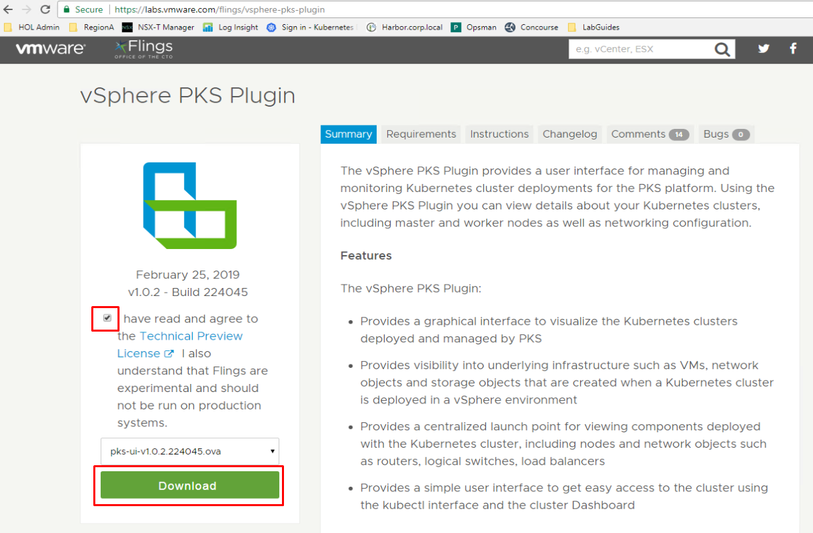
</details>
<br/>

1.1.1 Open a web browser connection to the vSphere (flash) client at `https://vcsa-01a.corp.local/vsphere-client` and login using the windows session credentials. Do not use the HTML5 Client for the OVF deploy. On the `Hosts and Clusters` page, right click the `RegionA01-MGMT01` cluster and select `Deploy OVF Template`

<details><summary>Screenshot 1.1.1</summary>
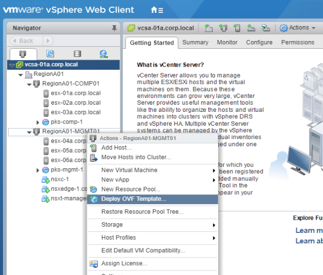
</details>
<br/>

1.1.2 On the `Select Template` screen, select `local file` and select the vSphere PKS Plugin OVA File in the `E:\Downloads` directory

<details><summary>Screenshot 1.1.2</summary>
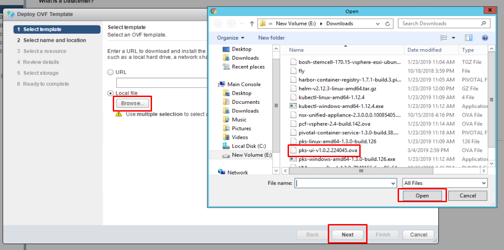
</details>
<br/>

1.1.3 On the `Select name and location` screen, set the `Name` to `pks-ui` and click `Next`

<details><summary>Screenshot 1.1.3</summary>

</details>
<br/>

1.1.4 On the `Select a resource` screen, select the `RegionA01-MGMT01` cluster and click `Next`

<details><summary>Screenshot 1.1.4</summary>

</details>
<br/>

1.1.5 On the `Review Details` screen, click `Next`

<details><summary>Screenshot 1.1.5</summary>
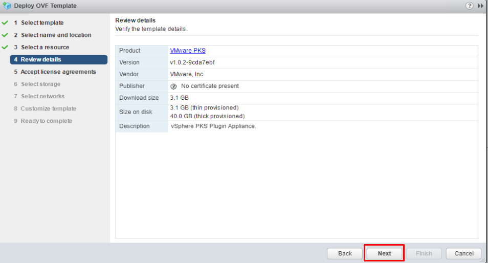
</details>
<br/>

1.1.6 On the `Accept license agreements` screen, click `Accept` and then click `Next`

<details><summary>Screenshot 1.1.6</summary>

</details>
<br/>

1.1.7 On the `Select Storage` screen, set the virtual disk format to `Thin provision`, set the `Datastore` to `RegionA01-ISCSI01-COMP01` and then click `Next`

<details><summary>Screenshot 1.1.7</summary>
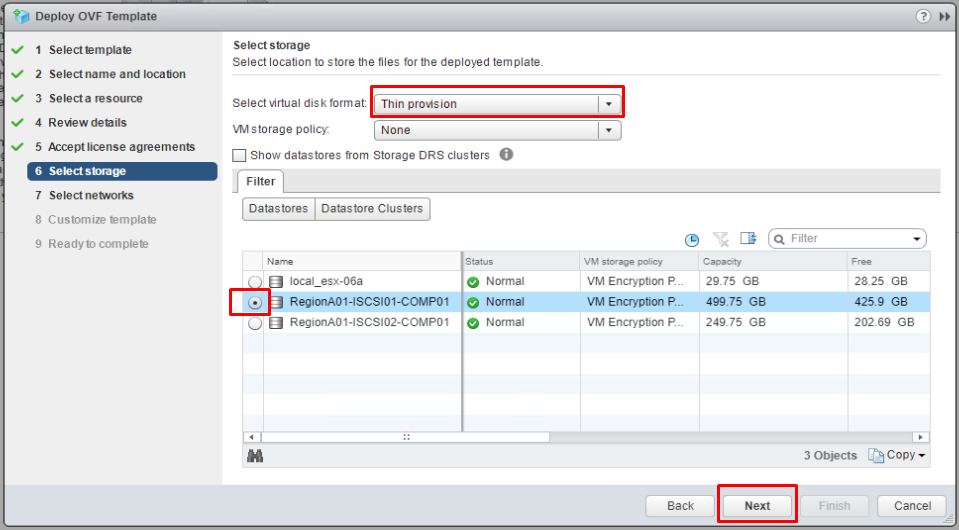
</details>
<br/>

1.1.8 On the `Select networks` screen, set `VM Network` and `PKS Deployment Network` to `VM-RegionA01-vDS-MGMT` and then click `Next`

<details><summary>Screenshot 1.1.8</summary>
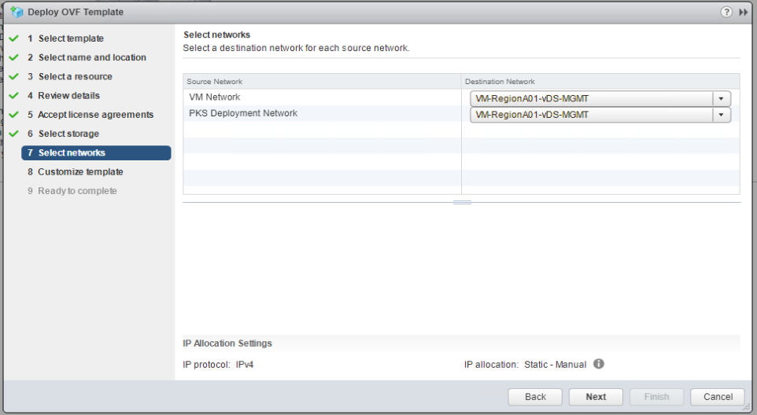
</details>
<br/>

1.1.9 On the `Customize template` screen, enter the following values:

- VC Address where the UI plugin will be running: vcsa-01a.corp.local
- Root Password: VMware1!
- Permit Root Login: True
- Network IP Address: 172.31.0.8
- Network Netmask: 255.255.255.0
- Default Gateway: 172.31.0.1
- Domain Name Servers: 192.168.110.10
- Domain Search Path: corp.local
- FQDN: pks-ui.corp.local
- Alternate IP Address: 10.40.14.8
- Do NOT enable the second network interface, ensure box is unchecked
- Leave other settings to their default values and click `Next`

<details><summary>Screenshot 1.1.9</summary>
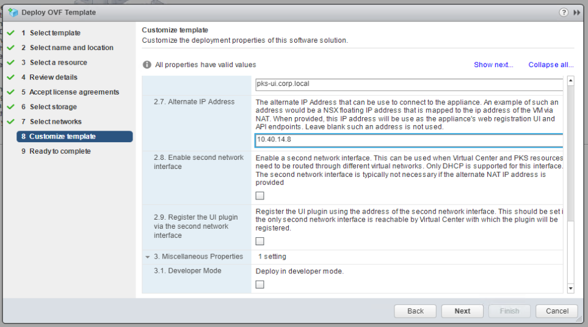
</details>
<br/>

1.1.10 On the `Ready to complete` screen, validate configuration data and click `Finish`

<details><summary>Screenshot 1.1.10</summary>

</details>
<br/>

Note: If there are insufficient resources to deploy the OVA, edit the settings for the NSX-T Controller, Edge & Manager to remove resource reservations

Please proceed through the following steps while the OVA template is deploying

### 1.2 Validate NSX-T Pipeline Installation and Core Component Health

1.2.1 Login to the vSphere web client, Navigate to `Hosts and Clusters`, and verify that the `nsxt-manager`, `nsxc-1` and `nsxedge-1.corp.local` virtual machines are powered on. View the summary screen of each VM to ensure there are no error messages and overall VM health appears good

<details><summary>Screenshot 1.2.1 </summary>

</details>
<br/>

1.2.2 Login to the NSX Manager UI and Navigate to the `Dashboard`. The dashboard makes it easy to identify any faults that NSX Manager is aware of and enable drilling down as needed by clicking on the displayed object

<details><summary>Screenshot 1.2.2 </summary>

</details>
<br/>

1.2.3 From the NSX Manager `Dashboard` page in the `System` section, click on `Manager Nodes` and observe the details provided

<details><summary>Screenshot 1.2.3 </summary>

</details>
<br/>

1.2.4 From the NSX Manager `Dashboard` page in the `System` section, click on `Controller Nodes` and observe the details provided

<details><summary>Screenshot 1.2.3 </summary>

</details>
<br/>

1.2.5 From the NSX Manager `Dashboard` page, Click on the header of the `Fabric` section to view the associated objects

<details><summary>Screenshot 1.2.5 </summary>

</details>
<br/>

1.2.6 From the NSX Manager `Nodes > Hosts` page, change the value of `Managed by` to `vCenter-Compute-Manager`, expand the datacenter and each cluster and observe the details provided. Ensure the `Deployment Status` for each esxi host is `NSX Installed`, the controller and manager connectivity are `Up` and a transport node is defined for each host entry.

<details><summary>Screenshot 1.2.6.1 </summary>

</details>

<details><summary>Screenshot 1.2.6.2 </summary>

</details>
<br/>

1.2.7 From the NSX Manager `Nodes` page, select the `Edges` tab and verify the status of `nsxedge-1.corp.local`. Ensure the `Deployment Status` is `Node Ready`, the controller and manager connectivity are `Up`.

<details><summary>Screenshot 1.2.7 </summary>

</details>
<br/>

1.2.8 From the NSX Manager `Nodes` page, select the `Edge Clusters` tab and verify `edge-cluster-1` exists and has an assigned transport node

<details><summary>Screenshot 1.2.8</summary>

</details>
<br/>

1.2.9 From the NSX Manager `Nodes` page, select the `Transport Nodes` tab and observe the details provided. Verify the `Configuration State` is `Success`, the `Status` is `Up`. The edge transport node should connect to both the `overlay-tz` and `vlan-tz` transport zones, and the esxi hosts should each be connected to the `overlay-tz` transport zone

<details><summary>Screenshot 1.2.9</summary>

</details>
<br/>

1.2.10 From the control center desktop, SSH and login to `nsxmgr-01a.corp.local` with username `admin` password `VMware1!`. Enter the command `get management-cluster status` to validate control-plane health

<details><summary>Screenshot 1.2.10</summary>

</details>
<br/>

1.2.11 From the SSH connection to `nsxmgr-01a.corp.local`, list all nodes registered with NSX-T manager with the command `get nodes`. Ensure that the NSX manager, edge, controller, and all 6 esx hosts are listed

<details><summary>Screenshot 1.2.11</summary>

</details>
<br/>

1.2.11 From the SSH connection to `nsxmgr-01a.corp.local`, list all nodes registered with NSX-T manager with the command `get nodes`. Ensure that the NSX manager, edge, controller, and all 6 esx hosts are listed. Close your ssh connection to nsx manager

<details><summary>Screenshot 1.2.11</summary>

</details>
<br/>

1.2.12 From the SSH connection to `nsxmgr-01a.corp.local`, display the edge cluster status with the command `get edge-cluster status`. Ensure that the NSX manager, edge, controller, and all 6 esx hosts are listed

<details><summary>Screenshot 1.2.12</summary>

</details>
<br/>

1.2.13 From the control center desktop, ssh to the nsx controller at its IP address `192.168.110.31` with username `admin` password `VMware1!`. Verify the control cluster health with the command `get control-cluster status`

As you have deployed a single-node controller topology, the controller it should be master, in majority and have the status `active` as in the following screenshot

Close the SSH connection to the nsx controller

<details><summary>Screenshot 1.2.13</summary>

</details>
<br/>

1.2.14 From the control center desktop, ssh to the nsx edge at its IP address `192.168.110.91` with username `admin` password `VMware1!`. Verify the edge cluster health with the command `get edge-cluster status`

Close the SSH connection to the nsx edge

<details><summary>Screenshot 1.2.14</summary>

</details>
<br/>

### 1.3 Validate PKS Installation & PKS Control Plane Operations

1.3.1 In the vSphere web client, on the `Hosts and Clusters` page, expand the `pks-mgmt-1` resource pool and check the summary tab of the `opsman`, Bosh and Harbor VM's. The Bosh and Harbor VM's have automatically generated VM names that are hard to identify. If you look under the `pks-mgmt-1` resource pool, you should see two virtual machines that have names beginning with "vm-", if you click on each of these VM's, on the `Summary` screen under `Custom Attributes`, the value for the `Deployment` parameter should be `p-bosh` for the BOSH VM and `harbor-container-registry-...` for the harbor VM, as shown in the following screenshots

Note: You should also see some VM's in the `pks-mgmt-1` resource pool that have names beginning with "sc-". These VMs are used by BOSH when processing certain tasks and are typically powered off under normal healthy state. If they are powered on it indicates BOSH is using them to process a task

<details><summary>Screenshot 1.3.1.1</summary>

</details>

<details><summary>Screenshot 1.3.1.2</summary>

</details>

<details><summary>Screenshot 1.3.1.3</summary>

</details>
<br/>

1.3.2 Log in to the ops manager web interface with username `admin` password `VMware1!`, navigate to `BOSH Director for vSPhere > Status` and observe the details provided. Note the IP address.

<details><summary>Screenshot 1.3.2.1</summary>

</details>

<details><summary>Screenshot 1.3.2.2</summary>

</details>
<br/>

1.3.3 Navigate to the on the `Credentials` tab. On the `Director Credentials` row, click `Link to Credential` and record the password

<details><summary>Screenshot 1.3.3.1</summary>

</details>

<details><summary>Screenshot 1.3.3.2</summary>

</details>
<br/>

1.3.4 From the control center desktop, open a putty session with opsman.corp.local and login with username `ubuntu` password `VMware1!` and enter the following command to prepare a local Bosh Director alias:

```bash
bosh alias-env my-bosh -e 172.31.0.2 --ca-cert /var/tempest/workspaces/default/root_ca_certificate
```

<details><summary>Screenshot 1.3.4</summary>
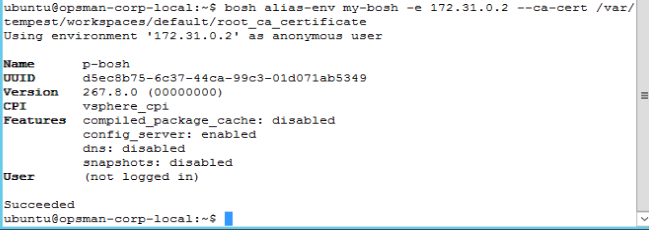
</details>
<br/>

1.3.5 From the Ops Manager prompt, log into Bosh Director with the command `bosh -e my-bosh log-in` using username `director` and the password you gathered in a recent step

<details><summary>Screenshot 1.3.5</summary>

</details>
<br/>

1.3.6 From the Bosh CLI, check your deployments with the command `bosh -e my-bosh deployments` and copy the name of your PKS deployment, which begins with `pivotal-container-service-...` as shown in the following screenshot

<details><summary>Screenshot 1.3.6</summary>

</details>
<br/>

1.3.7 From the Bosh CLI, run the bosh cloud-check with the following command and observe the output. Be sure to substitute the PKS deployment name with the deployment name you copied in the previous step

```bash
bosh -e my-bosh -d pivotal-container-service-cee84d9beaf7ca483987 cloud-check
```

<details><summary>Screenshot 1.3.7</summary>

</details>
<br/>

1.3.8 From the Bosh CLI, check the status of the bosh-managed VMs with the command `bosh -e my-bosh vms` and observe the output. Ensure that the `Process State` for each instance is `running` and the value in the `Active` column is `true`. Close the SSH session with Ops Manager

<details><summary>Screenshot 1.3.8</summary>

</details>
<br/>

1.3.9 From the control center desktop open a web browser connection and log into Ops Manager UI. Navigate to the `VMware Harbor Registry > Status` page and observe the provided details. Click on the icon in the `Logs` column to download the Bosh Harbor logs

<details><summary>Screenshot 1.3.9.1</summary>

</details>

<details><summary>Screenshot 1.3.9.2</summary>

</details>

<details><summary>Screenshot 1.3.9.3</summary>

</details>
<br/>

1.3.10 From the `VMware Harbor Registry` page in the Ops Manager UI, select the `Logs` tab and observe that the Bosh Harbor logs are now available for download

<details><summary>Screenshot 1.3.10</summary>

</details>
<br/>

1.3.11 In the vSphere web client, on the `Hosts and Clusters` page, expand the `pks-mgmt-2` resource pool and check the summary tab to verify the health of the PKS control plane VM. This should be the only VM running in the `pks-mgmt-2` resource pool, which can be confirmed by verifying the `Deployment` value under `Custom Attributes` includes `pivotal-container-service-...` as shown in the following screenshot

<details><summary>Screenshot 1.3.11</summary>

</details>
<br/>

1.3.12 From the control center desktop, open a putty session with cli-vm, login, authenticate to the PKS API, get the kubectl context for `my-cluster` and view the the kubernetes node ID's for `my-cluster` with the following commands. Take note of the output from the `kubectl get nodes` command as you will need to reference the node names provided in the following steps

Note: If you do not currently have a cluster deployed, please deploy a cluster per the instructions in [Step 2 of Lab5](https://github.com/CNA-Tech/PKS-Ninja/tree/Pks1.4/LabGuides/Lab5-DeployFirstCluster#step-2-login-to-pks-cli-and-create-cluster) before proceeding

```bash
pks login -a pks.corp.local -u pksadmin -k -p VMware1!
pks get-credentials my-cluster
kubectl get nodes
```

<details><summary>Screenshot 1.3.12</summary>

</details>
<br/>

1.3.13 In the vSphere web client, on the `Hosts and Clusters` page, expand the `pks-comp-1` resource pool and view the VM's in the resource pool. In the current configuration, all master and node VM's for all Kubernetes clusters created with this PKS instance will be deployed to the `pks-comp-1` resource pool

Currently in your lab environment you should have one small kubernetes deployment. In the lab deployment, the small plan settings were configured to provision a single master and 3 worker nodes (The same configuration is also applied during pipeline execution). Accordingly you should see four virtual machines in the resource pool

Review the output of the `kubectl get nodes` command from the previous step. Observe that there are only 3 nodes listed, which is because the master does not run the kubectl agent, only the workers

Click on one of the VM's in the `pks-comp-1` resource pool, navigate to the `Summary` tab and scroll down in the `Custom Attributes` to observe the value for the `job` attribute. If the value is `master`, click on a different VM in the `pks-comp-1` resource pool, repeat the preceding steps and verify that the value of the `job` attribute for the vm you have selected is `worker`

Near the top of the `Summary` page for the selected VM, observe the value for `DNS Name`, and compare this value to the output of the `kubectl get nodes` command from the previous step, one of the entries should match

Part of the point of this step is to demonstrate the complexity of correlating Kubernetes constructs to vSphere constructs without additional tools. Keep in mind there is currently only a single cluster deployed, in a production environment there can be hundreds of nodes and clusters

<details><summary>Screenshot 1.3.13</summary>

</details>
<br/>

## 2.0 Accelerating Planning, Operations and Problem Resolution with the vSphere PKS Plugin

The vSphere PKS plugin is a plugin for the vSphere HTML5 client that is optimized to support common workflows for virtual infrastructure administrators supporting PKS environments. The plugin is a very useful tool for validating the health of the PKS environment and rapidly identifying and accessing related assets and tools for planning changes or accelerating problem resolution

### 2.1 - Complete installation and configuration of vSPhere PKS Plugin

2.1.1 In the vSphere web client, navigate to the `Hosts and Clusters` view, expand the `RegionA01-MGMT01` cluster, right-click the `pks-ui` VM, select `Edit Settings`, set `Network adapter 1` to `ls-pks-mgmt` and click `OK`

<details><summary>Screenshot 2.1.1</summary>
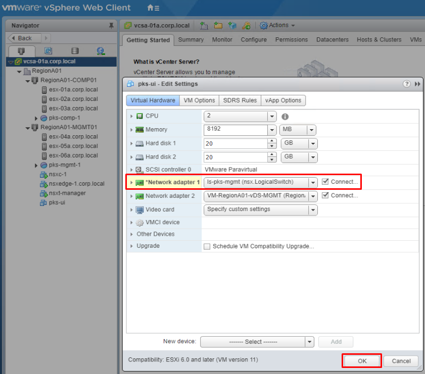
</details>
<br/>

2.1.2 In the vSphere web client, right-click the `pks-ui` VM and select `Power > Power On`

<details><summary>Screenshot 2.1.2</summary>
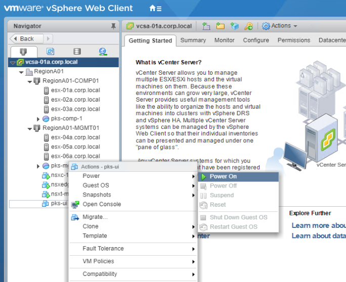
</details>
<br/>

2.1.3 From the control center desktop, open a new browser tab to NSX-T Manager, login with username `admin` password `VMware1!` and navigate to `Networking > Routing` page and click on the `t0-pks` router

<details><summary>Screenshot 2.1.3.1</summary>
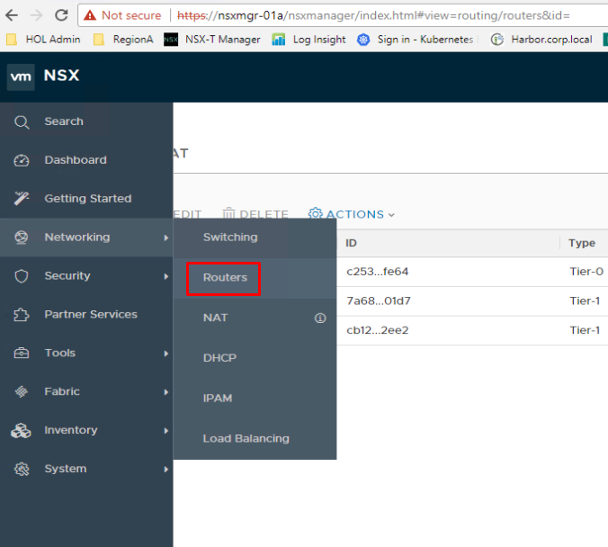
</details>

<details><summary>Screenshot 2.1.3.2</summary>
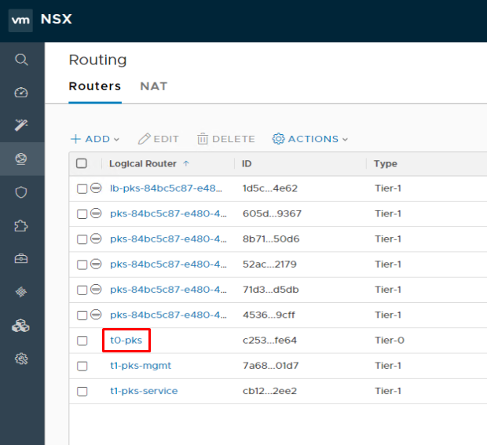
</details>
<br/>

2.1.6 On the `t0-pks` page, select `Services > NAT`. Click `+ ADD` to add a new NAT rule

<details><summary>Screenshot 2.1.6.1</summary>
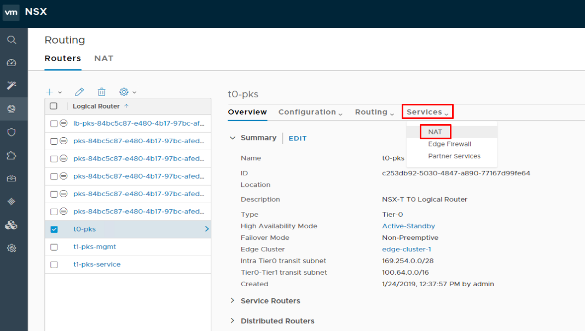
</details>

<details><summary>Screenshot 2.1.6.2</summary>
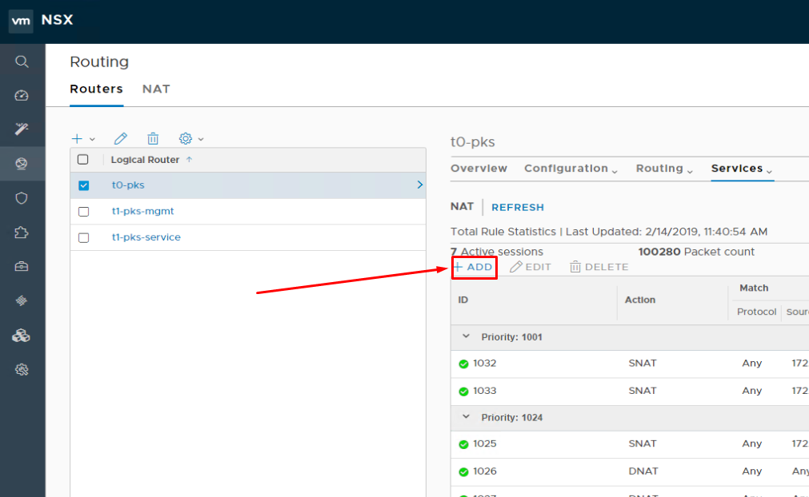
</details>
<br/>

2.1.7 Create a nat rule that allows your workstation to connect to the web UI served by the PKS-UI VM. On the `New NAT Rule` screen, enter the following values:

- Priority: 1024
- Action: DNAT
- Source IP: {Leave Blank}
- Destination IP: 10.40.14.8
- Translated IP: 172.31.0.8
- Click `Add` to add new nat rule

<details><summary>Screenshot 2.1.7</summary>
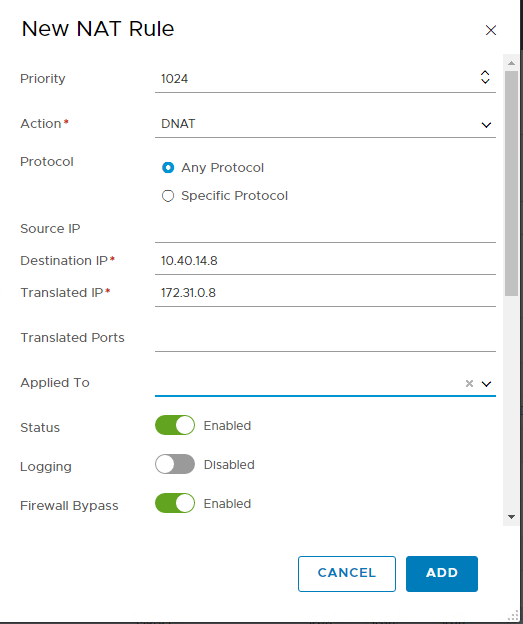
</details>
<br/>

2.1.8 From the control center desktop, press the windows button, search for `DNS` and select `DNS` as in the screenshot below to open DNS Manager.

<details><summary>Screenshot 2.1.8</summary>
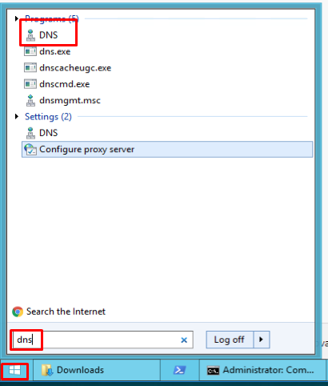
</details>
<br/>

2.1.9 In DNS Manager in the lefthand navigation column expand `ControlCenter`, expand `Forward Lookup Zones`, select and then right click on `corp.local` and select `New Host (A or AAAA)...`

<details><summary>Screenshot 2.1.9</summary>
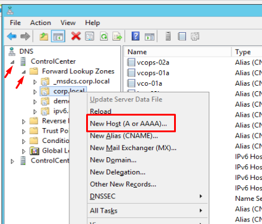
</details>
<br/>

2.1.10 On the `New Host` screen, enter the following values:

- Name: pks-ui
- IP Address: 10.40.14.8
- Click `Add Host`
- Press `OK` on the popup screen
- Close dns manager

<details><summary>Screenshot 2.1.10.1</summary>
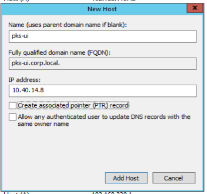
</details>

<details><summary>Screenshot 2.1.10.2</summary>
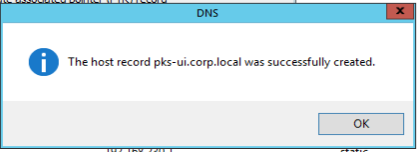
</details>
<br/>

2.1.11 Open a new web browser tab and navigate to `https://pks-ui.corp.local` being sure to use https as the ui vm will not respond to requests on port 80. Login with the username `administrator@vsphere.local` and password `VMware1!`, and on the `Complete PKS plugin registration` screen, click `CONTINUE`

<details><summary>Screenshot 2.1.11.1</summary>

</details>

<details><summary>Screenshot 2.1.11.2</summary>

</details>
<br/>

2.1.12 Continue with the `Complete PKS plugin registration` screen, click `REGISTER` and wait for the registration process to complete

<details><summary>Screenshot 2.1.12</summary>

</details>
<br/>

2.1.13 Finish the `Complete PKS plugin registration` dialogue by clicking `LOGOUT`

<details><summary>Screenshot 2.1.13</summary>

</details>
<br/>

2.1.12 From the control center desktop, if you have any open connections to the vSphere web or HTML5 client, log out of your sessions and then close the tabs. Open a new browser window and log into the vSphere HTML5 Client using the windows credential checkbox. Go to the home screen, where You should now see an option for `VMware PKS`, also on the Shortcuts screen and in the pulldown menu. Click on the `VMware PKS` icon to open the plugin

**NOTE** If you do not see the `VMware PKS` icon, try logging out, close any open browser windows and then try to log back in a second time, a second logout and login is often needed. You will only be able to use the PKS plugin from the HTML5 Client.

<details><summary>Screenshot 2.1.12.1</summary>
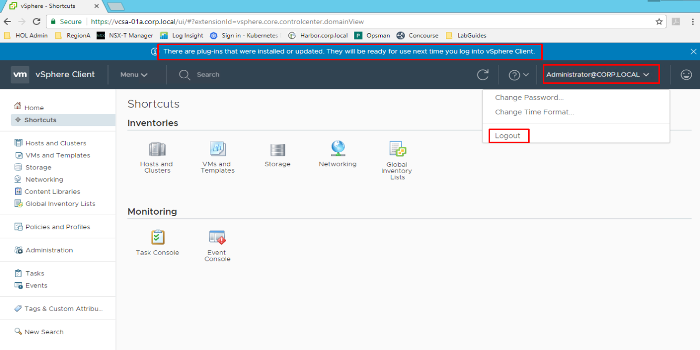
</details>

<details><summary>Screenshot 2.1.12.2</summary>
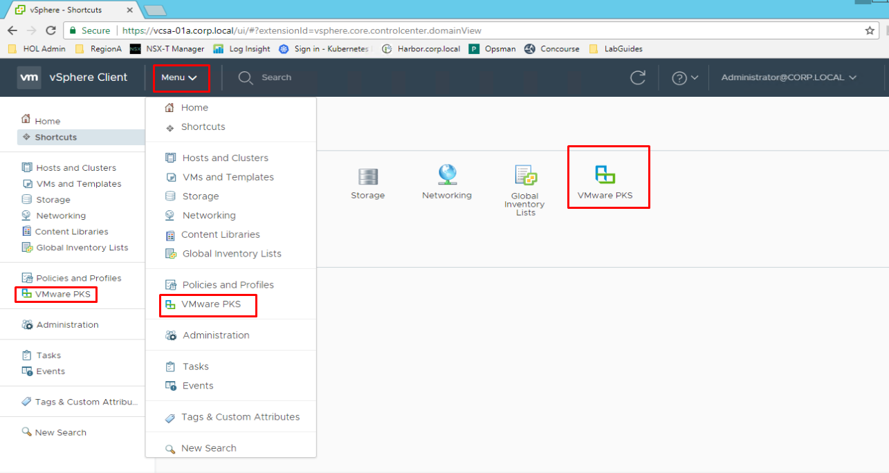
</details>

<details><summary>Screenshot 2.1.12.3</summary>
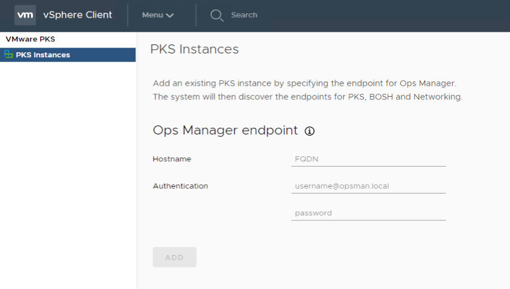
</details>
<br/>

2.1.13 Enter the following values for the Ops Man endpoint

- Hostname: opsman.corp.local
- Username: admin
- Password: VMware1!
- Click `Add` and then click `Continue` to verify fingerprint and wait for registration to complete (can take up to a few minutes to complete)

<details><summary>Screenshot 2.1.13.1</summary>
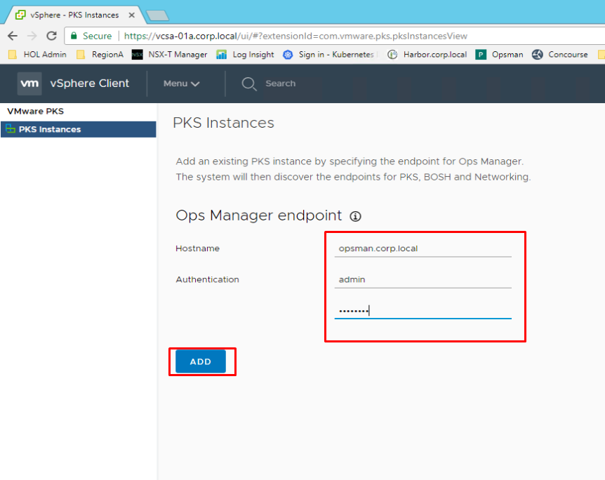
</details>

<details><summary>Screenshot 2.1.13.2</summary>
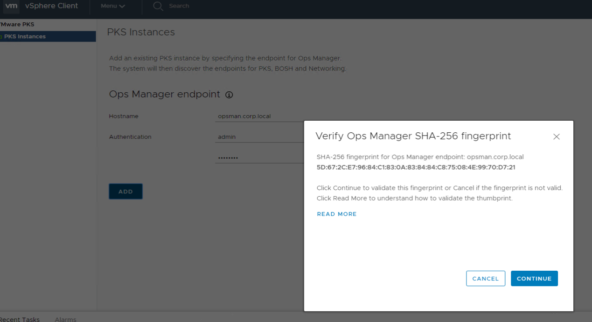
</details>
<br/>

2.1.14 After you click on `VMware PKS` you will be directed to the `PKS Instances` page

<details><summary>Screenshot 2.1.14.3</summary>

</details>
<br/>

## 2.2 - Use the vSphere PKS Plugin to validate PKS Instance & K8s Cluster Health

2.2.1 From `PKS Instances` page of PKS UI Plugin, click on the name of your PKS instance

<details><summary>Screenshot 2.2.1</summary>
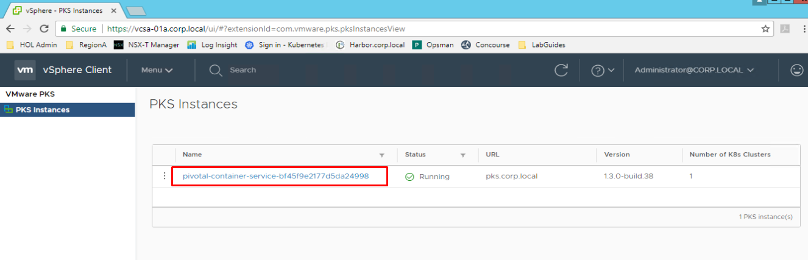
</details>
<br/>

2.2.2 On the `Summary` tab for your PKS instance, observe the details provided. The `Summary` tab is optimized to provide the most commonly needed PKS Instance details for VM administrators supporting PKS environments

<details><summary>Screenshot 2.2.2</summary>
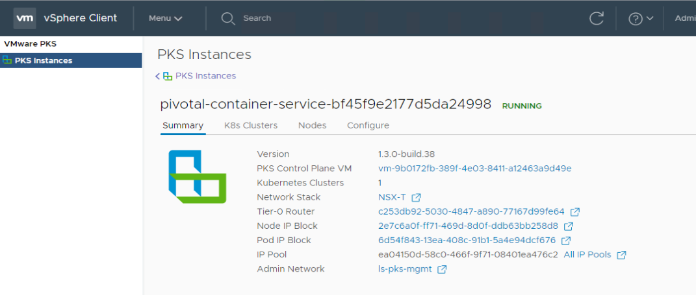
</details>
<br/>

2.2.3 On the `Summary` tab for your PKS instance, observe that the VM name for the PKS Control Plane VM is provided making it simple for an admin to find in vCenter. Click on the name of the VM and observe that you are directed to the corresponding page in the vSphere client where VM admins can leverage their experience and the mature vSphere toolset to validate the health and performance of the VM. Navigate back to the `Summary` tab of your PKS instance in the `VMware PKS` plugin

<details><summary>Screenshot 2.2.3.1</summary>
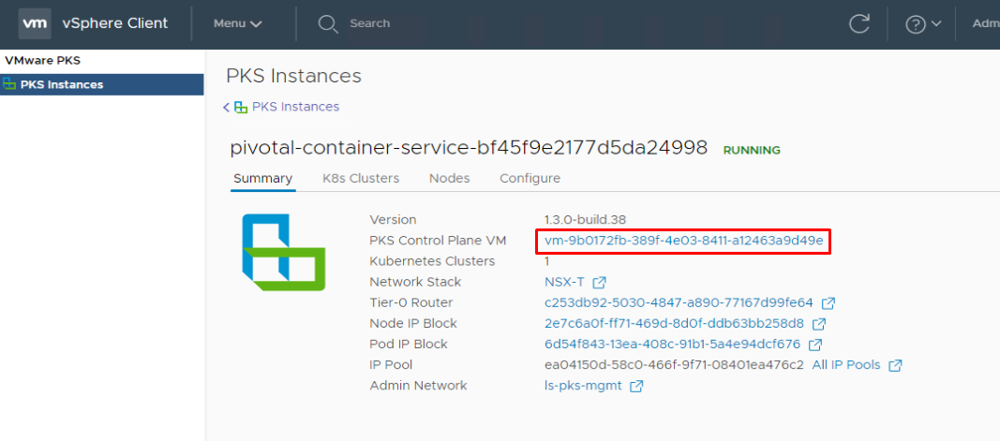
</details>

<details><summary>Screenshot 2.2.3.2</summary>
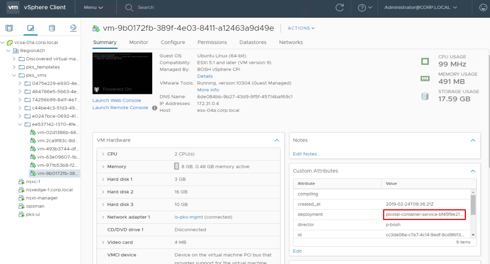
</details>
<br/>

2.2.4 On the `Summary` tab for your PKS instance, observe that the key network objects for PKS cluster health are displayed. Click on the name of the `Tier-0` router and observe that you are directed to the objects page in the NSX-T UI where VM admins can leverage their experience and the mature NSX-T toolset to validate the health and performance of the router. Navigate back to the `Summary` tab of your PKS instance in the `VMware PKS` plugin

<details><summary>Screenshot 2.2.4.1</summary>
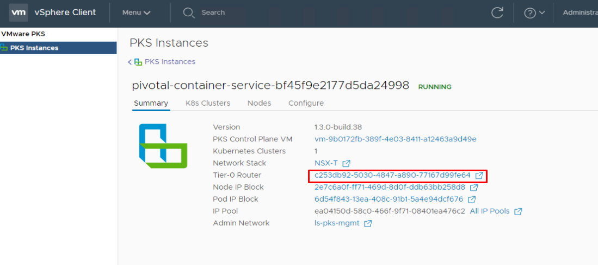
</details>

<details><summary>Screenshot 2.2.4.2</summary>

</details>
<br/>

2.2.5 Return to the `VMware PKS` plugin, navigate to the `Nodes` tab. On this screen you will see a list of all the running master and worker nodes for all K8s clusters deployed using this PKS instance

Observe that the list of nodes provides key details such as node status, type, IP Address, cluster, VM and AZ names and provides the ability to launch directly to the vSphere client page for the associated objects

<details><summary>Screenshot 2.2.5</summary>
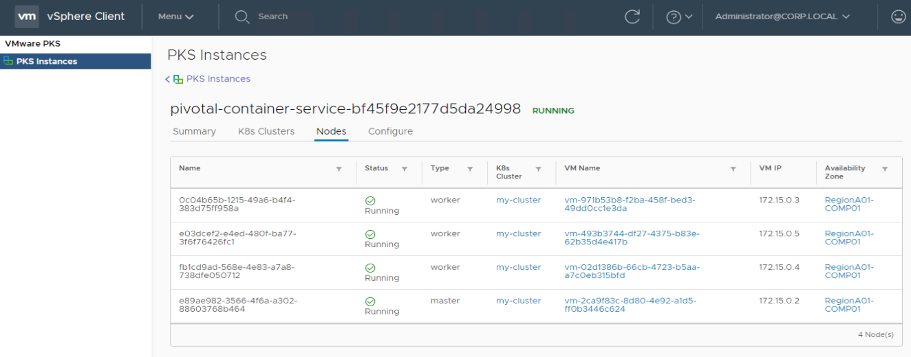
</details>
<br/>

2.2.6 From the `VMware PKS` plugin, navigate to the `Configure` tab for your PKS instance. On this screen you will see the configuration of the PKS instance selected. These details can be used both to validate or edit the plugin configuration or as a reference for the information provided

Navigate through the `PKS API Endpoint`, `Networking` and `Bosh Endpoint` pages and observe the details provided

<details><summary>Screenshot 2.2.6.1</summary>
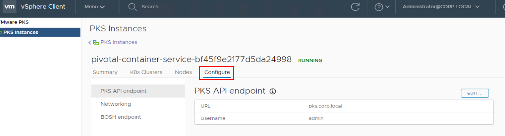
</details>

<details><summary>Screenshot 2.2.6.2</summary>
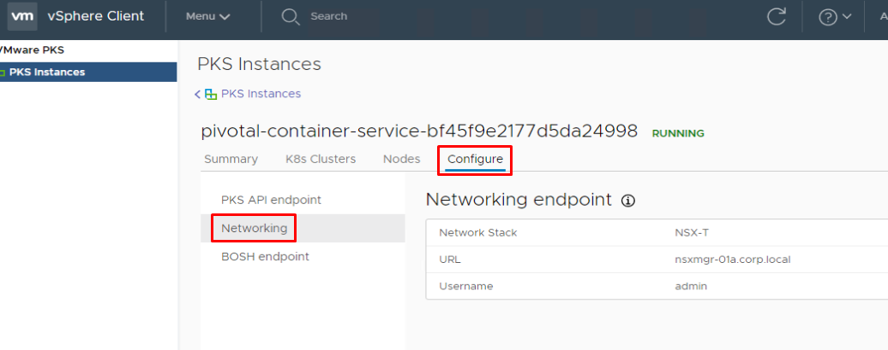
</details>

<details><summary>Screenshot 2.2.6.3</summary>
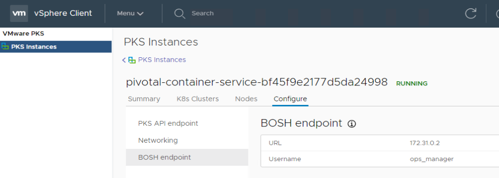
</details>
<br/>

2.2.7 From the `VMware PKS` plugin, navigate to the `K8s Clusters`. On this screen you will see a list of all the running clusters in this PKS instance. Click on `my-cluster` to view cluster details

<details><summary>Screenshot 2.2.7.1</summary>
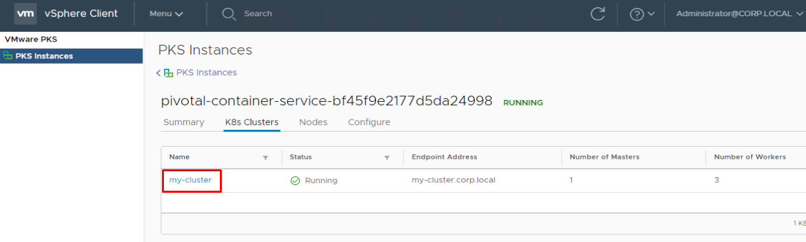
</details>

<details><summary>Screenshot 2.2.7.2</summary>
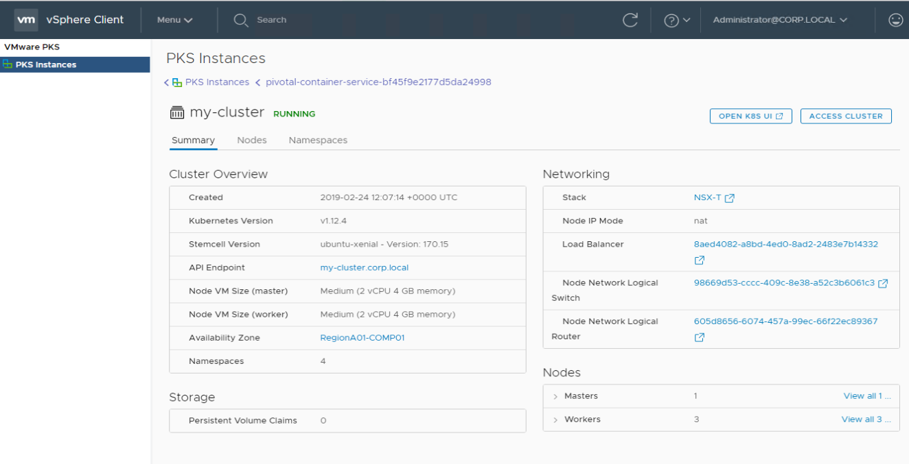
</details>
<br/>

2.2.8 Return to the `my-cluster > Summary` tab in the `VMware PKS` plugin and take some time to observe the details provided about your cluster

The Cluster overview provides key details about cluster composition pertinent for planning and troubleshooting

The Networking section provides information specific to the selected `my-cluster` deployment. Observe that the Load Balancer information is provided on the my-cluster screen as with PKS1.2/NSXT2.3 a load-balancer is deployed with each K8s cluster. Likewise the node-level networking objects where the cluster is deployed are presented, however the pod network objects are not shown as pod networks are deployed on a per-namespace basis, and accordingly are displayed on the namespaces tab

The Nodes section allows you to easily identify the master or node VM's in vCenter

The Storage section provides details about vSphere storage componentes used to provision persistent volumes for running kubernetes pods. There are currently no persistent volumes deployed, so no information is displayed at this time

<details><summary>Screenshot 2.2.8</summary>

</details>
<br/>

2.2.9 From the `my-cluster` screen in the `VMware PKS` plugin, select the `Nodes` tab to view the nodes associated with the cluster and take some time to observe the details provided

<details><summary>Screenshot 2.2.9</summary>

</details>
<br/>

2.2.10 From the `my-cluster` screen in the `VMware PKS` plugin, select the `Namespaces` tab and take some time to observe the details provided. Remember that NSX-T deployes unique network objects for each namespace

Observe the long, autogenerated name for each namespaces logical switch, and consider how much dramatically easier it is to identify and associate with a corresponding Kubernetes cluster with the plugin. Click on the name of the `Pod Network` for the `default` namespace and observe that this launches you directly into the NSX Manager UI for that object

<details><summary>Screenshot 2.2.10.1</summary>
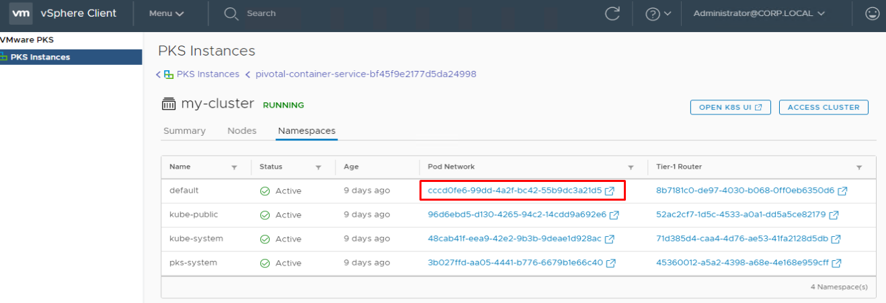
</details>

<details><summary>Screenshot 2.2.10.2</summary>

</details>
<br/>

2.2.11 From the Main Console (ControlCenter) desktop, open a windows command prompt and enter the following commands to prepare to connect to the kubernetes dashboard:

```bash
pks.exe login -a pks.corp.local -u pksadmin -k -p VMware1!
pks.exe get-credentials my-cluster
kubectl proxy
```

<details><summary>Screenshot 2.2.11</summary>
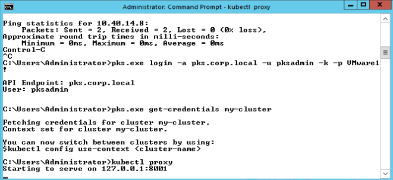
</details>
<br/>

2.2.12 From the Main Console (ControlCenter) desktop, open a chrome browser session and on the shortcuts bar select the shortcut `Sign in - Kubernetes` to access your kubernetes dashboard and proceed through the following steps to sign in:

- Select `Kubeconfig`
- Click on `Choose kubeconfig file`
- Navigate to the `C:\Users\Administrator\.kube` directory and select the `config` file
- Click `Sign In`

When you Sign in to the kubernetes dashboard, the homepage should show the overview page for your default namespace where your wordpress deployment is running. Scroll through the page to observe the various kubernetes artifacts that were deployed with this helm chart. Observe that the node listed for the wordpress-lamp pod shows the name of the VM where the pod is deployed.

<details><summary>Screenshot 2.2.12.1</summary>

</details>

<details><summary>Screenshot 2.2.12.2</summary>

</details>

<details><summary>Screenshot 2.2.12.3</summary>

</details>

<details><summary>Screenshot 2.2.12.4</summary>

</details>
<br/>

## 2.3 Launch a pod with a persistent volume to populate PKS plugin storage screen details

2.3.1 From the control center desktop, resume or open a new connection to `cli-vm`

2.3.2 From the vSphere HTML5 Client, navigate to `VMware PKS > Your PKS Instance > K8s Clusters > my-cluster > Summary`, click on the `ACCESS CLUSTER`, copy the contents to the clipboard and paste the contents into the `cli-vm` prompt

<details><summary>Screenshot 2.3.2.1</summary>

</details>

<details><summary>Screenshot 2.3.2.2</summary>

</details>
<br/>

2.3.3 Launch the planespotter mysql pod, which includes a persistent volume, with the following commands:

```bash
kubectl create ns planespotter
kubectl create -f https://raw.githubusercontent.com/yfauser/planespotter/master/kubernetes/storage_class.yaml -n planespotter
kubectl create -f https://raw.githubusercontent.com/yfauser/planespotter/master/kubernetes/mysql_claim.yaml -n planespotter
kubectl create -f https://raw.githubusercontent.com/yfauser/planespotter/master/kubernetes/mysql_pod.yaml -n planespotter
kubectl get pods -n planespotter
kubectl get pv
```

<details><summary>Screenshot 2.3.3</summary>

</details>
<br/>

2.3.4 From the vSphere HTML5 Client, navigate to `VMware PKS > Your PKS Instance > K8s Clusters > my-cluster > Summary`, and observe the Storage section to see the persistent volume claim you just created

<details><summary>Screenshot 2.3.4</summary>

</details>
<br/>

## 3.0 Validation and Troubleshooting with Kubernetes Native Tools

### 3.1 Observe and Validate Kubernetes Clusters with the Kubernetes Dashboard

3.1.1 From the vSphere HTML5 Client, navigate to `VMware PKS > Your PKS Instance > K8s Clusters > my-cluster > Summary`, click on the `OPEN K8S UI` link and follow the instructions to connect to the dashboard for my-cluster

<details><summary>Screenshot 3.1.1</summary>

</details>
<br/>

3.1.2 From the `Open K8s 'my-cluster' UI` screen, copy the text from the `Set context` box

<details><summary>Screenshot 3.1.2</summary>

</details>
<br/>

3.1.3 On the control center desktop, open Notepad++ and paste the contents of the clipboard. The text provided is prepared with unix style line endings (fine for Linux/Mac/WSL), and you need to prepare the commands to paste into the Windows command prompt

Remove the string `&& \` from the end of each line and copy the updated text to the clipboard

<details><summary>Screenshot 3.1.3</summary>
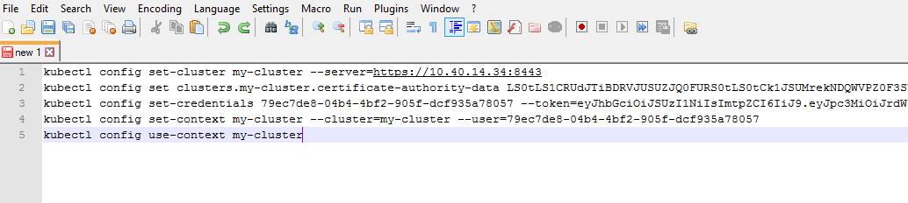
</details>
<br/>

3.1.4 On the control center desktop, open a command prompt and paste the contents of the clipboard into the command prompt

<details><summary>Screenshot 3.1.4</summary>

</details>
<br/>

3.1.5 Per step 2 in the `OPEN K8S UI` dialogue box, from the control center command prompt, enter the command `kubectl proxy --port=8011`

<details><summary>Screenshot 3.1.5</summary>

</details>
<br/>

3.1.6 From the control center desktop open a browser tab, connect to `http://localhost:8011/api/v1/namespaces/kube-system/services/https:kubernetes-dashboard:/proxy/#!/login`, select `Token` and paste the value from the `Open K8s UI > '3. Open Kubernetes dashboard` textbox and click `SIGN IN`

Note: Students using the onecloud lab can use the browser shortcut to the dashboard but will need to update the port number to 8011 in the url bar

<details><summary>Screenshot 3.1.6.1</summary>
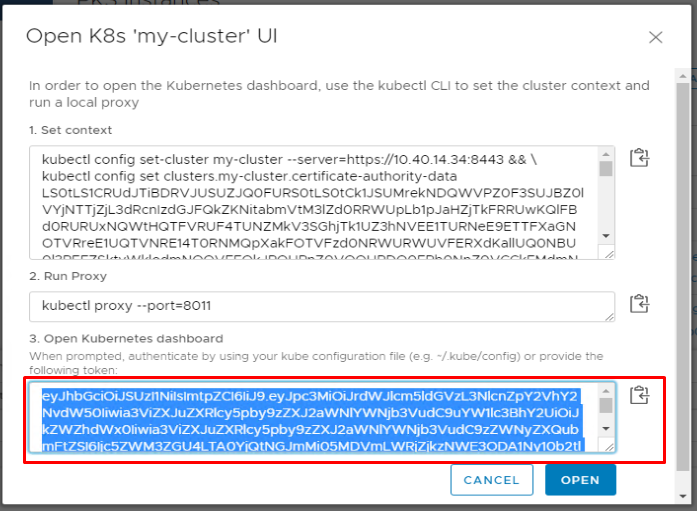
</details>

<details><summary>Screenshot 3.1.6.2</summary>

</details>

<details><summary>Screenshot 3.1.6.3</summary>

</details>
<br/>

3.1.7 Take some time to navigate through the Kubernetes dashboard and review observed details. While it is often reported that developers who work on K8s all day long prefer the commandline, the Kubernetes Dashboard is an extremely valuable tool that should not be discounted. When presenting a demo or value prop to a diverse audience, visualizations are frequently more impactful. Also when supporting a K8s environment you may not work on every day, it is generally easier and quicker to navigate much of the environment with the dashboard.

### 3.2 Observe and Validate Kubernetes Clusters with kubectl

This lab guide is primarily focused on infrastructure administration for Kubernetes clusters and does not intend to be an alternative to the overwhelming wealth of community resources available for the open standard kubectl application

This guide will however provide an introductory review of some common kubectl commands, however note that a key aspect here is that once you have PKS installed and operating in your lab, you can access a tremendous wealth of community resources and tutorials and simply apply the steps in your lab. So while you can just follow the steps provided below, we recommend you also check out the [Official kubectl Cheat Sheet](https://kubernetes.io/docs/reference/kubectl/cheatsheet/) and experiment executing commands directly from documentation and community resources.

3.2.1 Login the vSphere HTML5 Client, navigate to `VMware PKS > Your PKS Instance > K8s Clusters > my-cluster > Summary`, click on the `ACCESS CLUSTER`, copy the contents to the clipboard and paste the contents into the `cli-vm` prompt

<details><summary>Screenshot 3.2.1.1</summary>

</details>

<details><summary>Screenshot 3.2.1.2</summary>

</details>
<br/>

3.2.2 Enter the command `kubectl config view` to view the merged kubeconfig settings

<details><summary>Screenshot 3.2.2</summary>

</details>
<br/>

3.2.3 Enter the command `kubectl cluster-info` to view key cluster details

<details><summary>Screenshot 3.2.3</summary>

</details>
<br/>

3.2.4 Enter the command `kubectl api-resources` to view a list of kubernetes objects you can interact with via kubectl. Also make note of all the shortnames listed which can be extremely convenient, for example observe that the shortname for `componentstatuses` is simply `cs` and `persistentvolumeclaims` is simply `pvc`, they can really save a lot of effort

<details><summary>Screenshot 3.2.4</summary>

</details>
<br/>

3.2.5 Enter the following commands to view the kubernetes component statuses, and experiment with different output flags to manipulate output. Keep in mind the output flags used here work on other kubectl commands as well, and you should practice using the flags shown here with other commands

```bash
kubectl get componentstatuses
kubectl get cs
kubectl get cs -o yaml
```

<details><summary>Screenshot 3.2.5</summary>

</details>
<br/>

3.2.6 Enter the following commands to view the kubernetes component statuses, and experiment with different output flags to manipulate output. Keep in mind the output flags used here work on other kubectl commands as well, and you should practice using the flags shown here with other commands

```bash
kubectl get nodes
kubectl describe node #enter the name of a node from the previous commands output
```

<details><summary>Screenshot 3.2.6</summary>

</details>
<br/>

3.2.7 Enter the following commands to view the kubernetes component statuses, and experiment with different output flags to manipulate output. Keep in mind the output flags used here work on other kubectl commands as well, and you should practice using the flags shown here with other commands

```bash
kubectl get pods --all-namespaces
kubectl get pods --all-namespaces -o wide
kubectl get pods --all-namespaces -o yaml | more
kubectl get pod NameOfYourHeapsterPod -n kube-system -o wide
```

As you can see from the output of the above commands, output flags can change the volume of output tremendously

<details><summary>Screenshot 3.2.7.1</summary>

</details>

<details><summary>Screenshot 3.2.7.1</summary>

</details>
<br/>

3.2.8 View the [Official kubectl Cheat Sheet](https://kubernetes.io/docs/reference/kubectl/cheatsheet/) and experiment with different commands in your lab environment

You have now completed the troubleshooting lab
