# PKS Upgrade

## Contents

- [Prereqs](#prereqs)
- [Step 1: Review Current Versions Detail](#step-1-review-current-versions-detail)
- [Step 2: Prepare for Opsman Upgrade](#step-2-prepare-for-opsman-upgrade)
- [Step 3: Upgrade Opsman](#step-3-upgrade-opsman)
- [Step 4: Prepare for PKS Upgrade](#step-4-prepare-for-pks-upgrade)
- [Step 5: Upgrade PKS Tile](#step-5-upgrade-pks-tile)
- [Step 6: Upgrade CLI Tools](#step-6-upgrade-cli-tools)
- [Step 7: Verify  Upgrade](#step-7-verify--upgrade)
- [Summary](#summary)

## Prereqs

For this lab, you will need access to a PKS Ninja lab environment with a working PKS 1.2 deployment and a PKS deployed kubernetes cluster.

If you do not already have a prepared lab environment, you can follow the steps in the [Try Some Labs!](https://github.com/CNA-Tech/PKS-Ninja/tree/Pks1.4/Courses/CommunityLabs-CL7056) course to fully prepare a lab environment to complete this lab guide.

You will need an account on Pivnet to download udpate tile and stemcells. If you do not have a Pivnet account, follow the directions to create one here: https://account.run.pivotal.io/z/uaa/sign-up

_NOTE: Versions of PKS referred to in this lab guide may differ from the version you use to upgrade. For an instructor led lab, your lab guide will instruct you on the versions to use. For a self-led lab, you will need to determine the next viable upgrade version and adjust._

## Step 1: Review Current Versions Detail

1.1 From the ControlCenter desktop, login to Opsman from the browser with username `admin` and pasword `VMware1!`

<details><summary>Screenshot 1.1</summary></details><br>

1.2 View the BOSH Director and PKS Tile versions _(In this case, the versions are v2.3-build.146 and v1.2.0.build.47)_ When you upgrade PKS, you need to know the specific versions of BOSH and PKS you are running in order to know which version you can move up to. If you are upgrading at each release _(and you should be)_ , this is not a necessary check.

<details><summary>Screenshot 1.2</summary></details><br>

1.3 View the current stemcell version. From the Opsman dashboard, click on `Stemcell Library`

<details><summary>Screenshot 1.3</summary></details><br>

1.4 Sign in to Pivnet and access the PKS 1.2.0 release page _(Right click and open in new tab)_ https://network.pivotal.io/products/pivotal-container-service#/releases/191865.


<details><summary>Screenshot 1.4</summary></details><br>

1.5 Scroll down and review the release details. You'll notice that version 1.2.0 includes Kubernetes 1.11.2, AWS EC2 support, NSX-T 2.3 integration, etc., and that the required stemcell version is 97.17. You can click on `Release Notes*` for extended information. Compare these versions to the information you observed above.

<details><summary>Screenshot 1.5</summary>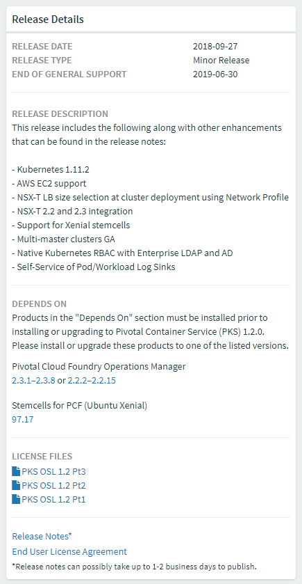</details><br>

1.6 Scroll up and select release 1.2.6 from the `Releases` dropdown list

<details><summary>Screenshot 1.6</summary></details><br>

1.7 Scroll down and review the `Depends On` and `Upgrades From` sections in the Release Details pane. Notice that this release can upgrade from PKS release 1.2.0 and that it depends on particular BOSH release versions. Notice that the stemcell version will need to be upgraded as well.

_NOTE: Based on the versions we observed above, we are ok to upgrade from PKS v1.2.0.build.47 but we are not ok to upgrade based on BOSH v2.3-build.146 (You can click on the depends on and upgrades from links to determine the equivelant build numbers). In real use, we would upgrade BOSH before upgrading PKS. To save time in the lab, we will upgrade PKS with the current version of BOSH._

<details><summary>Screenshot 1.7</summary></details><br>

1.8 Click on `2.3.1-2.3.8` link in the `Depends On` section

<details><summary>Screenshot 1.8</summary>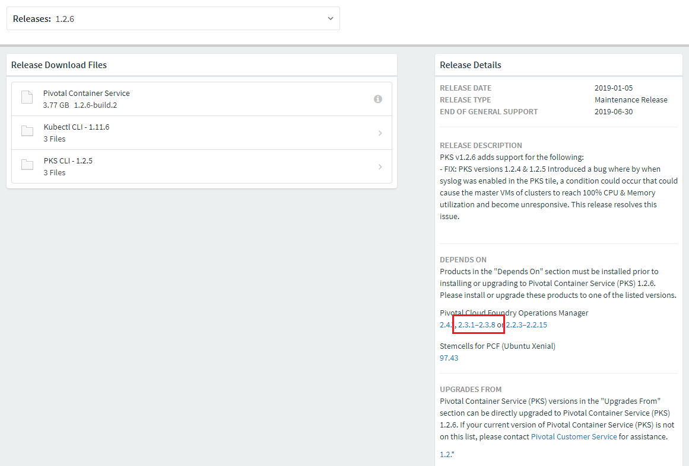</details><br>

1.9 Select `2.3.1` from the Release dropdown

<details><summary>Screenshot 1.9</summary></details><br>

1.10 Locate the vSphere Opsman file and maake a note of the release and build number. In this case, it's release 2.3.1 build 167. This is higher than the version we are running as observed earlier

<details><summary>Screenshot 1.10</summary>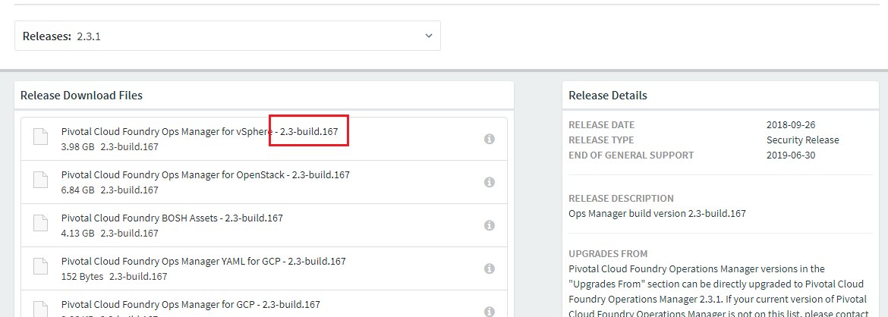</details><br>

1.11 Open a `Putty `session to `cli-vm` (if it's not already open). Submit the command `kubectl get nodes` to view the current version of your kubernetes cluster

_NOTE: If you receive an error, log back into to PKS controller and submit the get-credentials command for your cluster. (e.g. `pks login -a pks.corp.local -u pks-admin -p VMware1! --skip-ssl-validation` -> `pks get-credentials my-cluster`)_

<details><summary>Screenshot 1.11</summary></details><br>

## Step 2: Prepare for Opsman Upgrade

**Note: Your instructor may have you skip the Opsman upgrade steps in this lab to save time. Be sure to skip ahead to [Step 4: Prepare for PKS Upgrade](#step-4-prepare-for-pks-upgrade) if that is the case.**

Now that we know which versions we're on and which version we can upgrade to, the next step is to download the required files.

2.1 From the Pivnet Opsman 2.3.1 download page (https://network.pivotal.io/products/pivotal-container-service#/releases/271781),  click the `Pivotal Cloud Foundry Ops Manager for vSphere - 2.3-build.167` link to download

<details><summary>Screenshot 2.1</summary>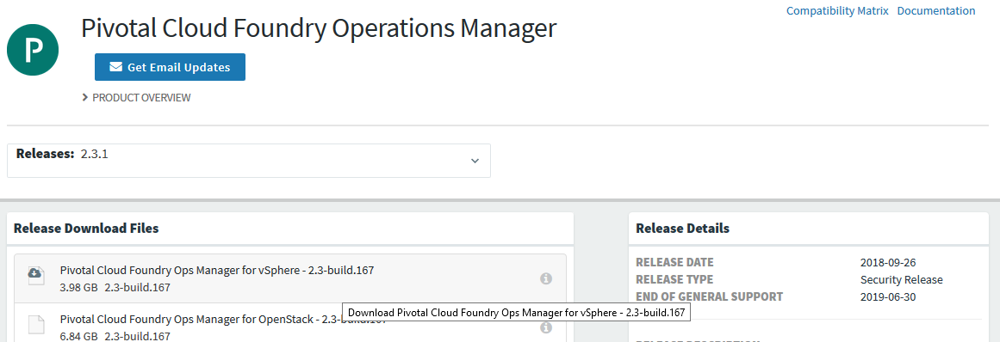</details><br>

_NOTE: The download is 4 GB and will take a few minutes to complete. You can continue to the next step._

## Step 3: Upgrade Opsman

3.1 From the Opsman dashboard, click on `admin` menu and then `settings`

<details><summary>Screenshot 3.1</summary>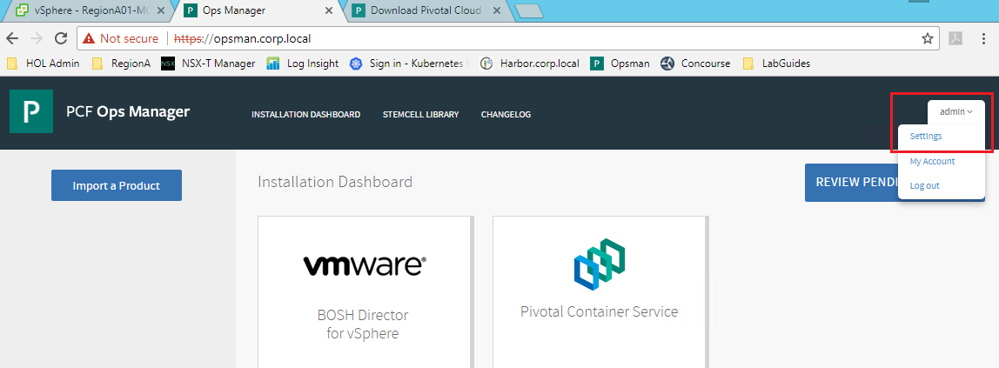</details><br>

3.2 Click on `Export Installation Settings` tab and then on `Export Installation Button`

_NOTE: Make note of the downloaded zip file in your download bar_

<details><summary>Screenshot 3.2.1</summary></details>
<details><summary>Screenshot 3.2.2</summary>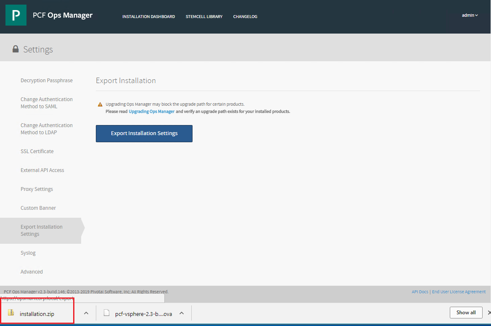</details><br>

3.3 From vCenter web client, power off the opsman VM

_NOTE: Make sure you are not using the HTML5 vSphere client_

<details><summary>Screenshot 3.3</summary>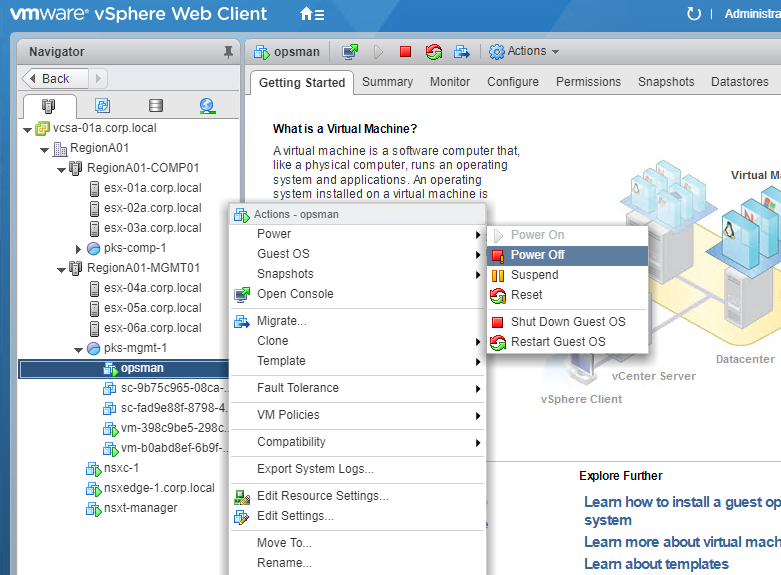</details><br>

3.4 Right click on resource pool `pks-mgmt-1` and select `Deploy OVF Template`

<details><summary>Screenshot 3.4</summary>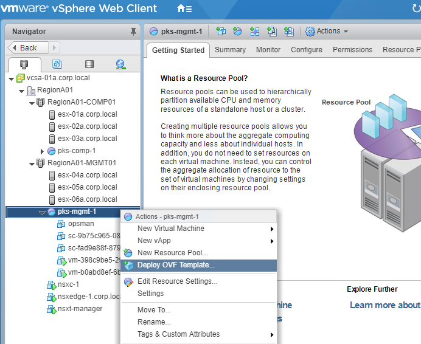</details><br>

3.5 Select `Local file` and click on `Browse`

<details><summary>Screenshot 3.5</summary></details><br>

3.6 Select `pcf-vsphere-2.3-build.167.ova` and click `Open` and then `Next`

<details><summary>Screenshot 3.6</summary>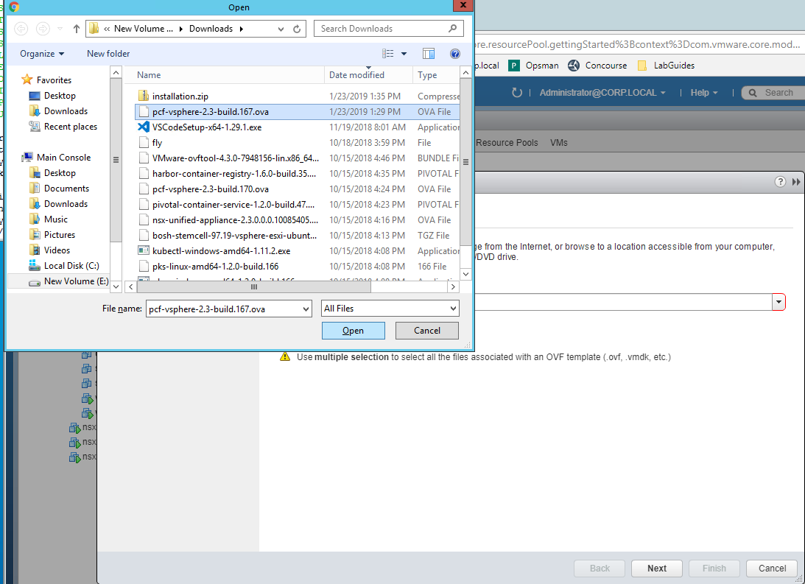</details><br>

3.7 Rename the vm `opsman-2.3.1-build-167` and click `Next`

<details><summary>Screenshot 3.7</summary></details><br>

3.8 Select resoutrce pool `pks-mgmt-1` and click `Next`

<details><summary>Screenshot 3.8</summary>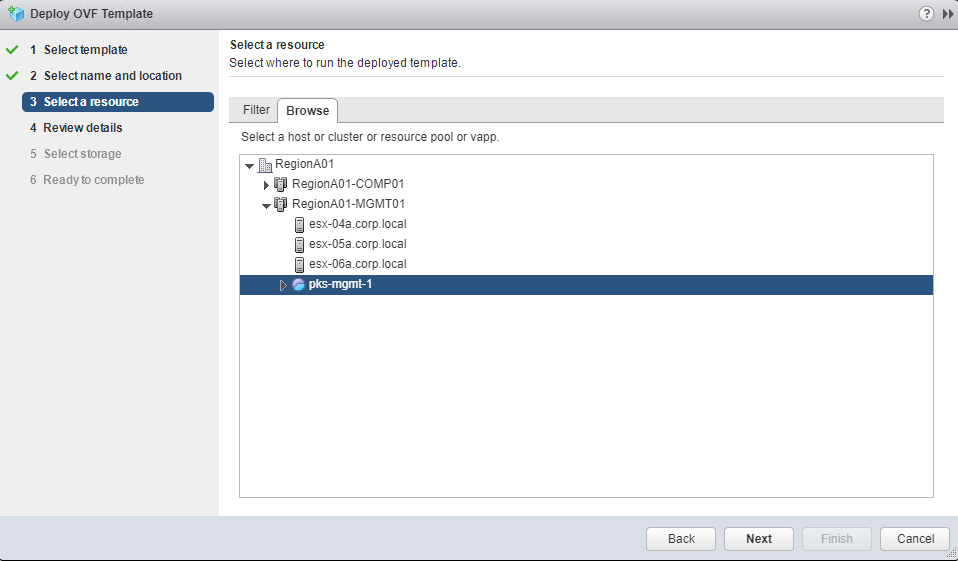</details><br>

3.9 Once the template is validated, click on `Next` from Review Details

<details><summary>Screenshot 3.9</summary>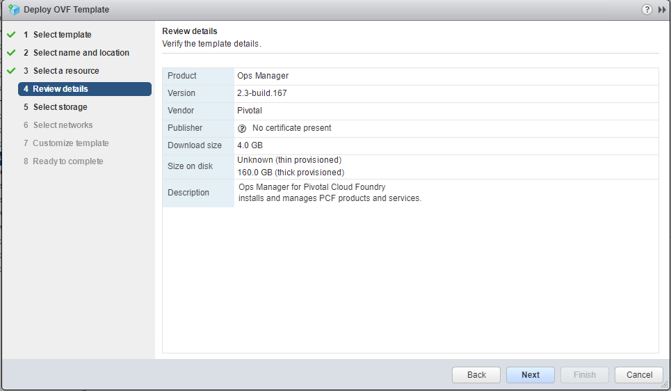</details><br>

3.10 Select `Thin Provision` disk format and datastore `RegionA01-ISCSI01-COMP01`, then click `Next`

<details><summary>Screenshot 3.10</summary>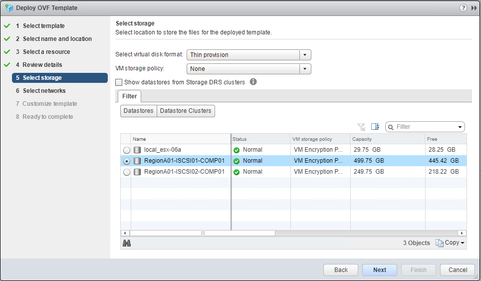</details><br>

3.11 Select network `VM-RegionA01-vDS-MGMT` and click `Next`

_NOTE: You may recall from the installation of PKS that we have to select a vDS switch during OVF deployment. We will change this to an NSX switch after the vm is deployed._

<details><summary>Screenshot 3.11</summary></details><br>

3.12 Use the following values for the customize template pane:

- Admin Password: `VMware1!`
- Custom Hostname: `opsman.corp.local`
- DNS: `192.168.110.10`
- Default Gateway: `172.31.0.1`
- IP Address: `172.31.0.3`
- NTP Server: `ntp.corp.local`
- Netmask: `255.255.255.0`
- Leave `Public SSH Key` blank
- Click `Next` and then click `Finish`

<details><summary>Screenshot 3.12</summary></details><br>

3.13 Monitor the deployment of the vm in `Recent Tasks` pane until it is succesfully deployed

_NOTE: This step can take 5 - 10 minutes to complete in the lab enviroment. You can skip ahead to the Prepare for PKS Upgrade step while this completes, but do not begin the Upgrade PKS step before retuning to complete this step_

<details><summary>Screenshot 3.13</summary>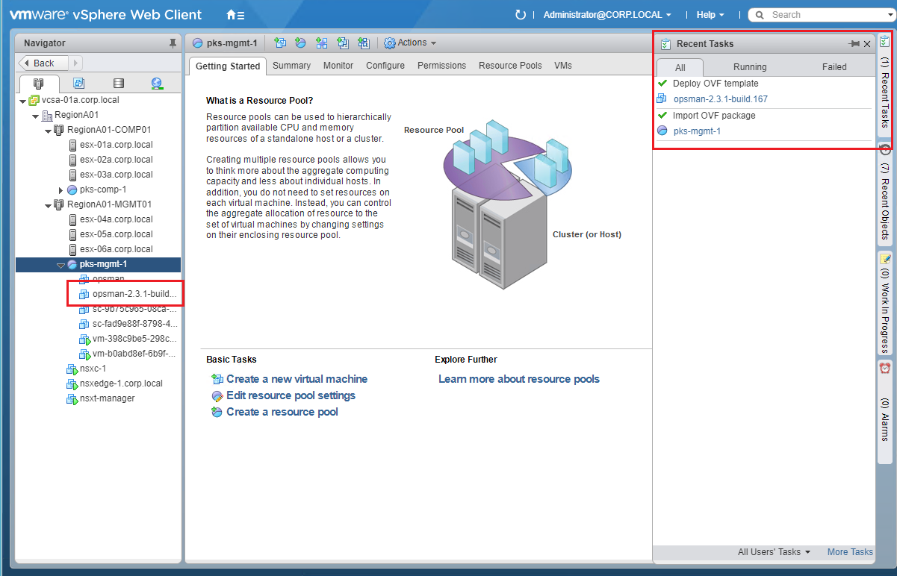</details><br>

3.14 Edit the settings of the vm and switch the network to `ls-pks-mgmt`, then click `Ok`

<details><summary>Screenshot 3.14.1</summary></details>
<details><summary>Screenshot 3.14.2</summary>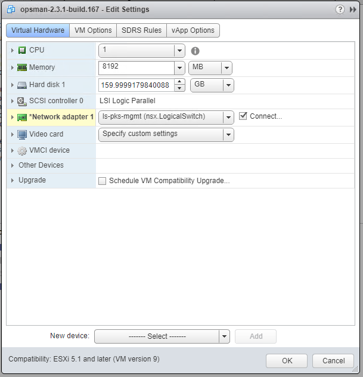</details><br>

3.15 Power on the vm

<details><summary>Screenshot 3.15</summary>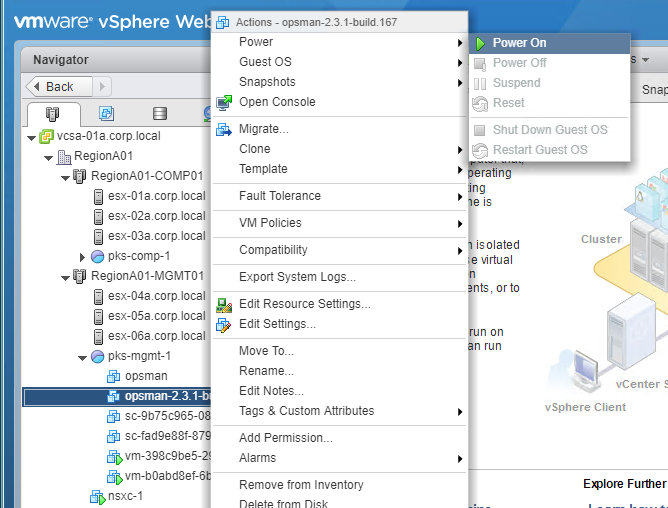</details><br>

3.16 From the web browser, open a tab to https://opsman.corp.local or refresh the existing tab

_NOTE: The opsman vm will need a few minutes to fully boot. You may need to wait and refresh a few times_

3.17 Select `Import Existing Installation`

<details><summary>Screenshot 3.17</summary></details><br>

3.18 Enter `VMware1!` for Decryption Passphrase and click `Choose File`

<details><summary>Screenshot 3.18</summary></details><br>

3.19 Select the `installation.zip` file you downloaded earlier _(Sort the dialog by date modified and it should be the top file)_, then click `Open`

<details><summary>Screenshot 3.19</summary>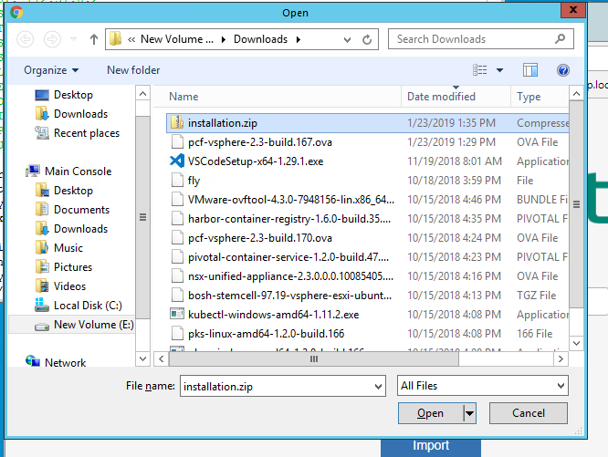</details><br>

3.20 Click `Import`

_NOTE: It will take a few minutes for the authentication service to start_

<details><summary>Screenshot 3.20</summary>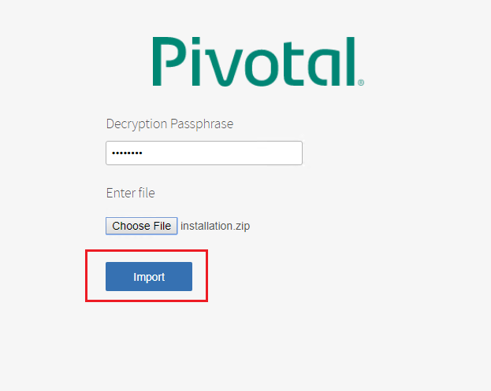</details><br>

3.21 Sign in to the opsman dash board with username `admin` and password `VMware1!`

<details><summary>Screenshot 3.21</summary>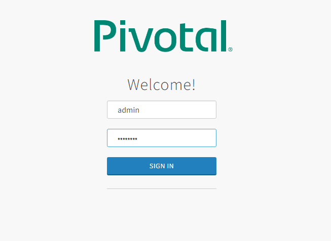</details><br>

<!---
3.22 Click on `Review Pending Changes`, deselect all tiles other than BOSH Director, and click `Apply Changes`

<details><summary>Screenshot 3.22</summary></details><br>

**You can continue to Prepare for PKS Upgrade while the tile BOSH deploys. Do not begin Upgrade PKS Tile before the BOSH tile deployment has successfully completed.**
-->


## Step 4: Prepare for PKS Upgrade

Now that we have upgraded Opsman and know which versions we're on and which version we can upgrade to, the next step is to download the required files for PKS.

4.1 From the Pivnet PKS release 1.2.6 download page (https://network.pivotal.io/products/pivotal-container-service#/releases/191865) download the `Pivotal Container Service` file

<details><summary>Screenshot 4.1</summary>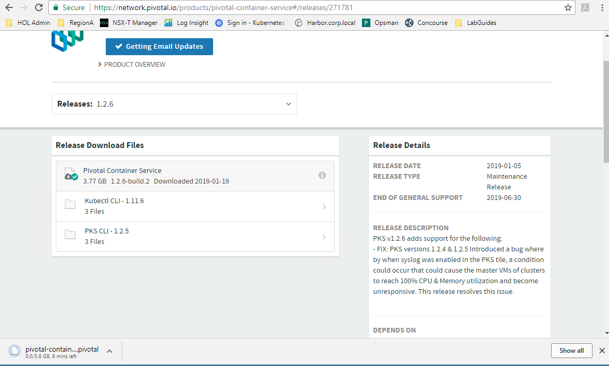</details><br>

4.2 Click on `Kubectl CLI - 1.11.6`

<details><summary>Screenshot 4.2</summary></details><br>

4.3 Click on `Kubectl 1.11.6 - Linux`

<details><summary>Screenshot 4.3</summary></details><br>

4.4 Click browser `Back` button and then `PKS CLI - 1.2.5`

<details><summary>Screenshot 4.4</summary>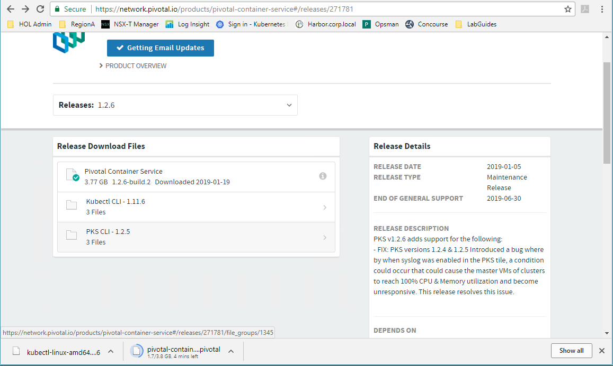</details><br>

4.5 Click `PKS CLI - Linux`

<details><summary>Screenshot 4.5</summary></details><br>

4.6 Scroll down and click on the `97.43` stemcell link in the Release Details pane

<details><summary>Screenshot 4.6</summary></details><br>

4.7 Click on `Ubuntu Xenial Stemcell for vSphere 97.43`

<details><summary>Screenshot 4.7</summary></details><br>

## Step 5: Upgrade PKS Tile

5.1 From the Opsman dashboard, click on `Import Product`

<details><summary>Screenshot 5.1</summary></details><br>

5.2 Click on `New Volumes (E:)` -> `Downloads` and then sort by `Date modfied`

<details><summary>Screenshot 5.2</summary></details><br>

5.3 Select `pivotal-container-service-1.2.6-build.2.pivotal` and click on `Open`

_NOTE: It can take a while for the tile to import, based on lab environment._

<details><summary>Screenshot 5.3.1</summary></details>

<details><summary>Screenshot 5.3.2</summary>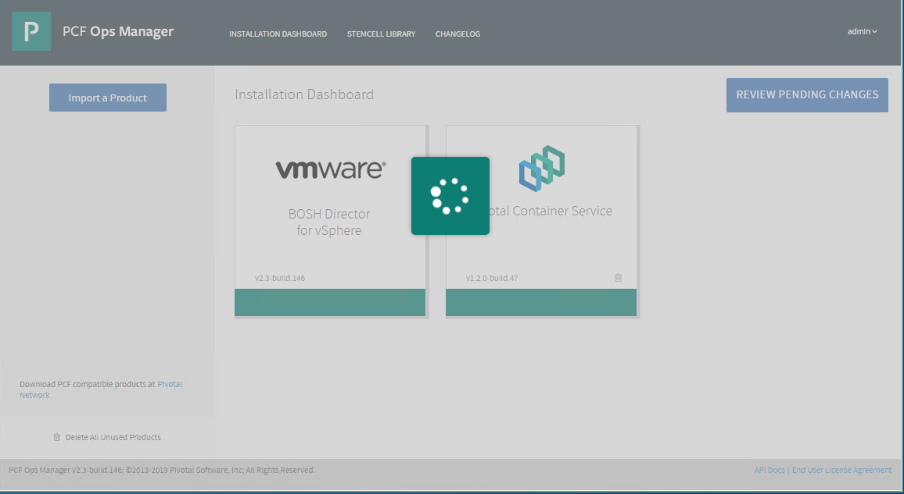</details><br>

5.4 Click on the `+` symbol in the left pane, next to the PKS tile you just imported

<details><summary>Screenshot 5.4</summary>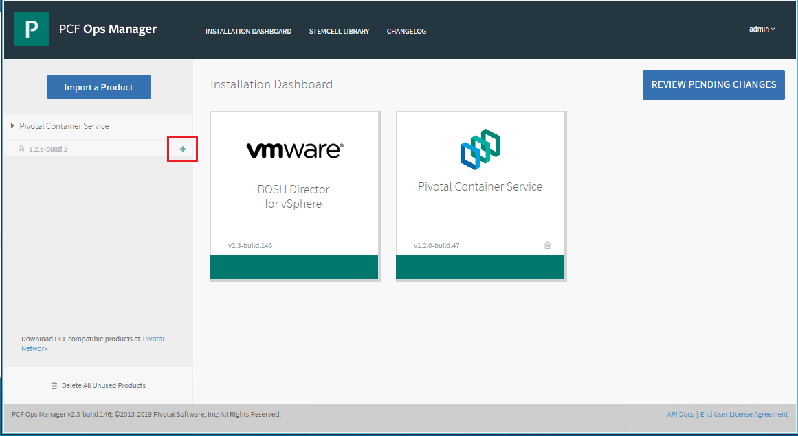</details><br>

5.5 Click on `Missing stemcell` in the added PKS tile

<details><summary>Screenshot 5.5</summary></details><br>

5.6 Click on `Import Stemcell`

<details><summary>Screenshot 5.6</summary>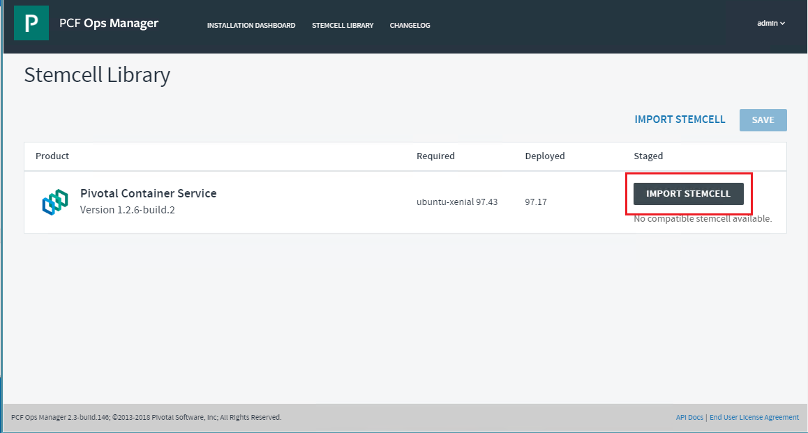</details><br>

5.7 Select `bosh-stemcell-97.43-vsphere-esxi-ubuntu-xenial-go_agent.tgz` and click `Open`

<details><summary>Screenshot 5.7</summary></details><br>

5.8 Apply the stemcell to `Product: Pivotal Container Service v1.2.6-build.2`

_NOTE: You will probably have the option to apply to Harbor, based on which labs you have completed. You can apply this only to PKS to save time_

<details><summary>Screenshot 5.8</summary></details><br>

5.9 Click on `Installation Dashboard`

<details><summary>Screenshot 5.9</summary></details><br>

5.10 Clcik on `Review Pending Changes`

<details><summary>Screenshot 5.10</summary>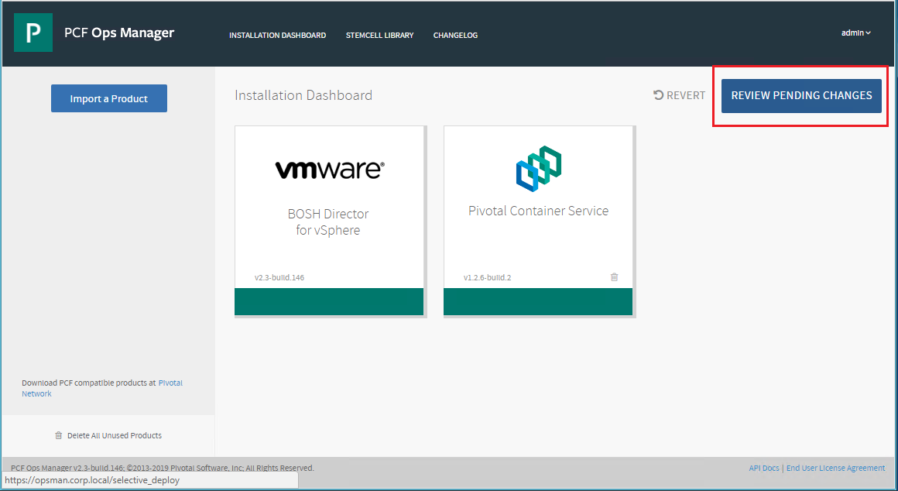</details><br>

5.11 If there are other tiles installed (e.g. Hrabor), clear the check box for them. Click `Apply Changes` and continue to the next step

<details><summary>Screenshot 5.11.1</summary></details>
<details><summary>Screenshot 5.11.2</summary></details><br>

## Step 6: Upgrade CLI Tools

In this section, you will copy the updated pks and kubectl CLI tools to your CLI VM. When you upgrade a PKS version, you are upgrading your Kubernetes and PKS API versions. This requires an update to the CLI tools you use to interact with the services. You will use the Putty pscp utility to copy the downloaded files to the cli-vm

6.1 From the ControlCenter desktop, open a Windows command prompt

<details><summary>Screenshot 6.1</summary></details><br>

6.2 Execute the following command to update the `pks` cli tool

```
pscp E:\Downloads\pks-linux-amd64-1.2.5-build.5 root@cli-vm.corp.local:/usr/local/bin/pks
```
<details><summary>Screenshot 6.2</summary></details><br>

6.3 Type `y` and `Enter` to accept the cli-vm key signature

<details><summary>Screenshot 6.3</summary></details><br>

6.4 From the ControlCenter command prompt, execute the following command to update the `kubectl` cli tool

```
pscp E:\Downloads\kubectl-linux-amd64-1.11.6 root@cli-vm.corp.local:/usr/local/bin/kubectl
```

<details><summary>Screenshot 6.4</summary></details><br>

## Step 7: Verify  Upgrade

7.1 Check on the Opsman deployment of the PKS update and ensure that it has completed successfully. Click on `Return to Dashboard`. Notice the upgraded versions of the BOSH and PKS tiles.

_NOTE: If you only uprgaded PKS, BOSH tile will have a different varion than the image below._

<details><summary>Screenshot 7.1.1</summary>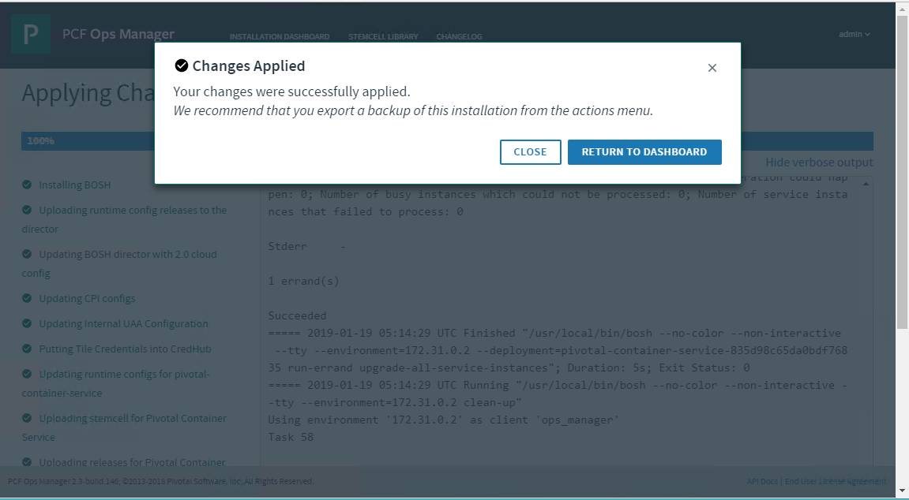</details>
<details><summary>Screenshot 7.1.2</summary>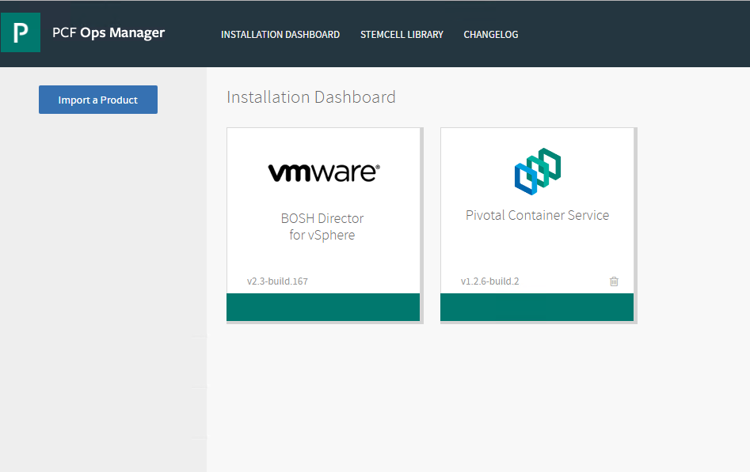</details><br>

7.2 Open a `Putty `session to `cli-vm` (if it's not already open). Submit the command `kubectl get nodes` to view the upgraded version of your kubernetes cluster

_NOTE: If you receive an error, log back into to PKS controller and submit the get-credentials command for your cluster. (e.g. `pks login -a pks.corp.local -u pks-admin -p VMware1! --skip-ssl-validation` -> `pks get-credentials my-cluster`)_

7.3 Observe the upgraded version of Kubernetes with the `kubectl get nodes` command. You should see that you've upgraded your Kubernetes clusters from 1.11.2 to 1.11.6.

<details><summary>Screenshot 7.3</summary>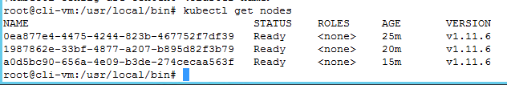</details><br>


## Summary

You have successfully upgraded the PKS and Kuberbetes environment. The PKS control plane is now updated and the Kubernetes clusters are running secured, validated, and updated versions of Linux and Kubernetes. Your replica set pods continued to run throughout the upgrade as a result of the BOSH canary upgrade process. You should be enabled to apply the above process to upgrading any version of PKS.

At the time this guide was written, PKS 1.3.0 was released. You can follow the upgrade procedures above to continue an upgrade to PKS v1.3.0.
