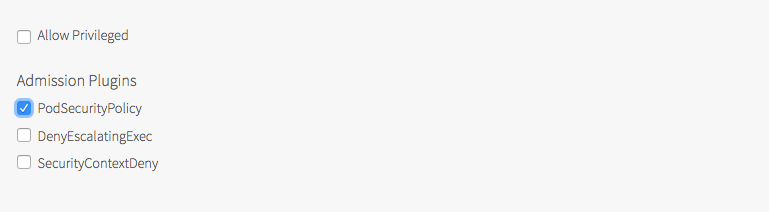

# POD Security Policies


### Introduction
Pod Security Policy is a cluster level resource that controls the security aspects if a POD specifcation by defining a set of conditions that a POD must run in orider to be accepted into the system. The following can be control by an administrator.

|Control Aspect | Field Names|
|---------------|------------|
|Running of privileged containers|	privileged|
|Usage of host namespaces|	hostPID, hostIPC|
|Usage of host networking and ports|	hostNetwork, hostPorts|
|Usage of volume types|	volumes|
|Usage of the host filesystem|	allowedHostPaths|
|White list of Flexvolume drivers|	allowedFlexVolumes|
|Allocating an FSGroup that owns the pod’s volumes|	fsGroup|
|Requiring the use of a read only root file system|	readOnlyRootFilesystem|
|The user and group IDs of the container|runAsUser, runAsGroup, supplementalGroups|
|Restricting escalation to root privileges|	allowPrivilegeEscalation, defaultAllowPrivilegeEscalation|
|Linux capabilities|	defaultAddCapabilities, requiredDropCapabilities, allowedCapabilities|
|The SELinux context of the container|	seLinux|
|The Allowed Proc Mount types for the container|	allowedProcMountTypes|
|The AppArmor profile used by containers|	annotations|
|The seccomp profile used by containers|	annotations|
|The sysctl profile used by containers|	annotations|


### RBAC
RBAC is a standard Kubernetes authorization mode, and can easily be used to authorize use of policies.

RBAC API has 4 top level Types
1. Role
    Role: Grant access to resources within a single namespace
    
    ```yaml
    apiVersion: rbac.authorization.k8s.io/v1
    kind: Role
    metadata:
      namespace: default
      name: pod-reader
    rules:
    - apiGroups: [""] # "" indicates the core API group
      resources: ["pods"]
      verbs: ["get", "watch", "list"]
    ```
2. ClusterRole

    ClusterRole: Same as roles +
    a. cluster-scoped resources (like nodes)
    b. non-resource endpoints (like “/healthz”)
    c. namespaced resources (like pods) across all namespaces (needed to run kubectl get pods --all-namespaces, for example)
    
    The following ClusterRole can be used to grant read access to secrets in any particular namespace, or across all namespaces (depending on how it is bound):
    ```yaml
    apiVersion: rbac.authorization.k8s.io/v1
    kind: ClusterRole
    metadata:
    # "namespace" omitted since ClusterRoles are not namespaced
    name: secret-reader
    rules:
    - apiGroups: [""]
    resources: ["secrets"]
    verbs: ["get", "watch", "list"]
    ```
3. RoleBinding

    A role binding grants the permissions defined in a role to a user or set of users. It holds a list of subjects (users, groups, or service accounts), and a reference to the role being granted. Permissions can be granted within a namespace with a RoleBinding, or cluster-wide with a ClusterRoleBinding. 
    A RoleBinding may reference a Role in the same namespace. The following RoleBinding grants the “pod-reader” role to the user “jane” within the “default” namespace. This allows “jane” to read pods in the “default” namespace.
    *roleRef* is how you will actually create the binding. The *kind* will be either *Role* or *ClusterRole*, and the name will reference the name of the specific *Role* or *ClusterRole* you want. In the example below, this RoleBinding is using *roleRef* to bind the user “jane” to the *Role* created above named *pod-reader*
      ```yaml
      apiVersion: rbac.authorization.k8s.io/v1
      # This role binding allows "jane" to read pods in the "default" namespace.
      kind: RoleBinding
      metadata:
        name: read-pods
        namespace: default
      subjects:
      - kind: User
        name: jane # Name is case sensitive
        apiGroup: rbac.authorization.k8s.io
      roleRef:
        kind: Role #this must be Role or ClusterRole
        name: pod-reader # this must match the name of the Role or ClusterRole you wish to bind to
        apiGroup: rbac.authorization.k8s.io
      ```
    A RoleBinding may also reference a ClusterRole to grant the permissions to namespaced resources defined in the ClusterRole within the RoleBinding’s namespace. This allows administrators to define a set of common roles for the entire cluster, then reuse them within multiple namespaces.
    For instance, even though the following RoleBinding refers to a ClusterRole, “dave” (the subject, case sensitive) will only be able to read secrets in the “development” namespace (the namespace of the RoleBinding)

      ```yaml
      apiVersion: rbac.authorization.k8s.io/v1
      # This role binding allows "dave" to read secrets in the "development" namespace.
      kind: RoleBinding
      metadata:
        name: read-secrets
        namespace: development # This only grants permissions within the "development" namespace.
      subjects:
      - kind: User
        name: dave # Name is case sensitive
        apiGroup: rbac.authorization.k8s.io
      roleRef:
        kind: ClusterRole
        name: secret-reader
        apiGroup: rbac.authorization.k8s.io
      ```

4. ClusterRoleBinding

    A ClusterRoleBinding may be used to grant permission at the cluster level and in all namespaces. The following ClusterRoleBinding allows any user in the group “manager” to read secrets in any namespace.

    ```yaml
    apiVersion: rbac.authorization.k8s.io/v1
    # This cluster role binding allows anyone in the "manager" group to read secrets in any namespace.
    kind: ClusterRoleBinding
    metadata:
      name: read-secrets-global
    subjects:
    - kind: Group
      name: manager # Name is case sensitive
      apiGroup: rbac.authorization.k8s.io
    roleRef:
      kind: ClusterRole
      name: secret-reader
      apiGroup: rbac.authorization.k8s.io
    ```

First, a Role or ClusterRole needs to grant access to *use* the desired policies.

```yaml
apiVersion: rbac.authorization.k8s.io/v1
kind: ClusterRole
metadata:
  name: <role name>
rules:
- apiGroups: ['policy']
  resources: ['podsecuritypolicies']
  verbs:     ['use']
  resourceNames:
  - <list of policies to authorize>
```

Then the (Cluster)Role is bound to the authorized user(s)

```yaml
apiVersion: rbac.authorization.k8s.io/v1
kind: ClusterRoleBinding
metadata:
  name: <binding name>
roleRef:
  kind: ClusterRole
  name: <role name>
  apiGroup: rbac.authorization.k8s.io
subjects:
# Authorize specific service accounts:
- kind: ServiceAccount
  name: <authorized service account name>
  namespace: <authorized pod namespace>
# Authorize specific users (not recommended):
- kind: User
  apiGroup: rbac.authorization.k8s.io
  name: <authorized user name>
```

If a RoleBinding (not a ClusterRoleBinding) is used, it will only grant usage for pods being run in the same namespace as the binding. This can be paired with system groups to grant access to run all pods in the namespace

```yaml
# Authorize all service accounts in a namespace:
- kind: Group
  apiGroup: rbac.authorization.k8s.io
  name: system:serviceaccounts
# Or equivalently, all authenticated users in a namespace:
- kind: Group
  apiGroup: rbac.authorization.k8s.io
  name: system:authenticated
```

### Default Pod Security Policies in Enterprise PKS

Enterprise PKS ships with the following default PSPs. Users also have the option to create custom PSPs using the [Kubernetes documentation](https://kubernetes.io/docs/concepts/policy/pod-security-policy/#example).

PSP|Description
----|----------
PKS Privileged| Allows privileged access to pod containers, which allows the container to do almost everything a host can do. See Privileged in the Kubernetes PSP documentation for more information
PKS Restricted|Restricts privileged access to pod containers.
|

In Enterprise PKS, a *pks:restricted* ClusterRole is created by default and it is bound to the *PKS Restricted* PSP. The following rolebinding can be used to bind the *psp:restricted* ClusterRole to a servcie account. The PKS priviliged PSP is not bound to anything by default.

```bash
kubectl create rolebinding <name> --clusterrole psp:restricted --serviceaccount=<namespace>:<serviceaccountname> -n <namespace>
```

NOTE: The most commonly used Kubernetes workloads (*deployment*, *replication controller*, for example) spin up pods using a service account. It is **this** entity that requires the *use* permission on the PSP. Just because the kubectl user has the *use* permission on a PSP does not mean your workload will spin up (unless you are doing simple pod-level workloads using *kubectl run*). To grant a service account *use* permission for a PSP, the user attempting to create the role binding must also have *use* on that PSP.

### Enabling Pod Security Policies
Pod security policy control is implemented as an optional (but recommended) admission controller. PodSecurityPolicies are enforced by enabling the admission controller, but doing so without authorizing any policies will prevent any pods from being created in the cluster. Enterprise PKS allows the enabling of Pod Security Policy admission controller through the PLAN section of the PKS tile configuration, in Ops Manager, as shown in the screenshot below



A Kubernetes cluster created from a plan with the PodSecurilyPolicy option enabled will require cluster users to have a binding that grants **_use_** on an appropriate PSP to deploy pods. Enabling the PodSecurilyPolicy option is a security feature. The design goal is to make the Kubernetes cluster more secure. Once enabled, PodSecurilyPolicy acts on creation and modification of pods in that cluster or namespace, and determines the actions that should be permitted based on the requested security context and the applied PSP.

### Policy Order
In addition to restricting pod creation and update, pod security policies can also be used to provide default values for many of the fields that it controls. When multiple policies are available, the pod security policy controller selects policies according to the following criteria:

1. If any policies successfully validate the pod without altering it, they are used.
2. If it is a pod creation request, then the first valid policy in alphabetical order is used.
3. Otherwise, if it is a pod update request, an error is returned, because pod mutations are disallowed during update operations.


### Configuring the pks-restricted PSP for Developers to Use with PKS
#### Define the PSP
The first step is to define the PSP. Enterprise PKS provides the PSP named pks-*restricted* for general development work in Kubernetes. To onboard cluster users (developers), the best practice is to start with the pks-resricted PSP.

NOTE: When PSP are enabled, unless the user or the service account the user is associated to is bound to a PSP, this user will not be able to run workloads.

To view the pks-restricted PSP, run the following command:

```bash
kubectl get psp pks-restricted -o yaml
```

#### Create the Cluster Role
The following ClusterRole grants permission to use the pks-restricted PSP resource. You can use this role for onboarding cluster users and granting them cluster access.

```yaml
kind: ClusterRole
apiVersion: rbac.authorization.k8s.io/v1
metadata:
  name: psp:restricted 
rules:
- apiGroups:
  - extensions
  resources:
  - podsecuritypolicies
  resourceNames:
  - pks-restricted # the psp we are giving access to
  verbs:
  - use
```

#### Create the Cluster Role Binding
For onboarding cluster users, you have two options based on the mode of authentication you have chosen for PKS: internal or external. Internal authentication uses a service account mechanism for role binding, such as *SERVICE-UUID-cluster-admin*, for example. External authentication uses the OpenID Connect (OIDC) identity provider to interface with an external system such as LDAP or AD. In this case the role binding references the user or group name.

Here is an example *ClusterRoleBinding* that binds service account users to the the *psp:restricted* ClusterRole, which provides permissions to use the pks-restricted PSP.

```yaml
apiVersion: rbac.authorization.k8s.io/v1
kind: ClusterRoleBinding
metadata:
  name: psp:restricted
roleRef:
  apiGroup: rbac.authorization.k8s.io
  kind: ClusterRole # Must be Role or ClusterRole
  name: psp:restricted # The name of the ClusterRole to bind to
subjects:
  - kind: ServiceAccount
    name: cluster-user
```

Here is an example ClusterRoleBinding that binds an externally authenticated user named jane to the the psp:restricted ClusterRole, which provides permissions to use the pks-restricted PSP.

```yaml
apiVersion: rbac.authorization.k8s.io/v1
kind: ClusterRoleBinding
metadata:
  name: psp:restricted
roleRef:
  apiGroup: rbac.authorization.k8s.io
  kind: ClusterRole # This must be Role or ClusterRole
  name: psp:restricted # The name of the ClusterRole to bind to
subjects:
  - kind: User
    name: jane # Name is case sensitive
```

Here is an example ClusterRoleBinding that binds externally authenticated group members to the the psp:restricted ClusterRole, which provides permissions to use the pks-restricted PSP.

```yaml
apiVersion: rbac.authorization.k8s.io/v1
kind: ClusterRoleBinding
metadata:
  name: psp:restricted
roleRef:
  apiGroup: rbac.authorization.k8s.io
  kind: ClusterRole # This must be Role or ClusterRole
  name: psp:restricted # The name of the ClusterRole to bind to
subjects:
  - kind: Group
    name: developers # Name is case sensitive
```

### Administering PSPs, Roles, and RoleBindings
This section lists common kubectl commands for administering and managing PSPs and related objects in Kubernetes.

To view the default PSPs:

```bash
$ kubectl get psp

NAME                PRIV    CAPS   SELINUX    RUNASUSER          FSGROUP     SUPGROUP    READONLYROOTFS   VOLUMES
pks-privileged      true    *      RunAsAny   RunAsAny           RunAsAny    RunAsAny    false            awsElasticBlockStore,azureDisk,azureFile,cephFS,configMap,csi,downwardAPI,emptyDir,fc,flexVolume,flocker,gcePersistentDisk,glusterfs,iscsi,nfs,persistentVolumeClaim,projected,portworxVolume,quobyte,rbd,scaleIO,secret,storageos,vsphereVolume
pks-restricted      false          RunAsAny   MustRunAsNonRoot   MustRunAs   MustRunAs   false            configMap,emptyDir,projected,secret,downwardAPI,persistentVolumeClaim
```

To view the details of a particular PSP:

```bash
$ kubectl describe psp pks-restricted

Name:  pks-restricted

Settings:
  Allow Privileged:                        false
  Allow Privilege Escalation:              false
  Default Add Capabilities:                <none>
  Required Drop Capabilities:              ALL
  Allowed Capabilities:                    <none>
  Allowed Volume Types:                    configMap,emptyDir,projected,secret,downwardAPI,persistentVolumeClaim
  Allow Host Network:                      false
  Allow Host Ports:                        <none>
  Allow Host PID:                          false
  Allow Host IPC:                          false
  Read Only Root Filesystem:               false
  SELinux Context Strategy: RunAsAny
    User:                                  <none>
    Role:                                  <none>
    Type:                                  <none>
    Level:                                 <none>
  Run As User Strategy: MustRunAsNonRoot
    Ranges:                                <none>
  FSGroup Strategy: MustRunAs
    Ranges:                                1-65535
  Supplemental Groups Strategy: MustRunAs
    Ranges:                                1-65535
```

To view the role bindings:
```bash
kubectl get rolebinding
```

To view the cluster role bindings:
```bash
$ kubectl get clusterrolebindings

NAME                                                   AGE
33afec17-7833-456f-b76a-df5a278dcca1-cluster-admin     19d
cluster-admin                                          19d
event-controller                                       19d
fluent-bit                                             19d
```
In the results, the UUID-cluster-admin is a service account.

To view service accounts:
```bash
$ kubectl get sa

NAME                                   SECRETS   AGE
33afec17-7833-456f-b76a-df5a278dcca1   1         19d
default                                1         19d
```

To view the YAML for a cluster role binding:
```bash
$ kubectl get clusterrolebinding 33afec17-7833-456f-b76a-df5a278dcca1-cluster-admin -o yaml

apiVersion: rbac.authorization.k8s.io/v1
kind: ClusterRoleBinding
metadata:
  creationTimestamp: "2019-05-22T20:00:56Z"
  labels:
    generated: "true"
  name: 33afec17-7833-456f-b76a-df5a278dcca1-cluster-admin
  resourceVersion: "143718"
  selfLink: /apis/rbac.authorization.k8s.io/v1/clusterrolebindings/33afec17-7833-456f-b76a-df5a278dcca1-cluster-admin
  uid: 4fcffc90-7ccc-11e9-befb-0050568fc1ef
roleRef:
  apiGroup: rbac.authorization.k8s.io
  kind: ClusterRole
  name: cluster-admin
subjects:
- kind: ServiceAccount
  name: 33afec17-7833-456f-b76a-df5a278dcca1
  namespace: default
  ```

To view a cluster role:
```bash
kubectl get clusterrole cluster-admin
```

To view the YAML for a clusterrole:
```bash
$ kubectl get clusterrole cluster-admin -o yaml

apiVersion: rbac.authorization.k8s.io/v1
kind: ClusterRole
metadata:
  annotations:
    rbac.authorization.kubernetes.io/autoupdate: "true"
  creationTimestamp: "2019-05-21T22:04:54Z"
  labels:
    kubernetes.io/bootstrapping: rbac-defaults
  name: cluster-admin
  resourceVersion: "41"
  selfLink: /apis/rbac.authorization.k8s.io/v1/clusterroles/cluster-admin
  uid: 76f28714-7c14-11e9-94c4-0050568fabb1
rules:
- apiGroups:
  - '*'
  resources:
  - '*'
  verbs:
  - '*'
- nonResourceURLs:
  - '*'
  verbs:
  - '*'
```

#### Create a policy and a pod

1. create namespace psp-example
2. create serviceaccount fake-user in namespace=psp-example
3. Create rolebinding in namepsace=psp-example named=fake-editor with clusterrole=edit and using the serviceaccount=psp-example:fake-user
4. Create a psp with priv=false
5. Create a POD using fake-user => fail
6. Create a role with verb=use, resource=psp and resource-name='psp in 4'
7. create rolebinding fake-user:psp:unprivilidged, role='psp in 4', serviceaccount=fake-user
8. Now create pod with fake-user
9. still cannot cerate pods with priv
10. remember this doesnot let us provision replicasers but deployments.

#### Set up
Set up a namespace and a service account to act as for this example. We’ll use this service account to mock a non-admin user.
```
kubectl create namespace psp-example
kubectl create serviceaccount -n psp-example fake-user
kubectl create rolebinding -n psp-example fake-editor --clusterrole=edit --serviceaccount=psp-example:fake-user
```

To make it clear which user we’re acting as and save some typing, create 2 aliases:
```
alias kubectl-admin='kubectl -n psp-example'
alias kubectl-user='kubectl --as=system:serviceaccount:psp-example:fake-user -n psp-example'

```

### Demo

Navigate to the demo directory. All the commands are run from within the demo directory in this tutorial. It is assumed that you have access to a kubernetes Cluster deployed by Enterprise PKS 1.4+ and you have access to kubeconfig file for the admin user fetched using "pks get-credentials <cluster-name>".

```bash
cd demo
````

Also, verify that you have access to the k8s cluster.

```bash
$ kubectl get nodes
NAME                                   STATUS   ROLES    AGE   VERSION
9f3bded9-598c-460e-bd85-74016135dbbb   Ready    <none>   20d   v1.13.5
b988008a-a0c1-416a-8b7a-3e25a5629b91   Ready    <none>   20d   v1.13.5
df311359-1dc8-4d20-84c2-c64f9bb83170   Ready    <none>   20d   v1.13.5
e2decb39-725d-4d33-a4ed-49a651b586cd   Ready    <none>   20d   v1.13.5
e930dd7c-65d6-4dca-8e0f-d6a0f4cf0fec   Ready    <none>   20d   v1.13.5
```

The first thing we need to create is a service account that will be used to deploy workloads. let's take a look at the service account yaml file.

```yaml
$ cat service-account.yml

---
apiVersion: v1
kind: ServiceAccount
metadata:
  name: demo-sa
```

The name of the service account is *demo-sa*, as seen in the name field.

Issuing following command will create the service account

```bash
$ kubectl apply -f service-account.yml

serviceaccount/demo-sa created
``` 

Next we will create a deployment which deploys a busybox container with 3 replicas

```yaml
$ cat restricted/busybox.yml
---
apiVersion: apps/v1
kind: Deployment
metadata:
  name: busybox
spec:
  selector:
    matchLabels:
      app: busybox
  replicas: 3
  template:
    metadata:
      labels:
        app: busybox
    spec:
      serviceAccountName: demo-sa
      containers:
      - name: busybox
        image: busybox
        command: [ "sh", "-c", "while true; do echo $(hostname) v1; sleep 60; done" ]
        securityContext:
          runAsUser: 500
```

Couple of things to note here:

1. The spec section describes that this deployment is bound to the *demo-sa* service account we created earlier. So this deployment will use demo-sa to provision pods.
2. Under securityContext, the user the POD will be running as 500 so this does not need privilidged access


Next we will create the deployment and check the deployment status.

```bash
$ kubectl apply -f restricted/busybox.yml

deployment.apps/busybox created

```

```yaml
$ kubectl describe deployment

Name:                   busybox
Namespace:              default
CreationTimestamp:      Mon, 10 Jun 2019 19:29:27 -0700
Labels:                 <none>
Annotations:            deployment.kubernetes.io/revision: 1
                        kubectl.kubernetes.io/last-applied-configuration:
                          {"apiVersion":"apps/v1","kind":"Deployment","metadata":{"annotations":{},"name":"busybox","namespace":"default"},"spec":{"replicas":3,"sel...
Selector:               app=busybox
Replicas:               3 desired | 0 updated | 0 total | 0 available | 3 unavailable
StrategyType:           RollingUpdate
MinReadySeconds:        0
RollingUpdateStrategy:  25% max unavailable, 25% max surge
Pod Template:
  Labels:           app=busybox
  Service Account:  demo-sa
  Containers:
   busybox:
    Image:      busybox
    Port:       <none>
    Host Port:  <none>
    Command:
      sh
      -c
      while true; do echo $(hostname) v1; sleep 60; done
    Environment:  <none>
    Mounts:       <none>
  Volumes:        <none>
Conditions:
  Type             Status  Reason
  ----             ------  ------
  Progressing      True    NewReplicaSetCreated
  Available        False   MinimumReplicasUnavailable
  ReplicaFailure   True    FailedCreate
OldReplicaSets:    <none>
NewReplicaSet:     busybox-69875b5488 (0/3 replicas created)
Events:
  Type    Reason             Age   From                   Message
  ----    ------             ----  ----                   -------
  Normal  ScalingReplicaSet  78s   deployment-controller  Scaled up replica set busybox-69875b5488 to 3
```

As you can see from the deployment, 0/3 replicas have been created. Let's take a deeper look by looking at the replica set. You can fetch the replica set id from the output from the previod command

```yaml
$ kubectl describe rs busybox-69875b5488
Name:           busybox-69875b5488
Namespace:      default
Selector:       app=busybox,pod-template-hash=69875b5488
Labels:         app=busybox
                pod-template-hash=69875b5488
Annotations:    deployment.kubernetes.io/desired-replicas: 3
                deployment.kubernetes.io/max-replicas: 4
                deployment.kubernetes.io/revision: 1
Controlled By:  Deployment/busybox
Replicas:       0 current / 3 desired
Pods Status:    0 Running / 0 Waiting / 0 Succeeded / 0 Failed
Pod Template:
  Labels:           app=busybox
                    pod-template-hash=69875b5488
  Service Account:  demo-sa
  Containers:
   busybox:
    Image:      busybox
    Port:       <none>
    Host Port:  <none>
    Command:
      sh
      -c
      while true; do echo $(hostname) v1; sleep 60; done
    Environment:  <none>
    Mounts:       <none>
  Volumes:        <none>
Conditions:
  Type             Status  Reason
  ----             ------  ------
  ReplicaFailure   True    FailedCreate
Events:
  Type     Reason        Age                   From                   Message
  ----     ------        ----                  ----                   -------
  Warning  FailedCreate  72s (x16 over 3m56s)  replicaset-controller  Error creating: pods "busybox-69875b5488-" is forbidden: unable to validate against any pod security policy: []
  ```

As you can see, the events are showing us that the creation of pods failed by the replicaset as there was no POD security policy associated with the service account that is used to created this deployment. As mentioned before, most Kubernetes pods are not created directly by users. Instead, they are typically created indirectly as part of a Deployment, ReplicaSet, or other templated controller via the controller manager. Granting the controller access to the policy would grant access for all pods created by that controller, so the preferred method for authorizing policies is to grant access to the pod’s service account.

Before we continue, let's cleanup the current deployment.
```bash
$ kubectl delete -f restricted/busybox.yml

deployment.apps "busybox" deleted
```

So to make this work, we need to have a PSP. Then create a Cluster Role to attach this ClusterRole to the PSP and then create a RoleBinding to attach the ClusterRole to a ServiceAccount.

PSP => Cluster Role (PSP) => RoleBinding (Cluster Role, Service Account)

The *pks-restrictive* psp is created by default. The ClusterRole named *psp:restricted* is also created and bound to *pks-restrictive* psp by default. The only things left to do is create the RoleBinding to associate the ClusterRole to our Service Account named *demo-sa*.

You can check the already created ClusterRole using the command below. Note that under rules->apiGroups->resourceNames the *pks-restricted* psp is specified and it has *use* permissions under verbs.

```yaml
$ kubectl get clusterrole psp:restricted -o yaml

apiVersion: rbac.authorization.k8s.io/v1
kind: ClusterRole
metadata:
  annotations:
    kubectl.kubernetes.io/last-applied-configuration: |
      {"apiVersion":"rbac.authorization.k8s.io/v1","kind":"ClusterRole","metadata":{"annotations":{},"name":"psp:restricted"},"rules":[{"apiGroups":["extensions"],"resourceNames":["pks-restricted"],"resources":["podsecuritypolicies"],"verbs":["use"]}]}
  creationTimestamp: "2019-05-21T22:05:50Z"
  name: psp:restricted
  resourceVersion: "60"
  selfLink: /apis/rbac.authorization.k8s.io/v1/clusterroles/psp%3Arestricted
  uid: 98120ea6-7c14-11e9-a2fc-0050568f5d45
rules:
- apiGroups:
  - extensions
  resourceNames:
  - pks-restricted
  resources:
  - podsecuritypolicies
  verbs:
  - use
  ```

Let's see the RoleBinding we will create.

```yaml
$ cat restricted/role-binding.yml
---
apiVersion: rbac.authorization.k8s.io/v1
kind: RoleBinding
metadata:
  name: psp:demo-psp-restricted
roleRef:
  apiGroup: rbac.authorization.k8s.io
  kind: ClusterRole
  name: psp:restricted
subjects:
- kind: ServiceAccount
  name: demo-sa
  namespace: default
```

As you can see, the RoleBinding is associating the ClusterRole *psp:restricted* to Service Account *demo-sa*.

Let's create this RoleBinding
```bash
$ kubectl apply -f restricted/role-binding.yml

rolebinding.rbac.authorization.k8s.io/psp:demo-psp-restricted created
```


Now that we have everything in place, let's recreate the deployment

```bash
$ kubectl apply -f restricted/busybox.yml

deployment.apps/busybox created
```

Checking the deployment status shows us that the deployment has 3 ready PODs implying that the deployment is running succesfully!

```bash
$ kubectl get deployments
NAME      READY   UP-TO-DATE   AVAILABLE   AGE
busybox   3/3     3            3           13s

$ kubectl get pods
NAME                       READY   STATUS    RESTARTS   AGE
busybox-69875b5488-4b78l   1/1     Running   0          2m30s
busybox-69875b5488-84lm6   1/1     Running   0          2m30s
busybox-69875b5488-pvwsj   1/1     Running   0          2m30s

```

Now we will run something that requires little bit more privilidge than this. We have an nginx container to showcase that.


