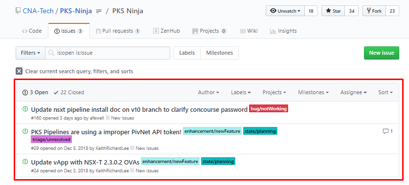
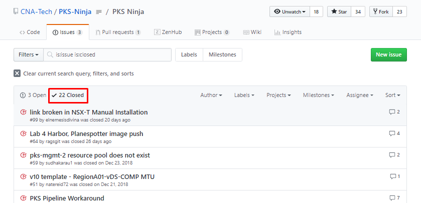
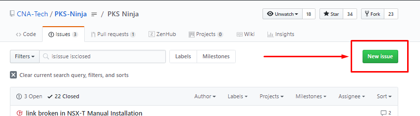
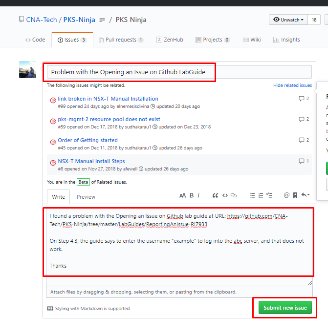

# Opening an Issue on Github

**Note: Always include the URLs for any pages impacted in your ticket**

If you find any problems or suggestions for improvement on this site, please open an issue ticket on github describing your issue or suggestion.

If you encounter a problem going through a lab guide and you arent sure if there is a problem in the lab guide or if you may have just made a mistake, it's best to try the slack channel for the best response, however you can open a github issue for any sort of issue you encounter, including if you need help completing an exercise.

Github issues are also used for any sort of suggestion you may have, it's very simple to open an issue, per the instructions below.

## Instructions

Before you open an issue, please take a moment to look at the issues that are already open to help avoid duplicates

1.1 Open a web browser to [any page on the PKS Ninja Github site](https://github.com/CNA-Tech/PKS-Ninja) and click on the `Issues` tab

Screenshot 1.1

 

1.2 On the issues page review the open tickets to avoid opening a duplicate issue. On the toolbar, click the `Closed` button to review closed tickets. In many cases the answer to your issue may have already been resolved in closed tickets so it is valuable to check.

Screenshot 1.2.1

Screenshot 1.2.2

 

1.3 From the `Issues` tab, click on `New Issue`

Screenshot 1.3

 

1.4 Enter a descriptive title, explain your issue or suggestion, include the URLs of any pages related to your issue in the body of the message, and click `Submit new issue`

Screenshot 1.4

 

**Thank you for opening an issue! There are no further steps in this exercise**
