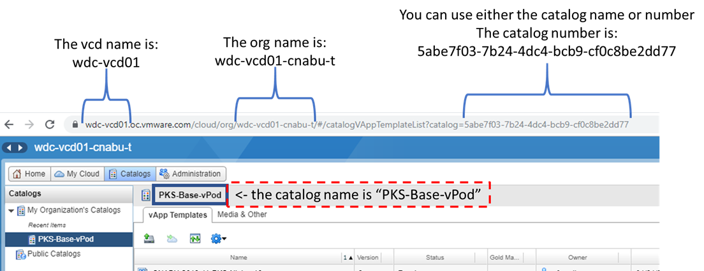
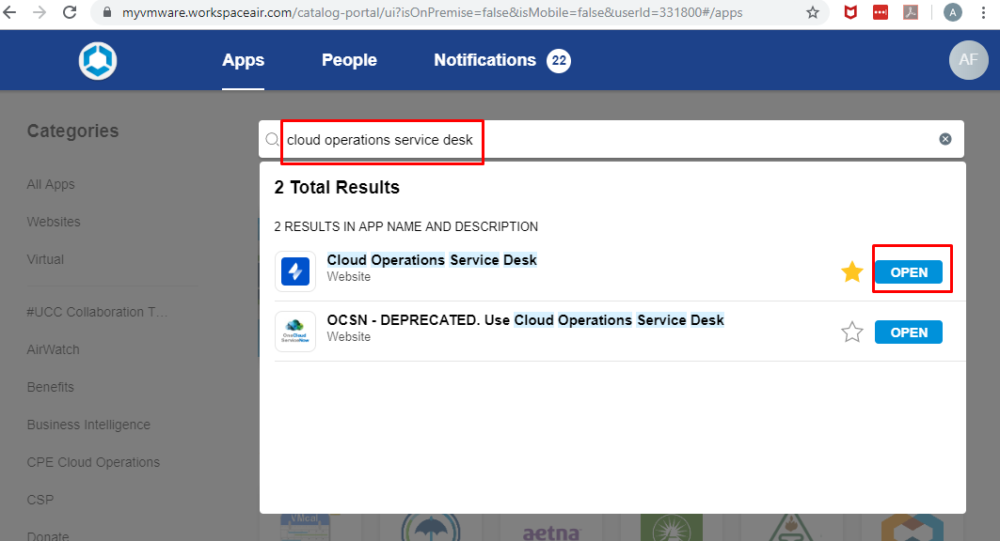
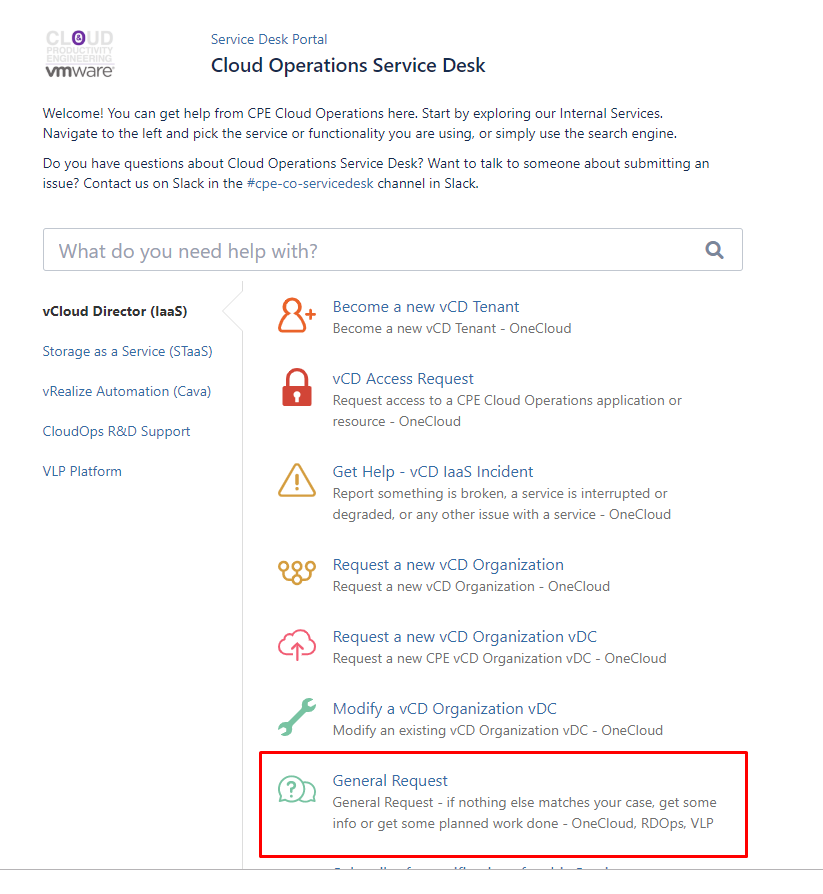

# Transferring a vApp Template to your Onecloud Org

- [Transferring a vApp Template to your Onecloud Org](#transferring-a-vapp-template-to-your-onecloud-org)
  - [Overview](#overview)
    - [Understanding the build and transfer process](#understanding-the-build-and-transfer-process)
    - [Step 1: Check to confirm that a template build is complete](#step-1-check-to-confirm-that-a-template-build-is-complete)
    - [Step 2: Check to see if the transfer has already been requested or in progress](#step-2-check-to-see-if-the-transfer-has-already-been-requested-or-in-progress)
    - [Step 3: Open a Github Issue Ticket to Request a Template Transfer](#step-3-open-a-github-issue-ticket-to-request-a-template-transfer)
    - [Step 4: Initiate a template transfer](#step-4-initiate-a-template-transfer)
      - [Step 4.1: Identify the source details for the template transfer](#step-41-identify-the-source-details-for-the-template-transfer)
      - [Step 4.2 Identify the Destination Details for the template transfer](#step-42-identify-the-destination-details-for-the-template-transfer)
      - [Step 4.3: Opening a Transfer Ticket](#step-43-opening-a-transfer-ticket)
      - [Step 4.4 Initiate a manual template transfer](#step-44-initiate-a-manual-template-transfer)

<small><i><a href='http://ecotrust-canada.github.io/markdown-toc/'>Table of contents generated with markdown-toc</a></i></small>


## Overview
If you are trying to access a vApp template from your onecloud org and do not find the template you are looking for, you can check to see if the template transfer is in progress already, or help by opening a github issue ticket to raise a request for a transfer, or you can help initiate the template transfer by opening a ticket with the Cloud Operations Service Desk or Initiating a Manual Transfer.

### Understanding the build and transfer process
Whenever a new template build is completed, the project lead for the sprint should ensure a transfer is initiated to the following orgs to enable access from Field Enablement Labs and from VLP tenants including Quick Demo and Hosted-eval. 

```text
Destination 1:
destination vcd: vcore2-us04.oc.vmware.com
destination organization: us04-2-fel-d

Destination 2: 
destination vcd: vcore2-us24.oc.vmware.com
destination organization: us24-2-fel-d
```

The above transfer should be part of any milestone/sprint that results in a new build of any template. 

There are a number of other onecloud orgs that people may want to transfer templates to, it is not difficult to schedule a template transfer, but at build time the admin completing the build can easily be overwhelmed by the large number of template transfers that are often desired. 

This document serves to help distribute the load of template transfer requests, and will provide instructions so that anyone can open a github issue to request a template transfer, and any VMware employee can through self-service request a template transfer. Unfortunately at this time, only VMware employees have access to the interfaces required to open template transfer tickets or attempt a manual template transfer, but non-vmware participants can still help bring attention to a transfer need by opening a github issue ticket to request a transfer.

### Step 1: Check to confirm that a template build is complete

**Note: if you are looking for a template you know is already complete but is not available in your onecloud org, you can skip to the next step**

If you are waiting on a new template to be ready and are not sure if it the build is complete, please validate that the build is complete before requesting a transfer. 

Every time a new template update is in planning or in progress, the project lead should first complete a project board to track the activities related to the milestone/sprint. Please check the [Projects Page](https://github.com/CNA-Tech/PKS-Ninja/projects) to find the project board related to the template build you are looking for. For example you can review the project board for [Milestone 6425](https://github.com/CNA-Tech/PKS-Ninja/projects/7) and review the `Builds Completed` column. If the template you are looking for is in the `Builds Completed` column, the build should be completed and ready to initiate template transfer. 

If you are seeking to access the template via FEL or the VLP quick demo or hosted-eval tenants, this transfer should always be part of the milestone/sprint that produced the builds. You can review the project board for the milestone, for example the [Milestone 6425 Project Board](https://github.com/CNA-Tech/PKS-Ninja/projects/7) and should see there if the transfer is in progress or complete. If you see a transfer in the `Transfers Complete` column but still cannot access it through FEL or VLP QD or Hosted eval tenants, please open a github issue ticket explaining the problem. 

If your build is complete and you would like to access it on another onecloud org, please proceed to the next step. 

### Step 2: Check to see if the transfer has already been requested or in progress

If you are trying to find the template on any onecloud org other than us04-2-fel-d or us24-2-fel-d and cannot find the template, someone else may have requested or initiated the transfer and it may be in-progress.

First, check the [PKS Ninja vApp Template Transfers & COSD Ticket Tracker](https://github.com/CNA-Tech/PKS-Ninja/projects/6) board on the PKS-Ninja github repo. While template transfers should be tracked on this board, it is possible that someone may have opened a transfer ticket without placing it on this board so please check the following items if you do not see the transfer you want listed on this board.

Next, check the open issue tickets and search or scan through all tickets. Its best to start by looking for the label for the specific template you would like to request a transfer for, as tickets should be labeled and this should make it easy to find related tickets and transfer requests. But please keep in mind many people who submit issue tickets do not have permissions to apply labels to their tickets, so it is possible that a ticket has been submitted but not yet labeled, so please scan through all open tickets or do keyword searches to verify there is not already an open github issue ticket requesting the transfer. 

If you do find an open issue ticket requesting a transfer of the template you want to your onecloud org, please open and review the ticket to determine ticket state. It is possible someone opened the ticket to request a transfer, but was not able to initiate the transfer process. If a ticket is in this state, if you are a VMware employee you can initiate the transfer yourself to accelerate access to the templatem per the instructions in this document. 

If you find a ticket and review the notes you may see that a ticket has already been opened with the Cloud Operations Service Desk (COSD), or a manual template transfer has been initiated. If a COSD ticket has already been opened for the transfer, the link to review the ticket status should be included in the github issue ticket, and VMware employees should be able to open the ticket to view notes. If a manual transfer has been initiated and the notes in the github issue ticket indicate that the manual template transfer was initiated more than 2 days in the past, you can reach out to the user who initiated the transfer or it may help accelerate the process to open a COSD ticket to let them know there may be a problem with the manual template transfer.

### Step 3: Open a Github Issue Ticket to Request a Template Transfer

The first step in requesting a template transfer is always to open an issue ticket on the [PKS-Ninja repo issues page](https://github.com/CNA-Tech/PKS-Ninja/issues). Please do this even if you plan to initiate the template transfer yourself, it is important that there is a Issue ticket visible on the PKS-Ninja repository so that any participant can clearly see if a template transfer has been requested or in progress.

Please include as much detail as possible about the destination onecloud org and catalog you would like the template transferred to. The template below shows all the values that are typically needed about a destination onecloud org in order for COSD to transfer the template (Including example values), or to manually initiate a template transfer:

```text
destination vcd: vcore3-us01-oc-vmware.com
destination organization: Sandbox-NASA
destination catalog: US01 - Sandbox NASA - Internal
destination template name: PKS-v12-Windows-0.3
```

If you do not have all these details, at minimum please include the complete URL string you access for your onecloud org, for example:

`https://wdc-vcd01.oc.vmware.com/cloud/org/wdc-vcd01-cnabu-t/#/orgUserHome?`

If possible, please label your issue with the appropriate labels, which at minimum shoudl include the label for the template name that you want to transfer. Not everybody has sufficient permissions in the github repo to apply labels, if you would like to get permissions to apply labels to issue, please complete the [Creating your Student Folder](https://github.com/CNA-Tech/PKS-Ninja/tree/Pks1.4/LabGuides/CreateStudentFolder-SF6361) exercise and then open a github issue ticket requesting that your account be given triage level permissions in the repo. You do not need any special qualification to be given triage level permissions other than completing this exercise. 

If you do have permission to apply labels to your issue, please also associate the github issue with the [PKS Ninja vApp Template Transfers & COSD Ticket Tracker](https://github.com/CNA-Tech/PKS-Ninja/projects/6) project and ensure you place the issue ticket in the appropriate column as you proceed through template transfer steps below.

### Step 4: Initiate a template transfer

The remaining steps in this document can only be completed by VMware employees. If you are a VMware employee, you can access a [video overview of this process here](https://vmware.hosted.panopto.com/Panopto/Pages/Viewer.aspx?id=66c97892-e82f-4638-8649-aa8f01827968).

If you validate per the steps above that a transfer has not already been initiated and you are a VMware employee, you may initiate the template transfer yourself per the steps below. 

Prior to initiatiting a template transfer, please ensure that a github issue ticket has been opened on the PKS-Ninja repo, so that others can see your activities and track status. If you open a COSD ticket to transfer status, please update the PKS-Ninja repo github issue ticket for the transfer with the COSD ticket number. If you initiate a manual template transfer, please update the PKS-Ninja github issue ticket with the details of the template transfer and the date you initiated it - preferably include a screen shot of the manual transfer screen to ensure all details are available for anyone who needs to follow up on the transfer. 

You can choose to open a ticket to have the template transferred or to initiate a manual template transfer. Opening a ticket is a little easier and is a more reliable processes, however it may be slower to transfer as the ticket will have to wait until a resource is assigned to initiate a transfer. Opening a manual template transfer can be the fastest method, assuming there are no issues encountered during the transfer - this method may end up being slower if you encounter issues as you will have to monitor the transfer status to identify if there are issues and then initiate corrective actions. A 3rd option could be to manually initiate a template transfer, and then open a ticket if you encounter problems. There is no one best method, use your discretion to determine which option looks best for you.

In either case you will need to identify the source and destination details per the instructions below, and then you can proceed to either the `Opening a Transfer Ticket` or the `Initiate a manual template transfer` sections below.

#### Step 4.1: Identify the source details for the template transfer

To initiate a template transfer whether you open a ticket with COSD or initiate a manual transfer, you need to identify the details for the source and destination of the transfer. 

All currently valid PKS-Ninja templates should be accessible in the `wdc-vcd01` vcd, in the `wdc-vcd01-cnabu-t` org and are typically saved in the `PKS-Base-vPod` catalog, unless otherwise indicated. When you request a transfer, you will need the exact name of the file as it is saved in the source catalog, which should be included in the release notes for your build. 

Please see the following template which identifies the source location of currently available templates:

```text
source vcd: wdc-vcd01
source organization: wdc-vdc01-cnabu-t 
source catalog: PKS-Base vpod
source template: {the name of the template you want transferred}
```

Please note at the time of writing, many templates are saved in the format "CNABU-PKS-Ninja-v12-{templatePostfix}-{templateMajorVersion}.{templateMinorVersion}" and we are transitioning the naming to remove the "CNABU" from the beginning of the template name. There may be templates where the name in the release notes does not match the exact filename of the source template, but we are working to eliminate this issue going forward. If you do run into this issue please reach out on the #PksNinjaLabs slack channel or open an issue ticket. 

#### Step 4.2 Identify the Destination Details for the template transfer

You will need to gather all of the details in the template below to request a transfer:

```text
destination vcd: {enter destination vcd}
destination organization: {enter destination org}
destination catalog: US01 - {enter destination catalog}
destination template name: {enter destination template name - please keep the template name the same as source if possible}
```
If you are unsure about how to find these details, you can open your onecloud interface, navigate to the catalog view where you want the template to be transferred, and find the `vcd`, `org` and catalog in the URL string of the page as shown in the following graphic:



The number one problem that occurs when transferring templates is the destination catalog does not have enough space to store the template, most onecloud users cannot see the utilization or available storage in a given catalog, so you have no choice but to guess and hope there is enough space - but please try to find a catalog with enough space and delete any unused templates in the destination catalog prior to initiating a transfer.

#### Step 4.3: Opening a Transfer Ticket

You can open a ticket with the Cloud Operations Service desk to request a template transfer per the following instructions:

4.3.1 From workspace one, search for and open the link to the `Cloud Operations Service Desk`

<details><summary>Screenshot 4.3.1</summary>

</details>
<br/>

4.3.2 From the Cloud Operations Service Desk homepage, click `General Request`

<details><summary>Screenshot 4.3.2</summary>

</details>
<br/>

4.3.3 Please use the subject line `Template Transfer Request`, and use the boilerplate text below as the body of your message. Please be sure to update this text with the specific details for the template name and source and destination details required for your specific template transfer request. 

As template transfer requests often encounter problems, we recommend opening a single ticket for each template transfer requests so each request can be tracked independently.

```text
Please transfer template "{Full Template Filename}" per the details below:

source vcd: {source vcd}
source organization: {source organization}
source catalog: {source catalog}
source template filename: {source template filename}

destination vcd: {destination vcd}
destination organization: {destination organization}
destination catalog: {destination catalog}
destination template filename: {destination template filename}

Thank you!
```

4.3.4 Please update the gitub issue ticket on the PKS-Ninja repo with the COSD ticket number and the link the the ticket page.

#### Step 4.4 Initiate a manual template transfer

4.4.1 Instructions for initating a manual template transfer can be found at the following link (VMware Employees Only): [https://confluence.eng.vmware.com/display/OCSANDBOX/How+to+do+an+ad-hoc+transfer+of+a+vApp+Template+using+the+CMS+tool](https://confluence.eng.vmware.com/display/OCSANDBOX/How+to+do+an+ad-hoc+transfer+of+a+vApp+Template+using+the+CMS+tool)


