# Docker-Lab
In this lab you will learn some basic commands of Docker to help you understand how to operate Docker as a building block of Kubernetes.

[Getting Started with Docker](#getting-started-with-docker)
[Docker Networking](#docker-networking)
[Docker Image Creation](#docker-image-creation)
[Clean up and Wordpress](#clean-up-and-wordpress)
[Challenge Activity](#challenge-activity)

## Getting Started with Docker

**HOL-2031 Users, Please Complete [HOL POD Prep for PKS Ninja Lab Guides](../HOLPodPrep-HP3631/readme.md) before proceeding. Please note you will not be able to browse the internet from the HOL-2031 lab environment, if any steps require you to browse a public internet site, you will need to do so from a seperate browser tab from your local machine, outside of the HOL lab environment. If there are any steps that require you to download an external file, please follow the instructions provided**

**All v12 templates must complete all steps in the [Enable Harbor Client Secure Connections Lab Guide](https://github.com/CNA-Tech/PKS-Ninja/tree/Pks1.4/LabGuides/HarborCertExternal-HC7212) before proceeding**

IP addresses in this tutorial will change in your environment and you may have to put your correct IP address into the commands for them to work.

Start by opening putty from the control center desktop, launch into cli-vm using the ubuntu@cli-vm saved session. There is no password.

Let's clone a repository that will contain all the code for your labs

```Bash
cd /home/ubuntu
git clone http://gitmir.cloudnativeapps.ninja/CNA-Tech/PKS-Lab.git
```

You can browse the the repository by changing into the directory or by [visiting the site](https://github.com/CNA-Tech/PKS-Lab/). 

Let's start with running a simple container from the PKS Ninja Labs public harbor server:

Run the following command:

`sudo docker run -dit --name my_container harbor.cloudnativeapps.ninja/library/alpine ash`

Enter the password `VMware1!` when prompted. 

This will start a container called my_container running the alpine image with it's shell ash started.  Let's examine the command line:

`-dit : d=detached i=interactive t=tty  this allows us to run commands in the container`

`--name : name of container for easy reference`

`harbor.cloudnativeapps.ninja/library/alpine : the image tag, which is made up of the container registry server ip address (harbor.cloudnativeapps.ninja), project folder (library) and the image name (alpine)`

`ash : parameter to tell it to start the ash shell which gives us the potential of interactivity`

 Note: Alternatively, from any standard docker host with access to docker hub, you could run the command `sudo docker run -dit --name my_container alpine ash` which as you can see does not specify the location of the alpine image. This results in searching [docker hub](hub.docker.com) for the image, which is the default image repository for standard docker engine installations. The HOL-2031 lab environment has restricted internet access and so it will need to access the image from the PKS Ninja Labs public Harbor registry at harbor.cloudnativeapps.ninja 

We can see it as running and get it's container ID with the following command

    docker ps

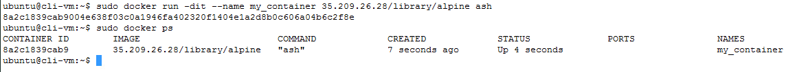

Now it's execute a ping inside this container.

`sudo docker exec -it my_container ping -w3 google.com`

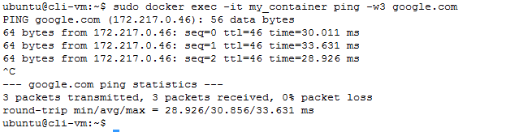

Let's examine this command line:

`-it : i=interactive t=tty this allows us to run commands in the container`

`my_container : user friendly name`

`ping -w3 google.com : send three pings to google.com`

Notice that the output from the ping command is being sent to standard out; in other words, it is being sent outside the container.  This is a key element of 12 factor applications that logging and error should go to standard out.   Having some method to capture this output is critical, otherwise it's lost.  12 factor applications should always log to standard out (console).

Let's review the network settings for our containers.

`sudo docker network ls`


The output shows that we have 3 networks total. Each of these networks represents its own routing domain.  Every container inside a specific network ID has the ability to communicate with each other.   The capability for a container to get outside it's own network is done via source NAT.  You can expose specific container ports on the docker host for external service exposure.   Lets examine the networking for my_container look specifically for the NetworkSettings section

`sudo docker inspect my_container`

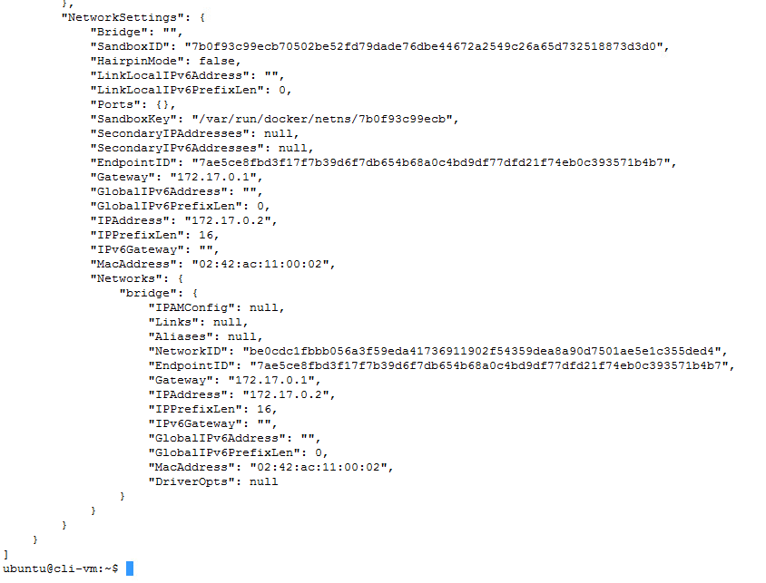

As you can see the container has an assigned IP address with a gateway you should be able to ping this container from your docker host but not the outside world.  Trying pinging the container from your docker host looking for the IPAddress line (mine is 172.17.0.2)

    ping 172.17.0.2

You can end your ping with CTRL-C

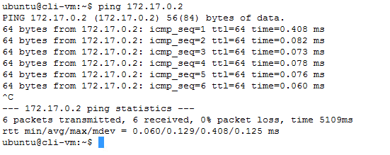

With containers you are able to start and stop them. Let's try stopping my_container:

    sudo docker stop my_container

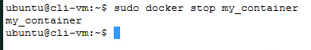

Let's see the status of my_container

    sudo docker ps

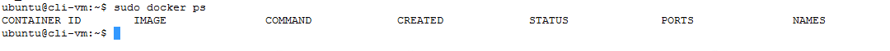

 As you can see my_container is not running.   It is still available and if I tried to create another container called my_container it would fail because it's just not currently running.  You can see all containers with this command:

     sudo docker ps -a

  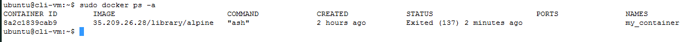

You can restart the container with `docker start my_container` or remove it completely with `docker rm container_id`  in my case I want it running again:

    sudo docker start my_container

  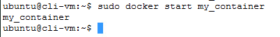

Let's now create a web server container that forwards container port 80 to docker host port 8080 (making port 80 on the container accessable on the real network)  For this we will use a ngnix container.

    sudo docker run -d -p 8080:80 --name my_web_server harbor.cloudnativeapps.ninja/library/nginx

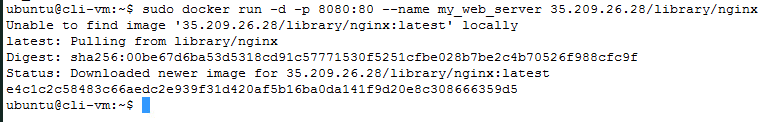

Lets examine this command line

`run : run a container`

`-d : detached`

`-p 8080:80 : expose port 80 on the container via port 8080 on the docker host`

`--name my_web_server : user friendly name of container`

`harbor.cloudnativeapps.ninja/library/nginx : docker image tag with location and image name to use`

Go to the browser and type in the URL: `http://cli-vm:8080` to see if nginx is working.

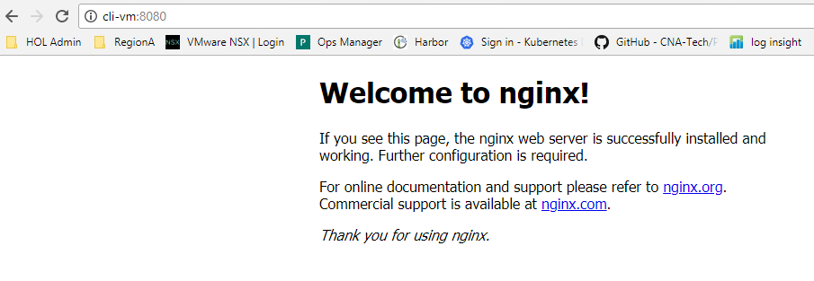

By default both of these containers are connected to the bridge docker network.   (Docker creates three networks when started: bridge, host, none)  Everything inside a network is able to communicate with each other and the host is able to communicate with all.

Let's inspect the bridge network to understand the containers IP addresses

    sudo docker network inspect bridge

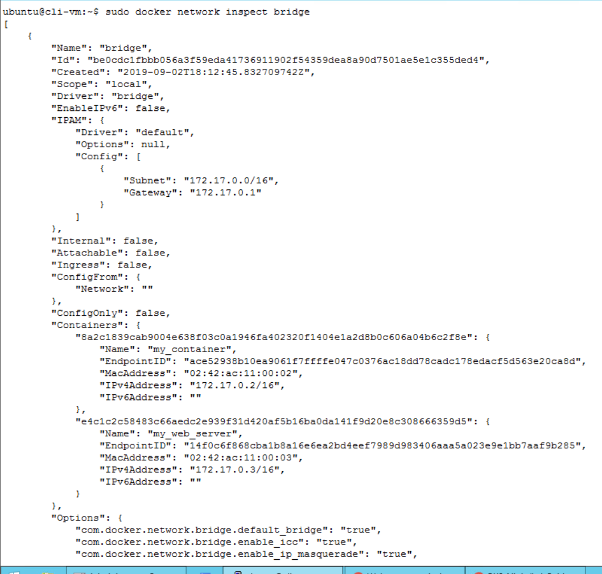

You can see that my_web_server and my_container both have ip addresses in 172.17.0.0/16 (or some other address randomly assigned by your system)

## Docker-Networking
A user defined network has the following characteristics that the default bridge network (bridge) does not have:
 - Containers on the same bridge automatically expose all ports to each other and no ports to outside world
 - Containers on the same bridge can access each other by IP or name/alias
 - Containers can connect and disconnect from user-defined networks on the fly while running
 - Each user defined network has it's own bridge network that can be configured

Let's create a new network for some containers by creating a user defined bridge

    sudo docker network create dev_network

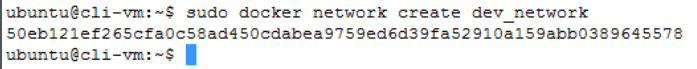

We can list currently created networks with

    sudo docker network ls

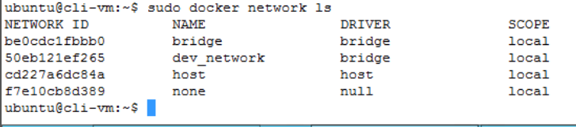

As shown we have now created a new network for docker.   When you create a new network, you create a new bridge.   All containers on the same bridge automatically expose all ports to each other, and no ports to the outside world.   Let's look at the details and compare the networks 'bridge' and 'dev_network':

    sudo docker network inspect bridge

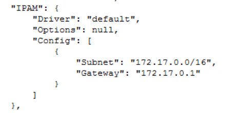

Notice that the default bridge has a subnet of 172.17.0.0/16 (yours may be different) and lots of configurable settings.

Examine dev_network

    sudo docker network inspect dev_network

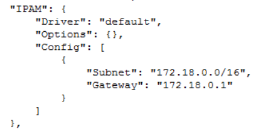

Notice a few differences with the output first it's a different randomly assigned network (172.18.0.0/16 in my case), and it has a default gateway assigned.

Let's test some of the properties of our 'dev_network' by deploying some containers to it:

```Bash
sudo docker run -dit --name ping1 --network dev_network harbor.cloudnativeapps.ninja/library/alpine ash
sudo docker run -dit --name ping2 --network dev_network harbor.cloudnativeapps.ninja/library/alpine ash
```

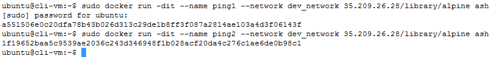

Let's examine the 'dev_network' in detail

    sudo docker network inspect dev_network

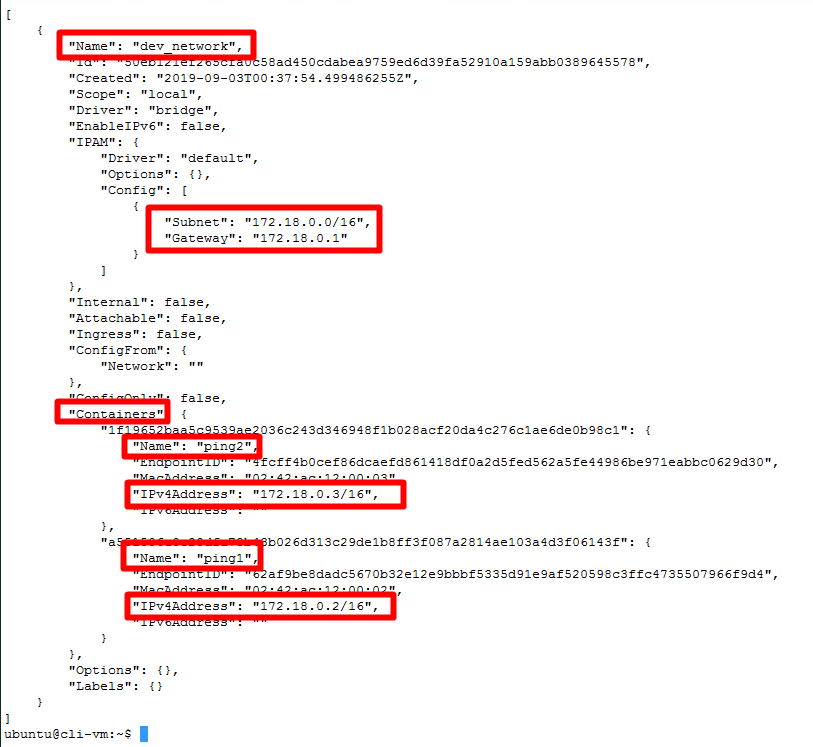

As you can see we now have two containers attached to the dev_network: ping1 (172.18.0.2/16) & ping2 (172.18.0.3/16), so let's test communication between the containers by attaching to the console on ping1 (which is possible because it's running the ash shell).

    sudo docker container attach ping1

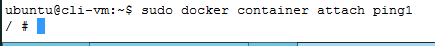

Let's try to ping the second container by name

    ping -c 3 ping2

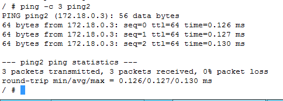

Let's try to ping by IP address (replace with your IP address)

    ping -c 3 {ip_address}

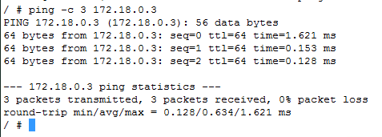

Being able to reference the container via name has a huge benefit in dynamic environments.   Let's try to ping one of the containers on our bridge network 'my_container' (172.17.0.2/16) or 'my_web_server' (172.17.0.3/16).

    ping -c 3 {ip_address}
    ping -c 3 my_container

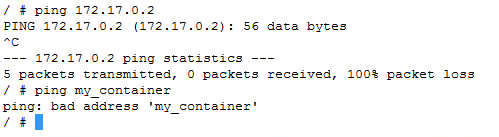

Exit the container (type `exit`).

 As you can see we have no path to access other containers unless they are exposing a port to the outside world.  'my_web_server' is exposing port 80 on the worker nodes' port 8080 which is accessible from control center and the local lab network environment as cli-vm exposes the port on its network interface.

 Networking exists only on a single host not across a clusters inside default docker which creates a lot of scalability challenges.

## Docker-Image Creation

**Note: Building docker images is greatly simplified in environments with unrestricted internet access. Accordingly, the HOL-2031 lab environment will not be used for this exercise. Instead, you can complete the docker image creation exercises from the docker playground at [https://labs.play-with-docker.com/](https://labs.play-with-docker.com/) from any computer with standard unrestricted internet access - you cannot access this side from within the HOL-2031 lab environmnet, but you should be able to access it from the same machine you are using to access HOL-2031.**

If you are accessing this lab guide from a v12 template with unrestricted internet access, you can complete these exercises from `cli-vm`, however examples will be shown from docker playground as most should be able to access that environment without restriction. 

----

One function inside docker is the creation of your own images.   An image is a layer of things compiled into a very small package for distribution.

You define what should be in a image with a text file called a Dockerfile.  A Dockerfile definition is in layers which are loosely coupled, then compiled together into a image by docker to use it in action.

You can find a complete list of command you can use in a Dockerfile at this site: https://docs.docker.com/engine/reference/builder/

If you are using docker playground, clone the PKS-Lab repository to the local shell in docker playground with the commands:

```Bash
cd ~
git clone https://github.com/CNA-Tech/PKS-Lab.git
```

Now let's create a blank directory for our new Dockerfile. From the cli-vm prompt, enter the following commands:

```Bash
cd ~
mkdir first
cd first
```

In order to avoid challenges with mistyping commands the Dockerfile has already been created.  Let's copy it from the clone git repository we downloaded.

     cp ~/PKS-Lab/docker/first/Dockerfile .

Looking inside the Dockerfile we have the following:

     vi Dockerfile

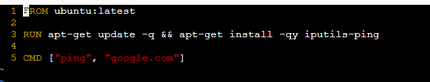

Enter `:q!` to exit vi

Breaking it down:

FROM ubuntu:latest
 - Use the ubuntu base operating system with the tag of latest


RUN apt-get update -q && apt-get install -qy iputils-ping
 - Execute the command listed above that updates the operating system and installs iputils-ping


CMD ["ping", "google.com"]
 - Run the command ping google.com forever

 So our basic container will use the latest ubuntu fully patched at time of image creation and ping google.com forever while running.

 It sounds like a great container, so let's build the image, which we are going to call our image 'pinggoogle':

    docker build -t pinggoogle .

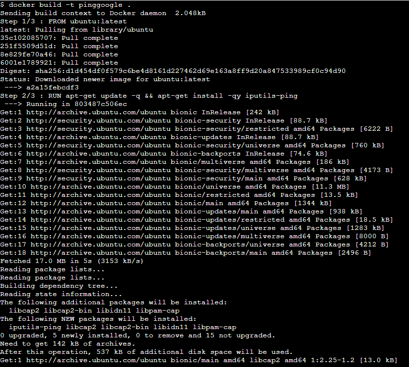

Looking at the output above you can see how it is built in layers.
 - Step 1 : Use "ubuntu:latest" which downloads the image (if required) and starts it
 - Step 2 : Run the "apt-get" commands on the new blank ubuntu container
 - Step 3 : Run "ping" command
 - Remove intermediate containers used
 - Build image and tag it

You can see the current images on your host:

    docker images

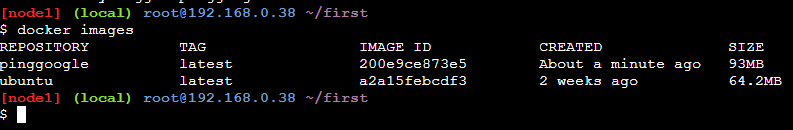

 As you can see image 200e9ce873e5 was created and is 93MB in size.

 This is the power of docker; the whole container is only 93MB in size, so it can be downloaded and started very quickly.

 Let's run our new image:

     docker run pinggoogle

 Press CTRL-C to kill the container.


 Let's create a more complex image.  We will create a nginx based web server with a custom static page.

```Bash
cd ~
mkdir second
cd second
cp ~/PKS-Lab/docker/second/Dockerfile ./
```

The contents of this Dockerfile are more complex:

    vi Dockerfile

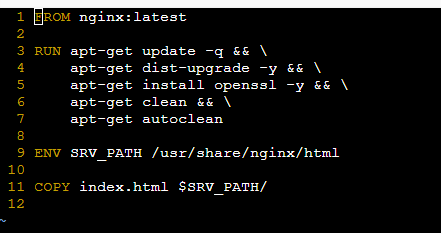

Enter `:q!` to exit vi

In detail:
 - FROM the nginx:latest image
 - RUN a bunch of apt-get commands plus install openssl
 - ENV set an environment vairable which can be rewritten on the command line if needed
 - COPY local file into the destination location on the image

Create a local file index.html to be inserted into your webserver

    echo "This is inside the container" > index.html

Let's build the image

    docker build -t pweb .

This compile should require multiple steps and downloads for your image:

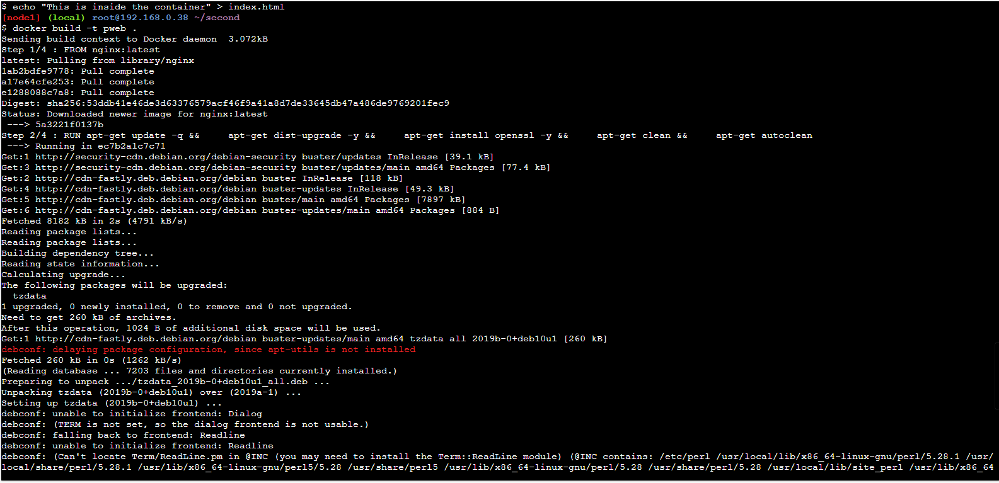

 Using the docker images command we can see our new image:

     docker images

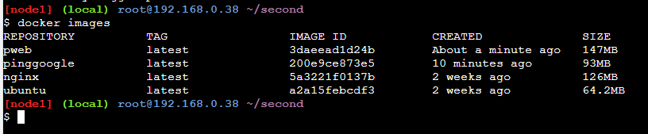

  You can see pweb is available to use and is 147MB in size.

  You could then upload the image to docker hub or your own private repository (such as Harbor) for reuse outside this single docker host.

  Let's deploy and test pweb.  We are going to deploy it exposing internal port 80 on external port 8000:

      docker run --name my_new_web -d -p 8000:80 pweb

Enter the command `curl http://localhost:8000/index.html` to see your file being served up, observe that the response includes the statement `This is inside the container` which you put in your index.html file in the previous step.

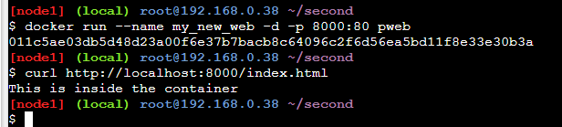

 A Dockerfile can have many levels of complexity in order to create the image you want.   nginx is really a previously layer image of Ubuntu.

## Clean up and Wordpress

For the final section in the docker lab we are going to clean up all currently running containers and images and run a new wordpress install.   Wordpress is being used to demostrate the challenges in creating multi-container solutions on docker.

First lets stop all running containers:

    docker kill $(docker ps -q)
    docker ps

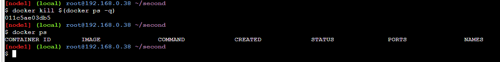

  Remove all shutdown containers

```bash
docker rm $(docker ps -a -q)
docker ps -a
```

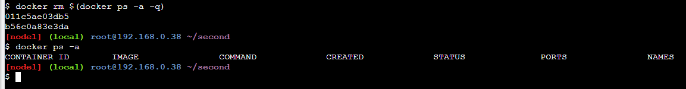

Note: At this point if you are using docker playground, you can leave your docker playground session and resume your connection with the HOL-2031 Lab environment. Please be sure if your HOL session ended, if you need to start a new session, you Complete [HOL POD Prep for PKS Ninja Lab Guides](../HOLPodPrep-HP3631/readme.md) before proceeding

 Ensure your docker environment is cleaned up, from cli-vm, enter the following command (this command will also delete any new/custom networks created in previous steps)

    sudo docker system prune -a

  Be sure to press 'y' at the prompt to continue.

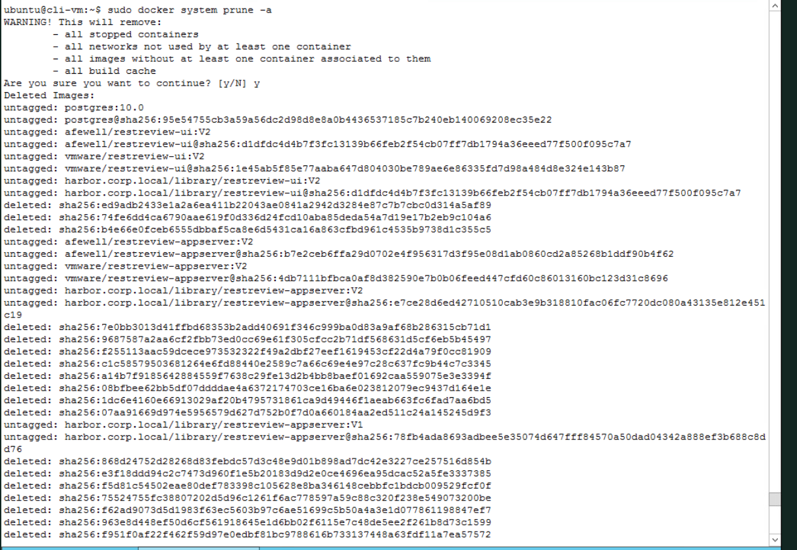

  Now we are all cleaned up, and ready for a Wordpress install (since we just deleted the 'pweb' image you created without any backup)

  Create a user network for Wordpress

      sudo docker network create wordpress

  Create a mysql container (normally you would not put passwords on the command line because they are stored in plain text)

      sudo docker run --name db --network wordpress -e MYSQL_ROOT_PASSWORD=VMware1! -d harbor.cloudnativeapps.ninja/library/mysql:5.7

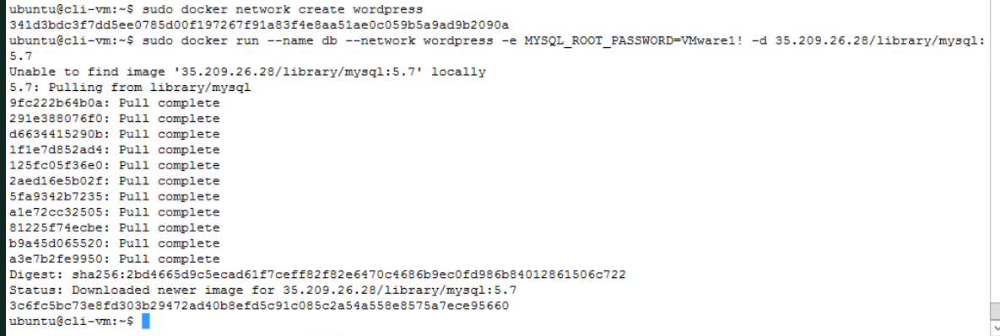

  Create an apacheweb server with Wordpress

`sudo docker run --name web -p 888:80 --network wordpress -e WORDPRESS_DB_HOST=db:3306 -e WORDPRESS_DB_USER=root -e WORDPRESS_DB_PASSWORD=VMware1! -d harbor.cloudnativeapps.ninja/library/wordpress`

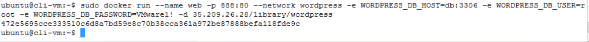

Wordpress should now be running on 'http://cli-vm.corp.local:888'. Visit this URL in your browser to see the Wordpress configuration page.

When these containers exit everything will be lost.

Before you stop this lab issue the following command from the cli-vm prompt to clean up everything

  Again, be sure to press 'y' at the prompt to continue.

     docker system prune -a

## Challenge Activity
If you have time and want a challenge do the following
 - Build a apache web server listing on port 80 serving up php content
 - You can copy the index.php to serve up from ~/PKS-Lab/docker/challenge


