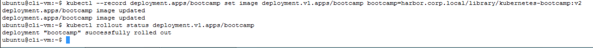
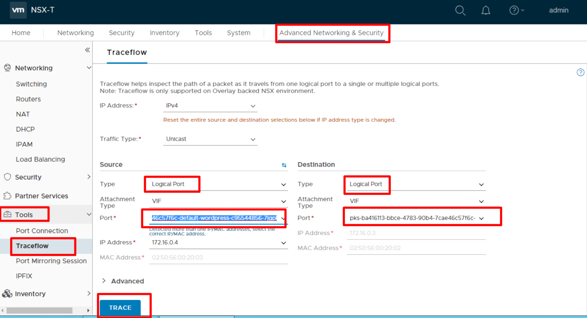
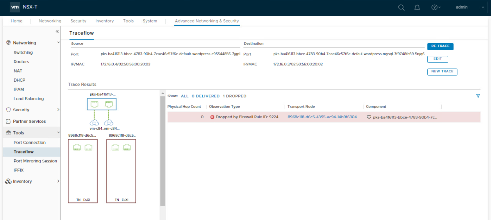

# Kubernetes-Lab 

**HOL-2031 Users: for some of the steps in this lab guide, you will need to complete an alternative step that is slightly adjusted to work in the HOL-2031 lab environment. Each step below that requires a modification for HOL-2031 will be clearly indicated. There may also be some some minor differences in the screenshots provided below from what you see in your lab environment. All HOL-2031 users will need to complete [HOL POD Prep for PKS Ninja Lab Guides](../HOLPodPrep-HP3631/readme.md) before proceeding. Please note you will not be able to browse the internet from the HOL-2031 lab environment, if any steps require you to browse a public internet site, you will need to do so from a seperate browser tab from your local machine, outside of the HOL lab environment. If there are any steps that require you to download an external file, please follow the instructions provided**

# Learning Kubernetes

Login to the cli-vm by using putty and selecting ubuntu@cli-vm  

If you have not already, clone the PKS-Lab repository with the following commands:

```bash
sudo su
#password is VMware1!
cd /root
git clone 
http://gitmir.cloudnativeapps.ninja/CNA-Tech/PKS-Lab.git
```

Enter the following command to login to PKS CLI

    pks login -a pks.corp.local -u pksadmin -p VMware1! -k

See available clusters

    pks clusters

Get credentials for my-cluster

    pks get-credentials my-cluster


You can switch between clusters using the suggested commands if you have multiple K8 clusters.  

Review the worker nodes for PKS cluster my-cluster

    kubectl get nodes
    

 
This displays basic data on the worker nodes.  

You can gather additional data on a specific node by cutting and pasting it's name and running the following command (in my case I did node 58fb66e9-b305-4670-bdb3-21a00bdedc82):

    kubectl describe nodes {name}
    
 
 
 
 We are going to use a container provided by google to test the functionality of Kubernetes.  These steps will be very similar to docker commands we did before. The image we will use is called kubernetes-bootcamp there are many different tutorials using this image available on the internet.  
 
    kubectl run bootcamp --image=gcr.io/google-samples/kubernetes-bootcamp:v1 --port=8080

<details><summary><b>HOL-2031 Users:</b> Please expand this section and use the alternate commands below</summary>

```bash
# First download the busybox image from the public PKS Ninja Labs Harbor registry, Retag and push the image to the harbor.corp.local registry server in your local lab with the following commands:  

sudo docker login harbor.corp.local -u admin -p VMware1!
sudo docker pull harbor.cloudnativeapps.ninja/library/kubernetes-bootcamp:v1
sudo docker tag harbor.cloudnativeapps.ninja/library/kubernetes-bootcamp:v1 harbor.corp.local/library/kubernetes-bootcamp:v1
sudo docker push harbor.corp.local/library/kubernetes-bootcamp:v1

# Enter the following command to run this container in your kubernetes cluster:

kubectl run bootcamp --image=harbor.corp.local/library/kubernetes-bootcamp:v1 --port=8080
```
</details>
<br/>


Looking at this command line we have:
- run : run a container
- bootcamp : name of deployment
- --image : url of image with version
- --port : port to expose on the container

We just created a deployment called bootcamp you can view it's current information via:

    kubectl get deployments
    


We can get additional details using the describe command:

    kubectl describe deployment bootcamp
    


Let's examine the other kubernetes constructs.  Namespace first

    kubectl get namespace
    


Let's get details on the default namespace:

    kubectl describe namespace default 
    
 

Time to review the pods:

    kubectl get pods
    
 

You can see we have a bootcamp pod running let's get more details on the pod (in my case it's pod bootcamp-95bd888fc-pc2pq)

    kubectl describe pod {pod-name}
    


This shows a lot of information on the pod (not individual image)  for example labels (metadata assigned) IP address of the pod and how the image was created.   Let's try to ping the IP address for the pod on the NSX-T overlay network. (in my case it was assigned 172.16.0.2) 

    ping -c 3 {ip_Address}
    
 
 
 Let examine the logs from the pod using your pod name (mine is bootcamp-95bd888fc-pc2pq)
 
     kubectl logs {pod_name}
     

 
 Running a command inside a container is very similar to Docker using the exec command for example lets get all the environment variables from our container using the env command:
 
     kubectl exec {pod_name} env
     


# Services

Adding services is a key element to exposing services to the outside world.   We can do this via the services command set.  Remember you can expose services via NodePort, LoadBalancer or ClusterIP (internal only).   NSX-T provides the functionality to provision load balancers on demand as needed from the Kubernetes command line or API.   First examine the current services:

    kubectl get services
    


It shows the loadbalancer currently provisioned for access to the Kubernetes API (master/etcd) (NAME: kubernetes TYPE: ClusterIP)

To create a LoadBalanced service for our deployment type the following command:

    kubectl expose deployment/bootcamp --type=LoadBalancer --port 8080
    
Let's review the services available now that we have created a new LoadBalancer for deployment/bootcamp:

   kubectl get services
   


You now have a new LoadBalancer for bootcamp with the following information:
- Cluster-IP (internal) : 10.100.200.103 internal way to access the loadbalancer for pod to pod/service traffic
- External-IP : 10.40.14.42,100.64.96.7 the first address is the external IP to access this service the second is a routing IP address.

Let's try accessing our deployment on your IP address (mine is 10.40.14.42) open the web browser and navigate to http://{your-external-ip:8080.   


The tight integration between NSX-T and Kubernetes makes this possible.  Login to NSX manager by opening an additional tab in Chrome and clicking on the NSX-T Manager icon.  
- Username: admin
- Password: VMware1!VMware1!

Once logged in:
- Navigate to `Advanced Networking & Security > Networking > Load Balancing`
- Click on the Virtual Servers tab
- Review the list of virtual servers and locate the one called default-bootcamp (denotes that it's default namespace and called bootcamp service)   

Return to the cli-vm console.  For additional details on the bootcamp service use the following command:

    kubectl describe service bootcamp
   


# Labels
Labels are metadata that allow you to group machines or apply policies dynamically.   Our deployment has a label assigned at creation time called run=bootcamp this is assigned to the pod, deployment & service.   You can see labels assigned to resources using the describe command.   Labels are in the form of designation=element for example version=1.  Let's get pods & services with the label.  

    kubectl get pods -l run=bootcamp

    kubectl get services -l run=bootcamp


We can assign a label to a resource for example the service using this command syntax:

    kubectl label service bootcamp app=v1

Let's return all the services with this label:

    kubectl get services -l app=v1
    


# Scale a deployment
Let's assume that at different times of the year your will need additional pods to service your requests.  This is handled very well by Kubernetes.  We have a external LoadBalancer that has awareness of the pods so we simply deploy additional pods.  In order to scale from one pod to 4 we issue the following command:

    kubectl scale deployments/bootcamp --replicas=4
    


Looking at the deployment and pods we should now have additional replicas of the image:

    kubectl get pods
    
    kubectl get deployments 
    


If you return to the NSX-T console in Chrome you can select the Server Pool tab and select the server pool that ends with `default-bootcamp-8080` to show the backend containers now included in the pool for the load balancer.  It clearly denotes 4 members.  Click on the 4 to see the pod names.   

Note: Depending on your screen size, you may need to zoom out in chrome to be able to clearly see the pods in the load balancer pool


Go to the Chrome tab for your LoadBalancer service and reload to see if the pod name changes.  (It may not because it assigns you a pool member when first connection is established and does not change until session is ended)

Return to cli-vm. 

You can get detailed information on the four pods using this command:

    kubectl get pods -o wide
    


Describing the service will show how each of the invidiual pods are now part of the service:

    kubectl describe service bootcamp

Scaling down is easy and non-interruptive as well using the following command we can scale down to 2 pods:

    kubectl scale deployments/bootcamp --replicas=2
    
You can track progress with this command:

    kubectl get pods
    
 
 
 # Update the application
 One of the super powers of Kubernetes is the ability to update an application dynamically without interruption.  For this we will update the image to a new version without customer interruption (remember we have two pods).   
 
 Start by updating the image to be used by the deployment:
 
     kubectl --record deployment.apps/bootcamp set image deployment.v1.apps/bootcamp bootcamp=jocatalin/kubernetes-bootcamp:v2

<details><summary><b>HOL-2031 Users:</b> Please expand this section and use the alternate commands below</summary>

```bash
# First download the busybox image from the public PKS Ninja Labs Harbor registry, Retag and push the image to the harbor.corp.local registry server in your local lab with the following commands:  

sudo docker login harbor.corp.local -u admin -p VMware1!
sudo docker pull harbor.cloudnativeapps.ninja/library/kubernetes-bootcamp:v2
sudo docker tag harbor.cloudnativeapps.ninja/library/kubernetes-bootcamp:v2 harbor.corp.local/library/kubernetes-bootcamp:v2
sudo docker push harbor.corp.local/library/kubernetes-bootcamp:v2

# Enter the following command to run this container in your kubernetes cluster:

kubectl --record deployment.apps/bootcamp set image deployment.v1.apps/bootcamp bootcamp=harbor.corp.local/library/kubernetes-bootcamp:v2
```
</details>
<br/>
     
 This will automatically update the image one at a time.  You will have to type the following commands fast to catch the state of the old containers.   
 
    kubectl get pods
    kubectl describe services/bootcamp
    kubectl rollout status deployments/bootcamp
    


Return to the web browser window for our application and reload to see the version change to v2

   

# Roll back the application
We can also rollback the V2 application to V1 very quickly.  

Set the image for the deployment:

    kubectl --record deployment.apps/bootcamp set image deployments/bootcamp bootcamp=gcr.io/google-samples/kubernetes-bootcamp:v1

<details><summary><b>HOL-2031 Users:</b> Please expand this section and use the alternate commands below</summary>

```bash
kubectl --record deployment.apps/bootcamp set image deployment.v1.apps/bootcamp bootcamp=harbor.corp.local/library/kubernetes-bootcamp:v1
```
</details>
<br/>
    
Do the rollout command:

    kubectl rollout undo deployments/bootcamp

Check progress:

    kubectl get pods
    
   

# Desired state management
Kubenetes is an orchestrator as illustrated so far ensuring it meets our requirements it is also a desired state management tool.   In order to illustrate this we are going to delete a pod inside our deployment.   Remember that we set this deployment to have two pods you can see the desired state using this command:

    kubectl get service bootcamp
    
 

We expect two pods.   Let's remove one of the pods:

    kubectl get pods

 

Select a name of a pod inside your list I am going to use bootcamp-f54cfd479-76ngz.  

    kubectl delete pod bootcamp-f54cfd479-76ngz

Let's see that pod get removed:

    kubectl get pods

 

As shown I now have a new pod automatically recreated by Kubernetes to satisfy my desired state of two pods (in my case bootcamp-f54cfd479-xfmsz is the new pod)  Just in case your wondering the new pod was added to the service / load balancer and the old pod was removed (unless it just took over the old IP address)


# Clean up 
Operating micro-services one command at a time is not normal for Kubernetes but has allowed us to step through operation.  Let's clean up the deployment and service.   

    kubectl delete service bootcamp
    kubectl delete deployment bootcamp

Over time this will remove all resources including pods.   (Yes the virtual server will be cleaned up as well).  

# WordPress
While Wordpress is not a micro-service it does allow us to show the power of Kubernetes.   One of the key challenges of the docker wordpress was the lack of persistent storage.   VMware implements storage persistence using Project Hatchway (https://vmware.github.io/hatchway/) this allows us to create a MySQL container with persistent storage.   This is critical if the container or worker node fails the storage will persist and be reconnected to the image recreated by Kubernetes.

<!--
  Download the wordpress image you will use in the next step from the PKS Ninja Labs public Harbor registry, retag the image to prepare it for upload and push the image to the harbor.corp.local registry in your local lab environment

```Bash
sudo docker login harbor.corp.local
sudo docker pull harbor.cloudnativeapps.ninja/library/wordpress
sudo docker tag harbor.cloudnativeapps.ninja/library/wordpress harbor.corp.local/library/wordpress
sudo docker push harbor.corp.local/library/wordpress
```
The sudo password is `VMware1!`, the harbor.corp.local login username is `admin` and the password is `VMware1!
-->

In this tutorial we will begin to work with much more complex constructs inside YAML files.   You can chain whole micro-services inside a single YAML file for ease of use.   The first thing we need to do is create a secret inside Kubernetes as the password for the database.  By using this method we avoid having hard coded passwords in the YAML files.  

    kubectl create secret generic mysql-pass --from-literal=password=YOUR_PASSWORD

Examine this command:
 - create secret : action
 - generic : type of password
 - mysql-pass : name of secret for reference in YAML
 - --from-literal=password=YOUR_PASSWORD  password is the variable and YOUR_PASSWORD is the password
 
 We can now create additional constructs using the kubectl create -f (-f for file) command.   We need to create a storage class inside Kubernetes that allows our YAML files to access project Hatchway.   Hatchway will dynamically create VMDK files on VMware cluster file system on demand.   In order to save you massive typing we are going to use the repository you downloaded:
 
    cd /root/PKS-Lab/kubernetes/wordpress

Note: If you do not see the /root/PKS-Lab directory, you may not have cloned it per the first step in this lab guide, or if you remember cloning it but dont see it in the /root/ directory, check the /home/ubuntu directory in case you may have cloned it there
 
 We will be implementing the file storage_class.yaml which contains the following:
 
 

In detail
 - kind: StorageClass - denotes a storage class entry
 - apiVersion: storage.k8s.io/v1 - denotes what API applies to this entry
 - name: thin-disk - denotes the reference name of this storage class
 - provisioner: kubernetes.io/vsphere-volume - denotes that we are going to use a vsphere-volume exposed by Hatchway
 - diskformat: thin - is a feature exposed by Hatchway from the storage system than means it will be thin provisioned
 
Execute the storage class:

    kubectl create -f storage_class.yaml

Note: You may recieve an error saying this storage class already exists, if so you can ignore the error message and move on. Some of the PKS Ninja Lab templates have this storage class pre-configured.

You can view the storage class using

    kubectl get storageclass
    


Or details using 

    kubectl describe storageclass thin-disk


Now lets create the mysql instance along with the persistent volume using wp_mysql.yaml which contains a service definition:


In Detail:
 - name: wordpress-mysql - name of the service
 - labels: - metadata
 - port: 3306 - exposed port
 - selector: app: wordpress tier: mysql - how to choose what should be part of the service (label app=wordpress tier=mysql)
 
PersistentVolumeClaim for MySQL data (VMDK to be created for persistent data):


In Detail:
 - name: mysql-pv-claim - name of volume
 - labels - metadata
 - annotations - like labels key value pairs used to select objects (labels are used to list objects)
 - spec: - specifics to the volume exposed by the provider
 
A Deployment:


In Detail:
 - Lots of data on the deployment
 - Spec: - contains the image and setup information including the secret from above
 - Ports: - exposed listen port --port from command line
 - VolumeMounts: - Location and volume to use for the persistent volume
 
Create the mysql deployment and service using this command:

    kubectl create -f wp_mysql.yaml

<details><summary><b>HOL-2031 Users:</b> Please expand this section and use the alternate commands below</summary>

```bash
# First download the wordpress image from the public PKS Ninja Labs Harbor registry, Retag and push the image to the harbor.corp.local registry server in your local lab with the following commands:  

sudo docker login harbor.corp.local -u admin -p VMware1!
sudo docker pull harbor.cloudnativeapps.ninja/library/mysql:5.6
sudo docker tag harbor.cloudnativeapps.ninja/library/mysql:5.6 harbor.corp.local/library/mysql:5.6
sudo docker push harbor.corp.local/library/mysql:5.6

# Enter the following command to create a deployment based on the wp_mysql.yaml file provided in the PKS-Lab directory:
kubectl create -f wp_mysql.yaml

# Note that the above command will create a wordpress-mysql deployment but the container will not load properly in the HOL-2031 environment as the wp_mysql.yaml file specifies an image on docker hub which is not accessible from HOL-2031
# Enter the following command to update the wordpress-mysql deployment to pull the mysql image from harbor.corp.local

kubectl set image deployment.v1.apps/wordpress-mysql mysql=harbor.corp.local/library/mysql:5.6
```
</details>
<br/>
 
You can list the specifics of the created entity with:

    kubectl get deployments
    kubectl get service
    kubectl get pods
    
 
  
  We can now create the Wordpress apache setup using the wp.yaml which includes a service:
  
 
 
 In detail:
  - name: wordpress - service name
  - port: 80 - listening port
  - selector - which app to use as pool members
  - type : LoadBalancer - deploy a virtual server with external access instead of NodePort or ClusterIP

A PersistentVolume for the wordpress site because some data is stored locally like pictures:

 

A deployment:

 
 
Some details:
 - env: - sets some environment details including the container name for the database (wordpress-mysql) allowing connection
 
Start up your wordpress apache service and deployment with:

    kubectl create -f wp.yaml

<details><summary><b>HOL-2031 Users:</b> Please expand this section and use the alternate commands below</summary>

```bash
# First download the wordpress image from the public PKS Ninja Labs Harbor registry, Retag and push the image to the harbor.corp.local registry server in your local lab with the following commands:  

sudo docker login harbor.corp.local
sudo docker pull harbor.cloudnativeapps.ninja/library/wordpress
sudo docker tag harbor.cloudnativeapps.ninja/library/wordpress harbor.corp.local/library/wordpress
sudo docker push harbor.corp.local/library/wordpress

# Enter the following command to create a deployment based on the wp_mysql.yaml file provided in the PKS-Lab directory:
kubectl create -f wp.yaml

# Note that the above command will create a wordpress deployment but the container will not load properly in the HOL-2031 environment as the wp_mysql.yaml file specifies an image on docker hub which is not accessible from HOL-2031
# Enter the following command to update the wordpress deployment to pull the mysql image from harbor.corp.local

kubectl set image deployment.v1.apps/wordpress wordpress=harbor.corp.local/library/wordpress
```
</details>
<br/>

You can see the output of the command with:

    kubectl get service
    kubectl get deployment
    kubectl get pods
    
  
  
  Once created we can visit the IP address from our wordpress LoadBalancer (in my case 10.40.14.41) via Chrome to see this:
  
 

# Network Policy
Network Policy is the implementation of firewall between pods.  Let's implement a firewall rule denying access between the MySQL and Apache pods.   Firewall rules are implemented using NetworkPolicies and can be triggered by many different Selectors including IP address, names and labels.   We will implement a network policy that denys all incomming access to the MySQL machine thus breaking our application.  

Ensure you are in the correct directory:

    cd /root/PKS-Lab/kubernetes/wordpress

Let's examine our network policy stored in the deny.yaml file:

 

In Detail:
 - kind: NetworkPolicy - denotes a networkpolicy
 - spec: podSelector: matchLabels: tier: mysql - this policy applies to entities with the tier: mysql label
 - ingress: [] - applies to all ingress all ports

Let's locate all entities with the label tier: mysql

    kubectl get pods -l tier=mysql

At this time the networkpolicy will apply to only the mysql pod.   This is dyanmic if you apply the label to something else it automatically gets included in the networkpolicy rules.  Let's execute the command to create a firewall policy in NSX-T.   

     kubectl create -f deny.yaml

You can list the networkpolicy and describe it via these commands:

    kubectl get networkpolicy
    kubectl describe networkpolicy mysql-deny-all


This has created a firewall solution inside NSX-T.  Switch to your wordpress tab in Chrome and try to reload the page.   After a timeout it will suggest there is a problem with the database.  

Let's review how it's handled in NSX-T.  Login to NSX-T Manager if required:

- Username: admin
- Password: VMware1!VMware1!

Once logged into the console do a search using the top bar search for mysql-deny-all (the name of the networkpolicy).  


You can see that Kubernetes and NSX-T have created a number of constructs including Firewall rules, sections and IP sets.  If you expand the IP set you will see that it contains the IP address for our MySQL pod (kubectl describe pods -l tier=mysql look for IP) Kubernetes will dynamically assign IP address into NSX-T as Networkpolicy matches are achieved.  NSX-T provides powerful troubleshooting capabilities due to the deep integration. 

- Navigate to the `Advanced Networking & Securty > Tools > Traceflow` page
- Switch the Source type to logical port
- Use the drop down in source port to locate the description that has wordpress (not wordpress-mysql) and select it
- Switch the Destination type to logical port
- Use the drop down in destination port to locate the description that has wordpress-mysql and select it



- Click on Trace



As you can see in my case the communication is on the same ESXi host and blocked by firewall rule 9224.  Using search icon in the menu bar you can locate 9224 (or your rule number it may be different) and see what firewall rule applies it.  

To remove this networkpolicy just delete it.   This is done in the console with:

    kubectl delete networkpolicy mysql-deny-all

Return to your wordpress Chrome tab and check if your application works.  It should now return the configuration page for Wordpress.  Return to NSX-T traceflow and re-trace the traceflow:


As you can see communication now works and you get much more detailed packet information.   If you search for mysql-deny-all or your firewall rule you will find it's been removed from NSX-T cleaning up all trace of the rules.  

You can learn more about NetworkPolicy and see sample rules from this repository: https://github.com/ahmetb/kubernetes-network-policy-recipes

# Wordpress Cleanup
 You can remove the wordpress setup with the following commands (using labels):
 
    kubectl delete deployment -l app=wordpress
    kubectl delete service -l app=wordpress
    kubectl delete pvc -l app=wordpress

# Micro-services application
In this execercise you will deploy a true micro-services application called plane-spotter.   Which is a pretty complex Micro-service based application shown below: 


We will skip the wavefront for monitoring stage of the application deployment but it can be added later with simple sidecars.  Let's get the application from github:

```bash
sudo su
sudo mkdir /root/cloned
cd /root/cloned
git clone http://gitmir.cloudnativeapps.ninja/CNA-Tech/planespotter.git
cd /root/cloned/planespotter/
```

**All v12 templates must complete all steps in the [Enable Harbor Client Secure Connections Lab Guide](https://github.com/CNA-Tech/PKS-Ninja/tree/Pks1.4/LabGuides/HarborCertExternal-HC7212) before proceeding - this does not apply to HOL-2031 lab environments**

The kubernetes manifests included in this directory will require that the planespotter container images be loaded onto the harbor.corp.local server in order to run successfully. Enter the following commands to launch a script that will download the planespotter container images from the public harbor registry and upload the images to the harbor.corp.local server in your lab environment

```bash
sudo chmod +x loadPsContainers.sh
./loadPsContainers.sh
cd /root/cloned/planespotter/kubernetes
``` 
Note: this script may take a few minutes to run

This application contains storage classes, persistent volumes, and multiple pods. Since we already have a storage class called thin-disk we will skip creating that part (kubectl get storageclass). We will need to create a new namespace (deploying a new T1 router) and switch to that namespace

    kubectl create namespace planespotter
    kubectl config set-context my-cluster --namespace planespotter

You can view your created namespace with (kubectl get namespace or kubectl get ns or details using kubectl describe ns planespotter).  Next we need to create our application.  Feel free to review these yaml files to learn more about their operation as time permits.  

     kubectl create -f mysql_claim.yaml
     kubectl create -f mysql_pod.yaml
     kubectl create -f app-server-deployment_all_k8s.yaml
     kubectl create -f redis_and_adsb_sync_all_k8s.yaml
     kubectl create -f frontend-deployment_all_k8s.yaml

You can view the status of all these containers using the following commands:

Note: It may take up to a few minutes before the new planespotter objects are up and running

     kubectl get pvc
     kubectl get deployments
     kubectl get pods -o wide
     kubectl get rs
     kubectl get statefulset -o wide
     kubectl get services -o wide
     kubectl get ingress -o wide

You will notice that by default the planespotter application uses a ClusterIP to expose it's frontend.  Let's switch this to a LoadBalancer so we can reach it from our machine.  

     kubectl get services
     kubectl delete service planespotter-frontend
     kubectl expose deployment/planespotter-frontend --type=LoadBalancer --port 80
     kubectl get services


Switch to Chrome and go to the Loadbalancer IP for your application (mine is 10.40.14.43).


Reload a few times and notice how the host and ip at the top change.  While you have the application setup lets locate all the 737 planes.  

# Cleanup
To cleanup planespotter (it uses a lot of memory) do the following:

    kubectl delete --all deployments --namespace=planespotter
    kubectl delete --all services --namespace=planespotter
    kubectl delete namespace planespotter
    kubectl config set-context my-cluster --namespace default
    

# Strech goals
If you have available extra time try to achieve one of these stretch goals:

- Setup a LAMP stack (Apache, MySQL, PHP on Linux containers) running a simple php script that does hello world and shows that database connection works
  - Note, in the HOL-2031 lab environment you cannot access docker hub to pull down these images, you can access the required images using harbor.cloudnativeapps.ninja/library/httpd, harbor.cloudnativeapps.ninja/library/php harbor.cloudnativeapps.ninja/library/mysql:5.6 and harbor.cloudnativeapps.ninja/library/wordpress to accomplish these objectives. You will need to download these images and then upload them to harbor.corp.local to deploy them to your kubernetes cluster
- Create custom firewall rules between the Wordpress site that allows 3309 but denies everything else
- Try another tutorial on the internet to learn Kubernetes 
