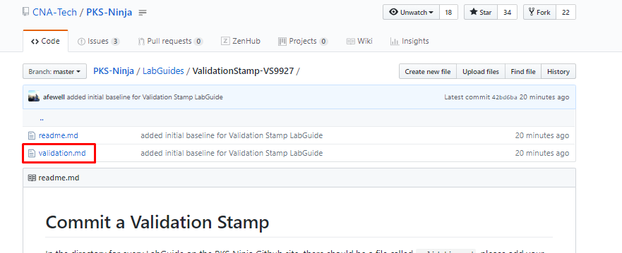
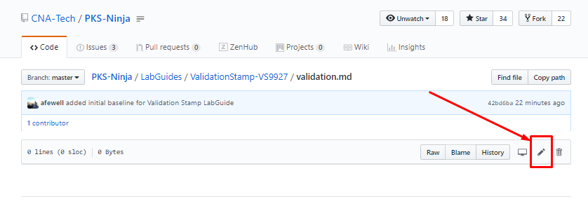
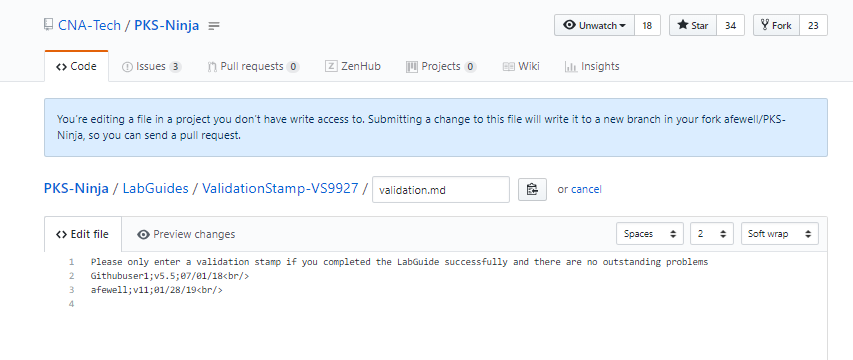
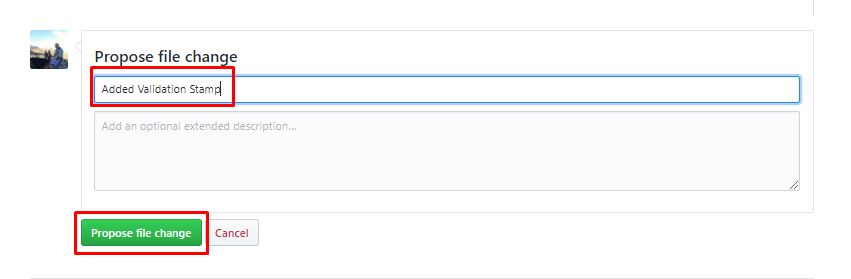
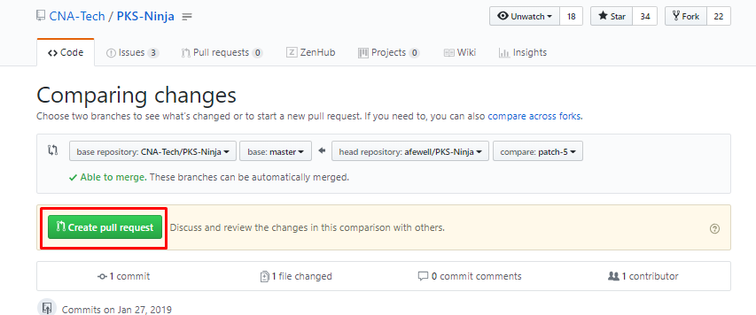
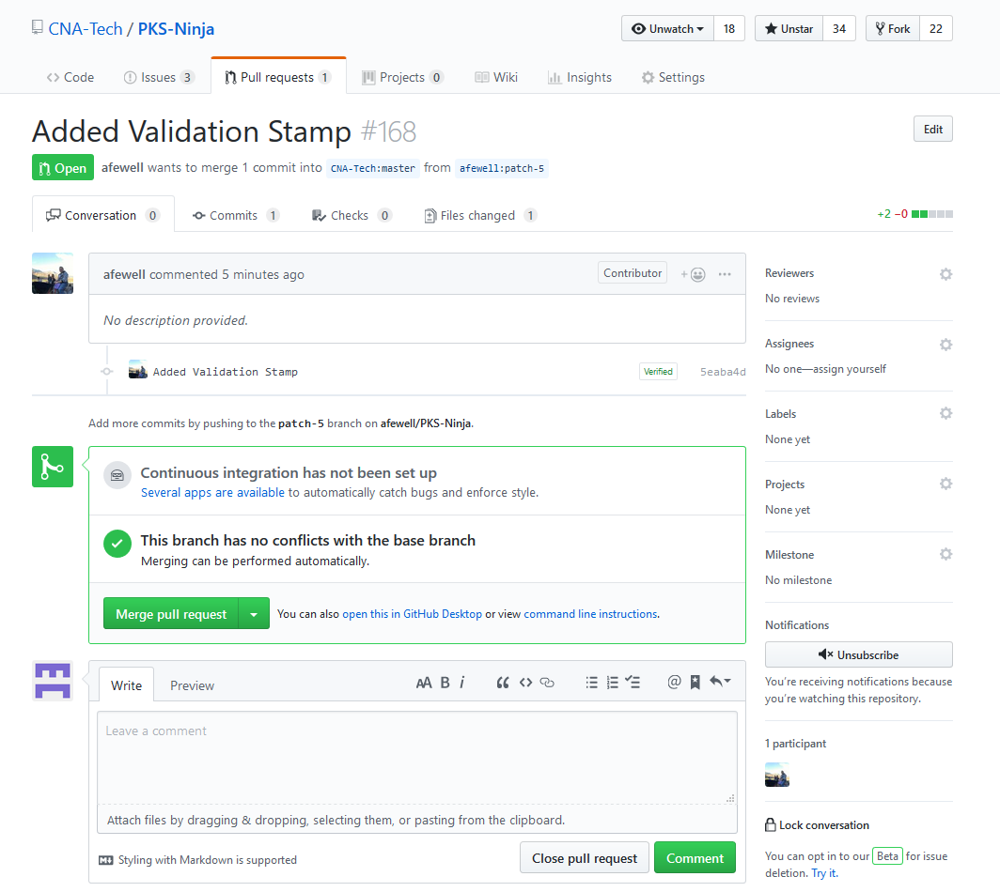

# Commit a Validation Stamp

This guide walks through the simplified method of committing an update to a shared git repository, using the example of adding your validation stamp to a file on the PKS Ninja Github repository. You can also use this method to update any other file on the PKS Ninja or other github repositories

## Contents

In the directory for every LabGuide on the PKS Ninja Github site, there should be a file called `validation.md`, please add your github username and the version number of the PKS Lab Template you are using to the validation.md file as described in the [Instructions](#instructions) section below.

- [Commit a Validation Stamp](#commit-a-validation-stamp)
  - [Contents](#contents)
  - [Introduction](#introduction)
  - [Prereqs](#prereqs)
  - [Understanding the Git Pull Request Process](#understanding-the-git-pull-request-process)
  - [Instructions](#instructions)

## Introduction

When you complete a lab guide on the PKS Ninja Github site, please enter a validation stamp to confirm that you were able to get through the lab without problems. It is very easy and quick to add a validation stamp.

*If you do not complete a LabGuide successfully, DO NOT ADD A VALIDATION STAMP*

If you had any problems and could not complete a lab guide, please open an issue as shown in the [Reporting an Issue on Github](https://github.com/CNA-Tech/PKS-Ninja/tree/Pks1.4/LabGuides/ReportingAnIssue-RI7933)

Validation Stamps are a very important part of the continuous integration model that the PKS Ninja Community uses to keep lab guides up to date. The PKS Ninja Lab template is continuously updated, and accordingly there is a need to continuously validate the lab guides with the latest version of the template, and it is a huge help to the community when you take an extra moment to leave a validation stamp.

## Prereqs

You only need access to a web browser and a github account to complete this lab

## Understanding the Git Pull Request Process

On any project where multiple people contribute updates, a system is needed so that project leaders can recieve and have an approval process to ensure that updates are desirable and do not conflict with updates other people are making.

On modern software and devops projects, version control systems are used for this purpose, and Git is the industry standard version control system for Linux, Cloud Native and Open Source projects.

Git uses a "Pull Request" process when a user wants to make an update to a community repository. This is because to make an update, the user first makes their own separate copy of the repository, updates their separate copy, and then opens a pull request, which sends a request to the admin of the git repository you want to update, requesting that they pull the updates from the users copy into the main repository.

For your reference, the image below from the [Kubernetes Contributor Guide](https://github.com/kubernetes/community/blob/master/contributors/guide/README.md#github-workflow) provides a visual overview of the full pull request process. Please note that to commit a validation stamp, you will be using a highly simplified version of this process:

In the [Instructions](#instructions) section below, you will use Github's in-browser text editor to add your validation stamp to the validation file for this LabGuide. When you use the in-browser editor to make an update, github automatically creates a fork and branch for you making it very quick and easy to do simple updates. 

This same process can be used to contribute updates to most modern open source and private development projects.

When you are making more complex updates or contribute to a project regularly, it is usually desirable to edit files on your local workstation where you can use more advanced editing tools. While it is not needed for simple updates, if you plan to work supporting cloud native and devops processes, you should plan to also learn the complete pull request process. The [Create your student folder](https://github.com/CNA-Tech/PKS-Ninja/tree/Pks1.4/LabGuides/CreateStudentFolder-SF6361) lab  is designed to help students new to Git to learn the full pull request process.

Note: If you have worked with your own personal Git repository before, the pull request process may be new to you as users do not need to do a pull request to update their own repositories.

## Instructions

1.1 Open a web browser to [https://github.com/CNA-Tech/PKS-Ninja/tree/Pks1.4/LabGuides/ValidationStamp-VS9927](https://github.com/CNA-Tech/PKS-Ninja/tree/Pks1.4/LabGuides/ValidationStamp-VS9927), make sure you are logged in, and click on the `validate.md` file

Screenshot 1.1

 

1.2 In the file editor toolbar, click on the pencil icon to edit the file

Screenshot 1.2

 

1.3 In the text editor window, on a new line, enter your validation stamp

Your validation stamp is your github username followed by a semicolon, followed by the PKS Template Version number you are using in your lab environment, followed by the date in MM/DD/YY format, followed by ` `, which is an html line break tag to ensure a line break follows your stamp. Include both major and minor version numbering if a minor version is used.

Note: When completing the validation stamp for this lab guide, use `v12` as the version number. When you validate any other lab guides be sure to use the version number of the pks lab template you used to complete the exercise. 

Example #1 - the github user `Githubuser1` using PKS Lab Template `v12` on the date July 1st 2018 would enter the following stamp:

`Githubuser1;v12;07/01/18 `

Example #2 - the github user `afewell` using PKS Lab Template `v10` on the date January 28th 2019 would enter the following stamp:

`afewell;v10;01/28/19 `

Please see the screenshots below for an additional example. Be sure to use your own github username in your validation stamps

Screenshot 1.3

 

1.4 Under the text editor window in the `Propose file change` section, enter the description `Added Validation Stamp` and click `Propose file change` as shown in the following screenshot

Screenshot 1.4

 

1.5 On the `Comparing Changes` screen, click `Create pull request`

Screenshot 1.5

 

1.6 On the `Open a pull request` screen, click `Create pull request`

Screenshot 1.6

 

1.7 You have now completed the pull request process which will create a request to have an admin for the PKS Ninja repo merge your update (your validation stamp).

Your validation stamp will not be visible on the PKS-Ninja repository until an admin approves your merge request, which could take up to a few days. There is no need for you to wait for your PR to be merged, you may proceed doing additional LabGuides or other activities. The email address associated with your github account will be notified when your pull request is updated.

For your reference, the following screenshot shows the administrator view of the screen used to approve the pull request:

Screenshot 1.7

 

**Thank you for completing the Commit a Validation Stamp LabGuide!**
