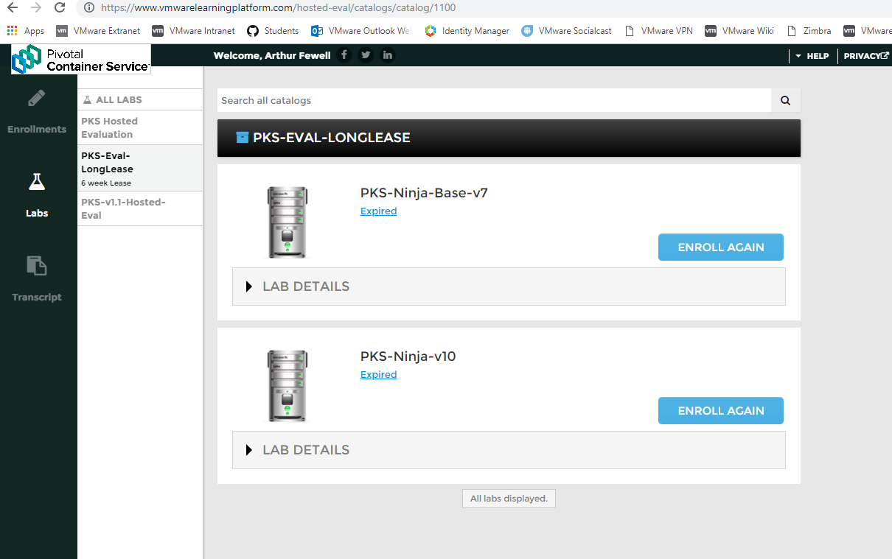

# Accessing the PKS Ninja Lab with VMware Learning Platform Hosted Eval Tenant

**The Hosted Eval VLP Tenant is only accessible to select VMware and Pivotal employees unless your VMware account representative has given you access, please see [Getting Access to a PKS Ninja Lab Environment](https://github.com/CNA-Tech/PKS-Ninja/tree/Pks1.4/Courses/GetLabAccess-LA8528) for lab access options for non VMware/Pivotal employees**

If you are a VMware or Pivotal employee and would like access to VLP, [please fill out this form](https://goo.gl/forms/SXRsAxXMC1gbZ2zk2) using your vmware or pivotal email address. For VLP access, your corporate email address is required, however for other activities on this site you can use a personal github account.

VMware employees will only be eligible for access to VLP Hosted-Eval if they do not have functional access to a PKS Ninja vApp Template from OneCloud

## Instructions

1.1 Open a web browser, navigate to https://www.vmwarelearningplatform.com/hosted-eval/catalogs/ and login. On the left hand side you should see Catalogs for 1 and 3 Day PKS templates, you may also see other lease durations depending on your level of access. Select the catalog the corresponds to the duration of the lab session you would like,  and launch one of the available PKS Ninja templates.

Screenshot 1.1

 
