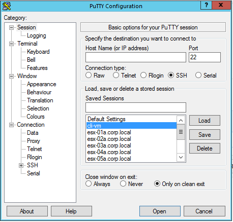
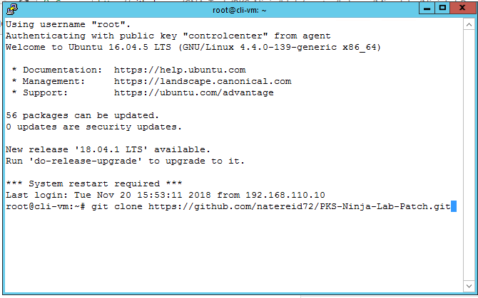
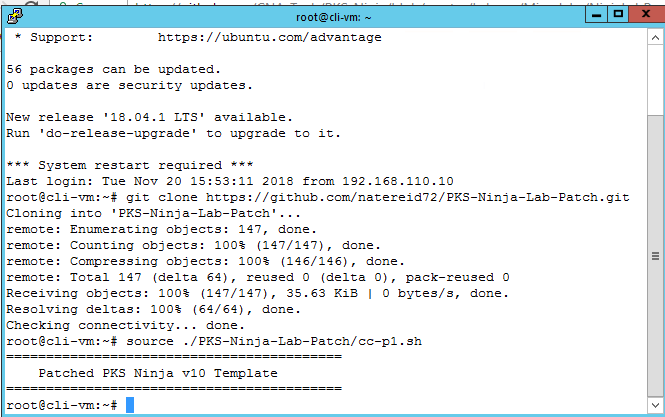

# Ninja Lab Prep Script

When Using the PKS Ninja v10 template, you must run a script to make some minor updates to the lab environment before beginning any lab guides - this needs to be done once and only once when you load a new lab session, prior to beginning NSX-T installation

1.1 From the control center desktop, open a putty ssh connection to `cli-vm` and enter the following commands to execute the shell script:

```bash
git clone https://github.com/natereid72/PKS-Ninja-Lab-Patch.git
source ./PKS-Ninja-Lab-Patch/cc-p1.sh
```
<details><summary>Screenshot 1.1.1</summary></details>
<details><summary>Screenshot 1.1.2</summary></details>
<details><summary>Screenshot 1.1.3</summary></details><br>

You have completed this step and you can now proceed with your NSX-T/PKS Installation