# NSX-T 2.3 Installation

## Overview

The following installation guide follows the implementation of a functional NSX-T 2.3 Installation configured for PKS 1.2 in a vSphere nested lab environment. This implementation uses variables that function in the lab environment. Anyone is welcome to build a similar lab environment and follow along with the lab exercises, but please note you will need to replace any variables such as IP addresses and FQDNs and replace them with the appropriate values for your lab environment.

The steps provided in this lab guide are intended for a lab implementation and do not necessarily align with best practices for production implementiations. While the instructions provided in this lab guide did work for the author in their lab environment, VMware and/or any contributors to this Guide provide no assurance, warranty or support for any content provided in this guide.

## Installation Notes

Anyone who implements any software used in this lab must provide their own licensing and ensure that their use of all software is in accordance with the software's licensing. This guide provides no access to any software licenses.

For those needing access to VMware licensing for lab and educational purposes, we recommend contacting your VMware account team. Also, the [VMware User Group's VMUG Advantage Program](https://www.vmug.com/Join/VMUG-Advantage-Membership) provides a low-cost method of gaining access to VMware licenses for evaluation purposes.

This lab follows the standard documentation, which includes additional details and explanations: [NSX-T 2.3 Installation Guide](https://docs.vmware.com/en/VMware-NSX-T/2.2/com.vmware.nsxt.install.doc/GUID-3E0C4CEC-D593-4395-84C4-150CD6285963.html)

### Overview of Tasks Covered in Lab 1

- [Step 1:  Deploy NSXT Manager using OVF Install Wizard](#step-1--deploy-nsxt-manager-using-ovf-install-wizard)
- [Step 2: Add NSX Compute Manager](#step-2-add-nsx-compute-manager)
- [Step 3: Deploy NSX Controller](#step-3-deploy-nsx-controller)
- [Step 4: Create IP Pool](#step-4-create-ip-pool)
- [Step 5: Prepare and Configure ESXi Hosts](#step-5-prepare-and-configure-esxi-hosts)
- [Step 6: Deploy NSX Edge](#step-6-deploy-nsx-edge)
- [Step 7: Create Edge Transport Node](#step-7-create-edge-transport-node)
- [Step 8: Create Switches and Routers](#step-8-create-switches-and-routers)
- [Step 9: Create Network Address Translation Rules](#step-9-create-network-address-translation-rules)
- [Step 10: Create IP Blocks for PKS Components](#step-10-create-ip-blocks-for-pks-components)
- [Step 11: Create NSX API Access Certificate](#step-11-create-nsx-api-access-certificate)


NOTE: NSX Manager OVA cannot be installed via HTML5 client, so for installation labs please use the vSphere web client (Flash-based).

This section follows the standard documentation, which includes additional details and explanations: [NSX Manager Installation](https://docs.vmware.com/en/VMware-NSX-T/2.2/com.vmware.nsxt.install.doc/GUID-A65FE3DD-C4F1-47EC-B952-DEDF1A3DD0CF.html)

-----------------------

## Step 1:  Deploy NSXT Manager using OVF Install Wizard

1.1 In the vSphere web client (not the HTML5 Client), From the Hosts and Clusters view, right click on the RegionA01-MGMT01 Cluster and select `Deploy OVF Template'

<Details><Summary>Screenshot 1.1</Summary>
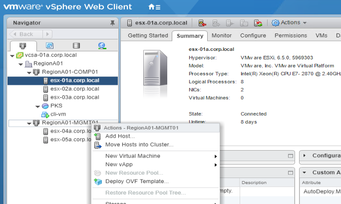
</Details>
<br/>

1.2 On the `Select Template` step, select `Local File` and Navigate to the NSXT Manager OVA file. In the reference lab, this is located on the E:/Downloads Directory

<details><summary>Screenshot 1.2</summary>

</details>
<br/>

1.3 On the `Select name and location` step, use the name `nsxt-manager` and select RegionA01 Datacenter as the location

<details><summary>Screenshot 1.3</summary>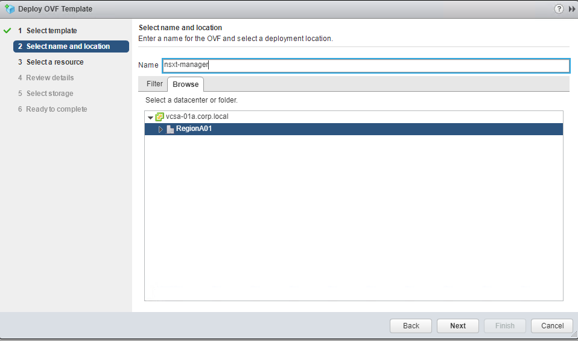</details><br>

1.4 On the `Select a Resource` step, select RegionA01-MGMT

<details><summary>Screenshot 1.4</summary>
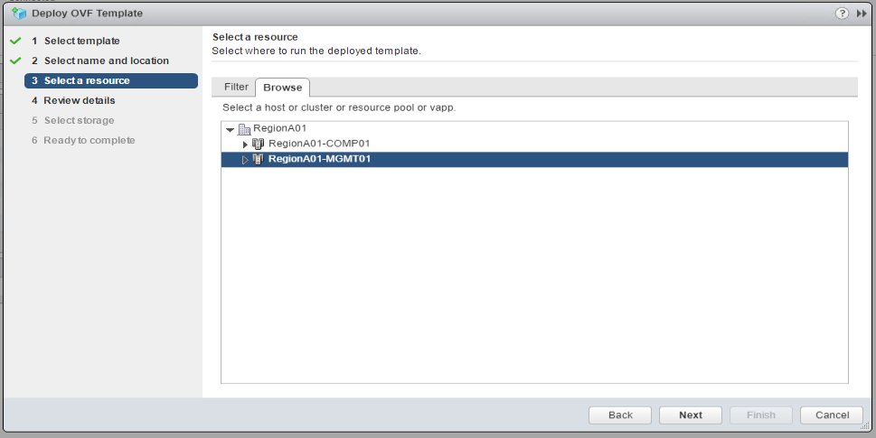
</details>
<br/>

1.5 On the `Review Details` step, verify details and click `Next`

<details><summary>Screenshot 1.5</summary>

</details>
<br/>

1.6 On the `Select Configuration` step, select a Small Configuration

<details><summary>Screenshot 1.6</summary>

</details>
<br/>

1.7 On the `Select Storage` step, set the virtual disk format to `Thin Provision` and select the `RegionA01-ISCSI01-COMP01` datastore

<details><summary>Screenshot 1.7</summary>

</details>
<br/>

1.8 On the `Select Networks` step, set the Destination Network to `VM-RegionA01-vDS-MGMT

<details><summary>Screenshot 1.8</summary>
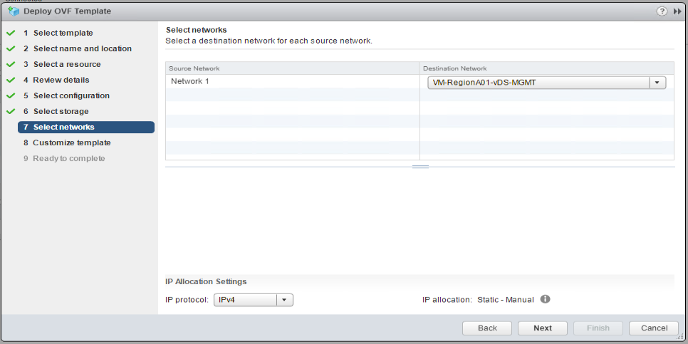
</details>
<br/>

1.9 On the `Customize Template` step, enter the following variables:

- Application
    - System Root User Password: VMware1!
    - CLI Admin User Password: VMware1!
    - CLI Audit User Password: VMware1!
- DNS
    - DNS Server List: 192.168.110.10
    - Domain Search List: corp.local
- Network Properties
    - Default Gateway: 192.168.110.1
    - Hostname: nsxmgr-01a.corp.local
    - Management Network IPv4 Address: 192.168.110.42
    - Management Network Netmask: 255.255.255.0
    - Rolename: nsx-manager
- Services Configuration
    - Allow Root SSH Logins: True
    - Enable SSH: True
    - NTP Server: 192.168.100.1
- All other options were left as default values

<details><summary>Screenshot 1.8</summary>
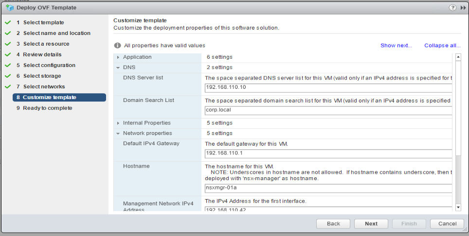
</details>
<br/>

1.9 Complete the Deploy OVF Template Wizard

<details><summary>Screenshot 1.9</summary>
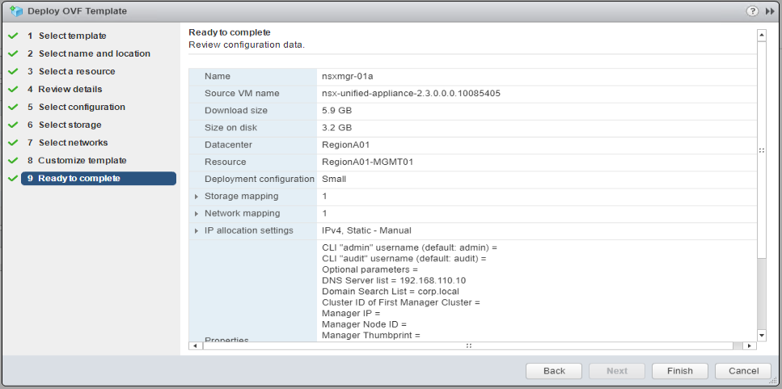
</details>
<br/>

1.10 In the vSphere web client go to the task console and verify that the Status for Deploy OVF Template is "Completed" before proceeding
<br/>

<details><summary>Screenshot 1.10</summary>
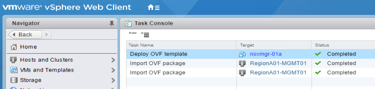
</details>
<br/>

1.11 In the vSphere web client go to Hosts and Clusters and on the `Actions` menu for `nsxmgr-01a`, select `Edit Settings`

<details><summary>Screenshot 1.11</summary>

</details>
<br/>

1.12 Expand the `Memory` section and set the `Reservation` to `0`

NOTE: This step is provided to help limit the requirements for resource constrained lab environments, if your lab environment has ample hardware resources, you may skip this step

<details><summary>Screenshot 1.12</summary>

</details>
<br/>

1.13 In the vSphere web client power on the nsxmgr-01a VM, wait a few minutes for NSX Manager to fully boot up before proceeding to the next step

NOTE: If the option to power on the nsxmgr-01a VM is not available, log out and then log back in to the vSphere web client

<details><summary>Screenshot 1.13</summary>

</details>
<br/>

1.14 Using the IP address you assigned to NSX Manager in the Deploy OVF Template Wizard, open a web browser connection to NSX Manager, for example:

`https://nsxmgr-01a.corp.local/login.jsp`

Login as:

- User: admin
- Password: VMware1!

_NOTE: On your first login, you will be prompted to accept the EULA. Accept EULA and opt out of VMware Customer Experience program._

<details><summary>Screenshot 1.14</summary>
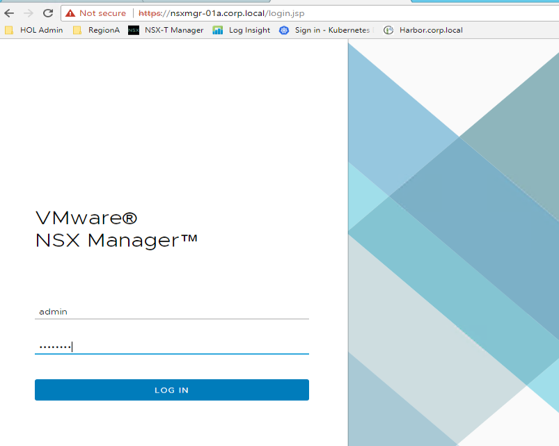
</details>
<br/>


## Step 2: Add NSX Compute Manager

In sthis step, you create a connection between the NSX manager and your vCenter. This enables NSX manager to deploy VIBs to the hosts, controller and edge VMs, etc.

 2.1 From NSX Manager, click on **Fabric** -> **Compute Manager**

<details><summary>Screenshot 2.1</summary></details><br>

 2.2 Click on **Add** and Configure the New Compute Manager form with following values:

- Name: `vCenter-compute-manager`
- Domain Name/IP Address: `vcsa-01a.corp.local`
- Type: `vCenter`
- Username: `administrator@vsphere.local`
- Password: `VMware1!`
- Clcik **Add**
- Click **Add** again to accept the vCenter certificate thumbprint

_NOTE: in a production implementation, you would first copy the vCetner thumbprint and then provide it in the form to properly authenticate the intial connection._

<details><summary>Screenshot 2.2.1</summary>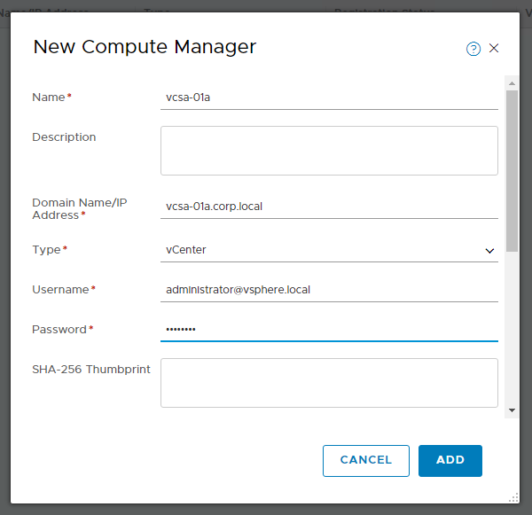</details>
<details><summary>Screenshot 2.2.2</summary></details><br>


 2.3 Click **Refresh** in the lower-left hand corner and verify the Compute Manager is `Registered` and `Up`

<details><summary>Screenshot 2.3.1</summary>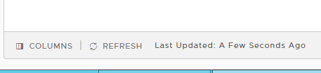</details>
<details><summary>Screenshot 2.3.2</summary>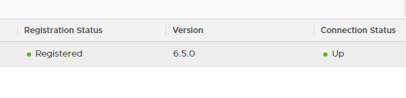</details><br>

## Step 3: Deploy NSX Controller

The NSX controller is the center of the NSX overlay control plane. I a production implementation, you would deploy at least three in a cluster for redundancy.

 3.1 Click on **System** -> **Components**, and then click **Add Controllers** 

<details><summary>Screenshot 3.1</summary></details><br>

 3.2 Enable `SSH` and `Root Access`, then complete Add Controller form with the following:

- Compute Manager: `vCenter-compute-manager`
- Shared Secret: `VMware1!`
- CLI Password: `VMware1!`
- ROOT Password: `VMware1!`
- DNS Servers: `192.168.110.10`
- NTP Servers: `192.168.100.1`
- Click **Next**

(Note: Notice there is no option for Small Controller size. Leave the default of 'Mediumm', you will change it to a 'Small' config in a later step.)

<details><summary>Screenshot 3.2.1</summary>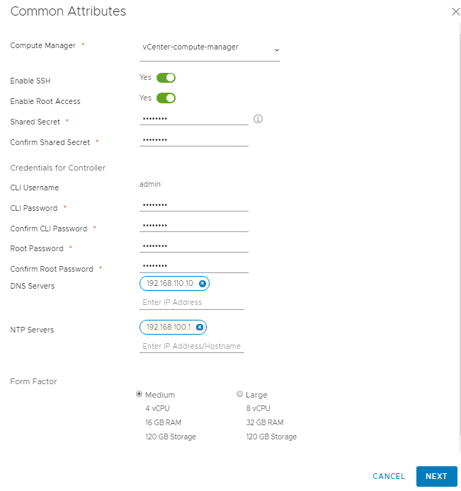</details><br>

- Host Name/FQDN: `nsxc-1`
- Cluster: `RegionA01-MGMT01`
- Datastore: `RegionA01-ISCSI01-COMP01`
- Network: `VM-RegionA01-vDS-MGMT`
- Management/IP Mask: `192.168.110.31/24`
- Management Gateway: `192.168.110.1`
- Click **Finish**

<details><summary>Screenshot 3.2.2</summary>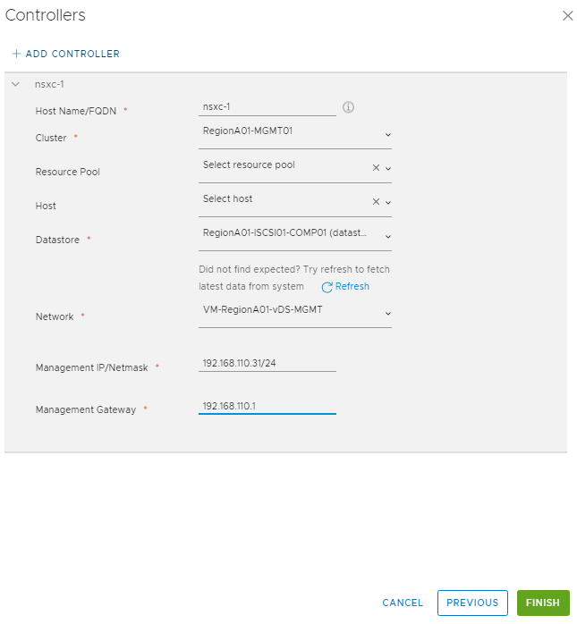</details><br>

 3.3 Verify Management Cluster is **Stable** and Controller Cluster Connectivity is **Up**

 This process will take some time as the VM is built, registered, and connected with the management plane.

<details><summary>Screenshot 3.3</summary></details><br>

_Optional:_

- On the cli-vm, create and open terminal emulator SSH sessions, as described in Screenshots 3.3.2 and 3.3.3, and execute the following commands to check control plane health 

    - <details><summary>Screenshot 3.3.1</summary></details>
    - <details><summary>Screenshot 3.3.2</summary>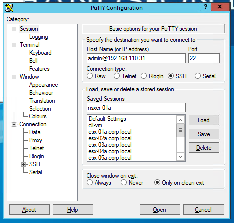</details>

- From the Manager command line, execute the following command
    - `get management-cluster status`
- From the Controller command line, execute the following commands
    - `get control-cluster status`
    - `get managers`
- Verify that all  status indicates Active/Stable/True/Connected

    - <details><summary>Screenshot 3.3.3</summary>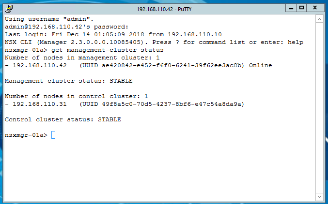</details>
    - <details><summary>Screenshot 3.3.4</summary>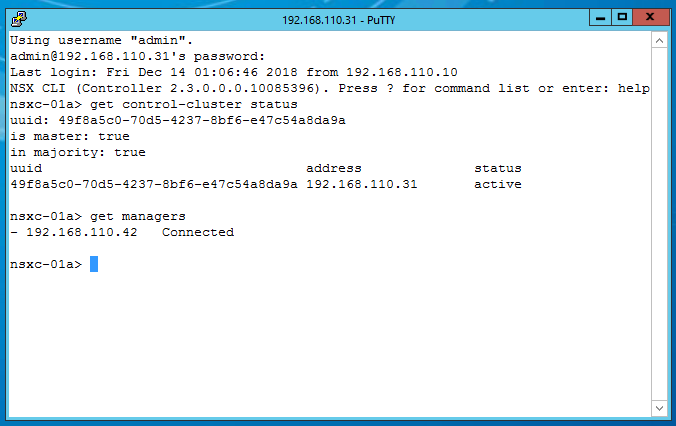</details><br>

 3.4 Resize Controller

_NOTE: Confirm that step 3.3 has completed before proceeding to step 3.4. This step is for lab resource efficiency only. We are resizing the Controller VM to be the equivelant of a Small factor. This is only applicable for a lab environment._

- Login to the vCenter web client with Windows authentication
- Shutdown the **nsxc-01a** VM
- Edit the settings for the **nsxc-01a** VM
- Set CPU: `2`
- Set Memory: `8 GB`
- Set Memory Reservation: `0`
- Click **Ok** and restart the VM

<details><summary>Screenshot 3.4</summary></details><br>

## Step 4: Create IP Pools

An IP Pool is an IP address range definition within the NSX-T IPAM construct. In this step, you will create an ip pool for tunnel endpoints and an ip pool for k8s cluster load balancers.

 4.1 Click **Inventory** -> **Groups**, and then click on **IP Pools**

<details><summary>Screenshot 4.1</summary></details><br>

 4.2 Create the TEP IP Pool, click **Add** and complete with the following values

- Name: `tep-ip-pool`
- Click `Add` under Subnets
- IP Range: `192.168.130.51-192.168.130.75`
- Gateway: `192.168.130.1`
- CIDR: `192.168.130.0/24`
- Click **Add**

<details><summary>Screenshot 4.2</summary></details><br>

 4.2 Create the k8s LB Pool, click **Add** and complete with the following values

- Name: `ip-pool-vips`
- Click `Add` under Subnets
- IP Range: `10.40.14.34-10.40.14.62`
- CIDR: `10.40.14.32/27`
- Click **Add**

<br>

## Step 5: Prepare and Configure ESXi Hosts

Prepapting hosts entails NSX Manager deploying and installing NSX VIBs (i.e.kernel modues) and configuring the NSX tunnel endpoints. You will use the NSX Manager web client to configure this step.

 5.1 Click on **Fabirc** -> **Nodes**, and then click on **Hosts**

<details><summary>Screenshot 5.1</summary></details><br>

 5.2 Select **vCenter-compute-manager** from the **Managed by** dropdown

<details><summary>Screenshot 5.2</summary>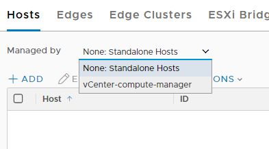</details><br>

 5.3 Configure Cluster RegionA01-MGMT01

- Select **RegionA01-MGMT01**
- Click **Configure Cluster**

<details><summary>Screenshot 5.3.1</summary></details><br>

- Enable `Automatically Install NSX` and `Automatically Create Transport Node`
- Click on **Or Create New Transport Zone**  under Transport Zone

<details><summary>Screenshot 5.3.2</summary></details><br>

- Name: `overlay-tz`
- N-VDS Name: `hostswitch-overlay`
- N-VDS Mode: `Standard`
- Traffic Type: `Overlay`
- Click **Add**

<details><summary>Screenshot 5.3.3</summary>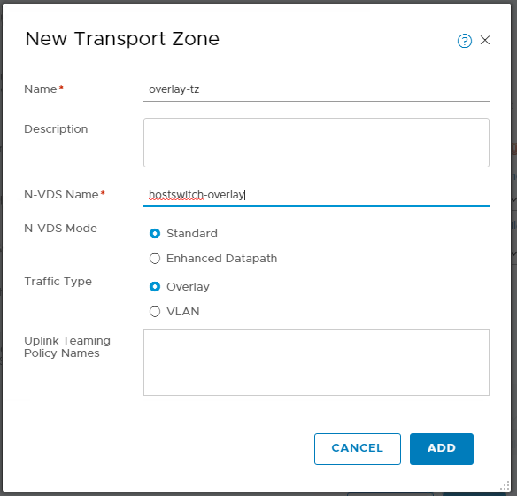</details><br>

- Uplink Profile: `nsx-default-uplink-hostswitch-profile`
- Ip Assignment: `Use IP Pool`
- IP Pool: `tep-ip-pool`
- Physical NICs: `vmnic1`
- Click **Add**

<details><summary>Screenshot 5.3.4</summary>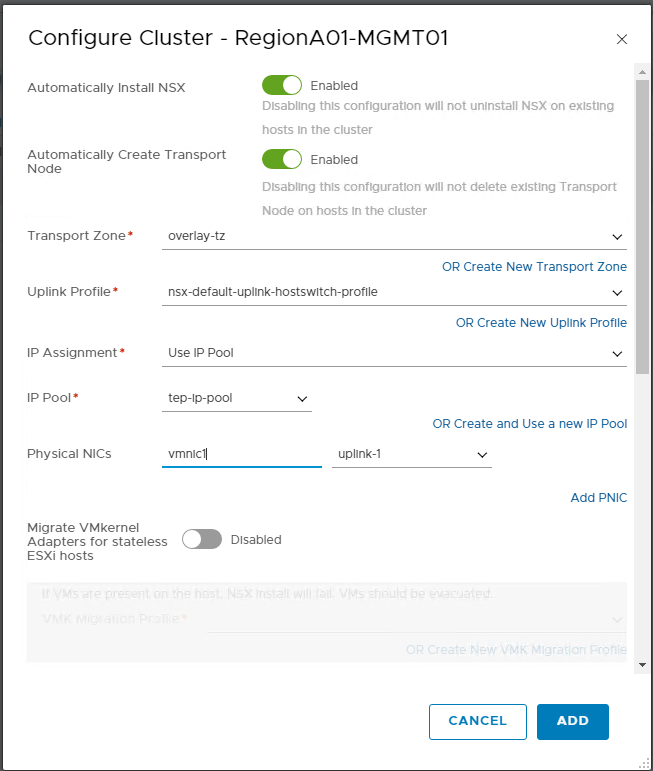</details><br>

 5.4 Configure RegionA01-COMP01

- Select **RegionA01-COMP01**
- Click **Configure Cluster**

<details><summary>Screenshot 5.4</summary></details><br>

- Enable `Automatically Install NSX` and `Automatically Create Transport Node`
- Transport Zone: `overlay-tz`
- Uplink Profile: `nsx-default-uplink-hostswitch-profile`
- Ip Assignment: `Use IP Pool`
- IP Pool: `tep-ip-pool`
- Physical NICs: `vmnic1`
- Click **Add**

## Step 6: Deploy NSX Edge

An NSX Edge enables services above, and beyond, layer 2  and 3 virtual networking for your NSX environment. It also serves an interface for a tier 0 router (more on tier 0 routers later) to connect to the physical netwrok.

  6.1 Add an NSX Edge

- Click on **Fabric** -> **Nodes**, and click on **Edges**
- Click on `Add EDge VM`
- Name: `nsxedge-1.corp.local`
- Host name/FQDN: `nsxedge-1.corp.local`
- Form Factor: **`Large`** _(PKS currently requires the NSX Edge to be Large size)_
- Make sure you selected 'Large' size
- Click on **Next**

<details><summary>Screenshot 6.1.1</summary>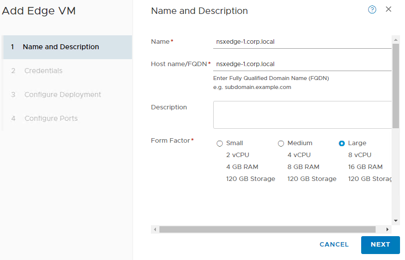</details><br>

- CLI Password: `VMware1!`
- System Root Password: `VMware1!`
- Click **Next**

<details><summary>Screenshot 6.1.2</summary></details><br>

- Compute Manager: `vCenter-compute-manager`
- Cluster: `RegionA01-MGMT01`
- Datastore: `RegionA01-ISCSI01-COMP01`
- Click **Next**

<details><summary>Screenshot 6.1.3</summary></details><br>

- Assignment: `Static`
- Management IP: `192.168.110.91/24`
- Default Gateway: `192.168.110.1`
- Management Interface: `VM-RegionA01-vDS-MGMT`
- Datapath Interfaces: 
    - `Uplink-RegionA01-vDS-MGMT`
    - `Transport-RegionA01-vDS-MGMT`
    - `Transport-RegionA01-vDS-MGMT`
- Clcik **Finish**

<details><summary>Screenshot 6.1.4</summary>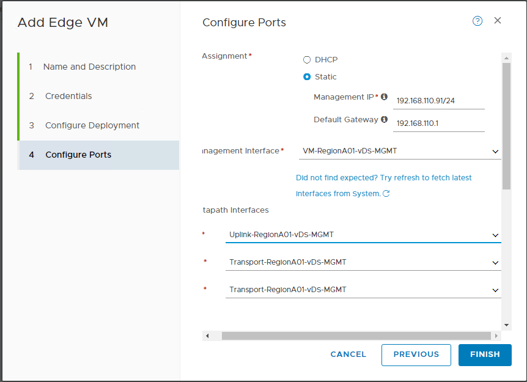</details><br>

 6.2 Monitor deployment status until **Deployment Status** shows **Node Ready** and **Manager Connectivity  Up**. 
 
 You may need to hit the **Refresh** link in the lower-left corner and it may take a while to complete. Controller connectivity will not show Up until we complete a future configuration.

<details><summary>Screenshot 6.3</summary>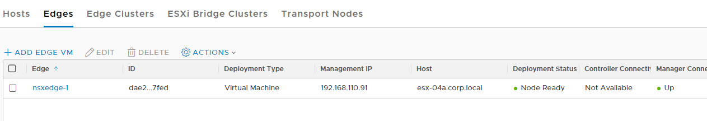</details><br>

 6.3 Verify that the edge vm has been created and powered on in vCenter web client and that it is showing as **Node Ready** and **Up** in NSX Manager UI

<details><summary>Screenshot 6.3.1</summary></details>
<details><summary>Screenshot 6.3.2</summary></details><br>

## Step 7: Create Edge Transport Node

An NSX Edge Transport Node is the configuration of an edge with an existing transport zone. This includes install and configure of the tunnel enddpoint and virtual switch for connection to your NSX network.

 7.1 Configure the **nsxedge-1** edge as a transport node

- Click on **Fabric** -> **Nodes**, and then click **Edges**
- Select `nsxedge-1.corp.local`
- Click the gear dropdown
- Select Configure as Tansport Node

_NOTE: If the 'Configure as Transport Node' menu item is not active, wait a few minutes and try again._

<details><summary>Screenshot 7.1</summary></details><br>

7.2 Complete the Transport Node as follows

_NOTE: This conifguration step is a common source of confusion when first learning to configure NSX-T. You are configuring the edge VM with an interface connecting to the physical network via a vSphere vswitch and an interface connected to the overlay host switch with a tunnel enpoint that is connected to a vSphere vswitch. The TEP terminates inside the edge VM. This configuration enables routing to/from overlay/physical._

- Click on **Create New Transport Zone** 

<details><summary>Screenshot 7.2.1</summary>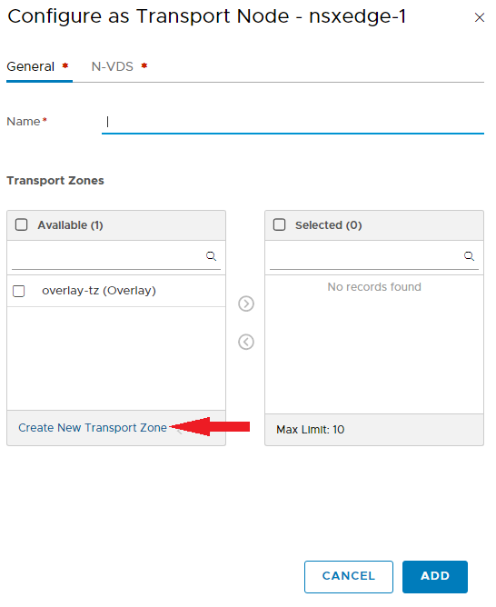</details><br>

- Name: `vlan-tz`
- N-VDS Name: `hostswitch-vlan`
- N-VDS Mode: `Standard`
- Traffic Type: `VLAN`
- CLick **Add**

<details><summary>Screenshot 7.2.2</summary></details><br>

- From the **General** tab
- Name: `edge-tn-1`
- Select `overlay-tz` in **Available**
- Click on the `>` to move vlan-tz to **Selected**
- Make sure that both transport zones are selected as shown in screenshot 7.2.3
- **Do NOT click on `Add`

<details><summary>Screenshot 7.2.3</summary></details><br>

- Click on **N-VDS** tab 
- Edge Switch Name: `hostswith-vlan`
- Uplink Profile: `nsx-default-edge-vm-uplink-hostswitch-profile`
- Virtual NICs: `fp-eth0`
- Click **Add N-VDS**

<details><summary>Screenshot 7.2.4</summary>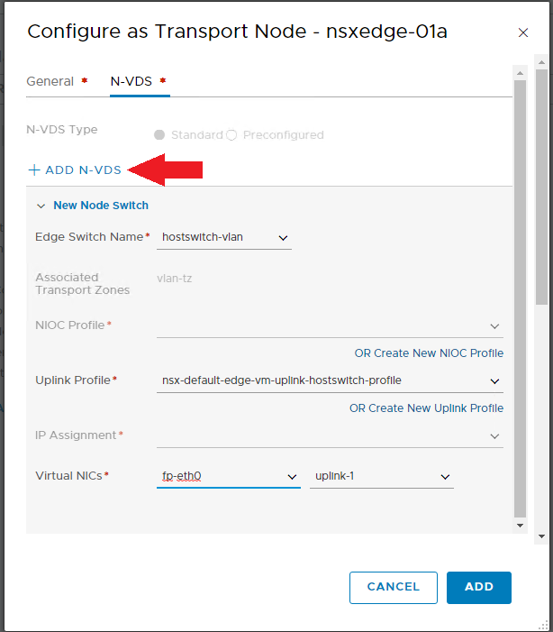</details><br>

- Edge Switch Name: `hostswitch-overlay`
- Uplink Profile: `nsx-default-edge-vm-uplink-hostswitch-profile`
- IP Assignment: `Use IP Pool`
- IP Pool: `tep-ip-pool`
- Virtual NICs: `fp-eth1`
- Click **Add**

<details><summary>Screenshot 7.2.5</summary></details><br>

 7.3 Add an Edge Cluster

- Click on **Fabric** -> **Nodes**, and then click on **Edge Clusters**
- Click on **Add**
- Name: `edge-cluster-1`
- Edge Cluster Profile: `nsx-default-edge-high-availability-profile`
- Member Type: `Edge Node`
- Select `edge-tn-1` from **Available** and click on ``>`` to move it to **Selected**
- Click **Add**

<details><summary>Screenshot 7.3</summary>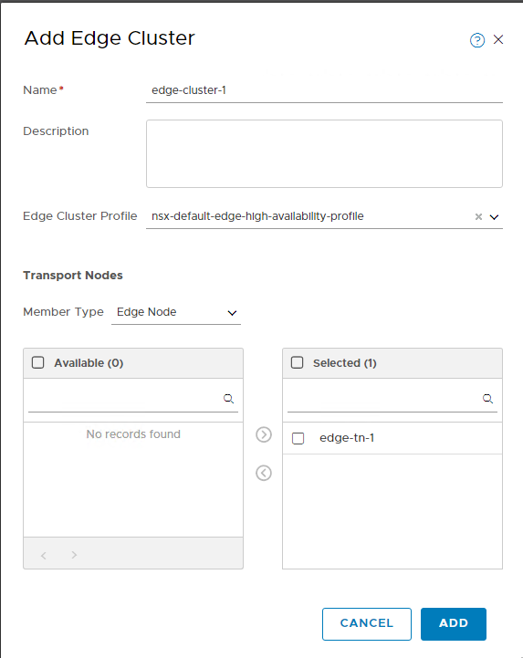</details><br>

 7.4 Click on **Transport Nodes** and verify edge-tn-1 status is **Success** and **Up**

<details><summary>Screenshot 7.6</summary>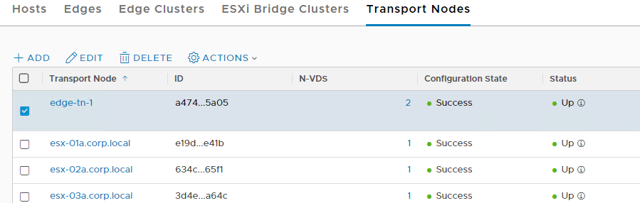</details><br>


## Step 8: Create Switches and Routers

NSX switches and routers enable virtual and physical network connectivity. NSX uses multiple tier 1 routers spoked into a tier 0 router. The teir 0 router connects to the physical network though the edge VLAN interface. For this, you will create a VLAN Uplink switch. You will then create tier 1 switches and routers to connect the virtual subnets to the tier 0.

 8.1 Create VLAN Uplink Switch

- Click on **Networking** -> **Switching**

<details><summary>Screenshot 8.1.1</summary></details><br>

- Click on **Add**
- Name: `uplink-vlan-ls`
- Transport Zone: `vlan-tz`
- VLAN: `0` _(Press [Enter] key after input to store it)_
- Click on **Add**

<details><summary>Screenshot 8.1.2</summary></details><br>

 8.2 Create PKS Management Switch

- Clcik on **Add**
- Name: `ls-pks-mgmt`
- Transport Zone: `overlay-tz`
- Click on **Add**

<details><summary>Screenshot 8.2</summary></details><br>

 8.3 Create PKS Compute Switch

- Clcik on **Add**
- Name: `ls-pks-service`
- Transport Zone: `overlay-tz`
- Click on **Add**

<details><summary>Screenshot 8.3</summary></details><br>

 8.4 Create T0 Router

- Click on **Networking** -> **Routers**, and then click on **Add** -> **T0 Router**

<details><summary>Screenshot 8.4.1</summary></details><br>

    Be sure to configure HA Mode as `Active-Standby'

- Name: `t0-pks`
- Edge Cluster: `edge-cluster-1`
- High Availabilty Mode: **`Active-Standby`**
- Failover Mode: `Non-Preemptive`
- Click **Add**

<details><summary>Screenshot 8.4.2</summary></details><br>

 8.5 Create PKS Managent T1 Router

- Click **Add** -> **Tier-1 Router**
- Name: `t1-pks-mgmt`
- Tier-0 Router: `t0-pks`
- Edge Cluster: `edge-cluster-1`
- Edge Cluster Members: `edge-tn-1`
- Click **Add**

<details><summary>Screenshot 8.5</summary></details><br>

 8.6 Create PKS Compute T1 Router

- Click **Add** -> **Tier-1 Router**
- Name: `t1-pks-service`
- Tier-0 Router: `t0-PKS`
- Edge Cluster: `edge-cluster-1`
- Edge Cluster Members: `edge-tn-1`
- Click **Add**

<details><summary>Screenshot 8.6</summary>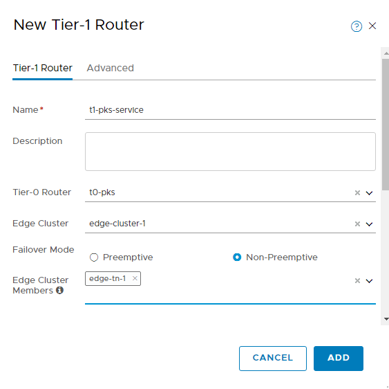</details><br>

 8.7 Configure T0 Router VLAN Uplink Port

- Click on **t0-PKS**, and then select **Configuration** -> **Router Ports**

<details><summary>Screenshot 8.7.1</summary>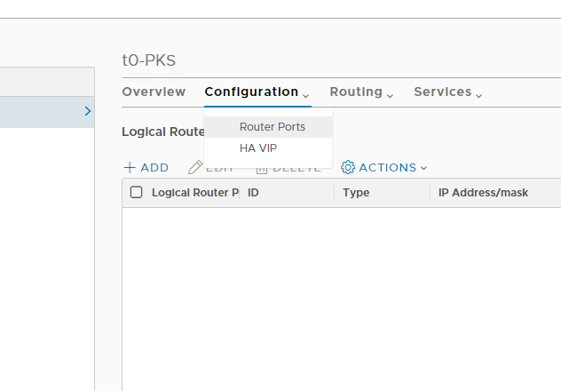</details><br>

- Click **Add**

<details><summary>Screenshot 8.7.2</summary></details><br>

- Name: `t0-uplink-1`
- Type: `Uplink`
- Transport Node: `edge-tn-1`
- Logical Switch: `uplink-vlan-ls`
- IP Address/mask: `192.168.200.3/24`  _(NOTE: We will ping this later to check connectivity)_
- Click **Add**

 <details><summary>Screenshot 8.7.3</summary></details><br>

 8.8 Add T0 Static Route

- Clcik on **Routing** -> **Static Routes**

<details><summary>Screenshot 8.8.1</summary>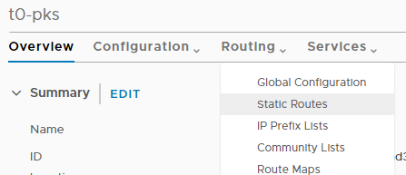</details><br>

- Click on **Add**
- Network: `0.0.0.0/0`
- Click on **Next Hops +Add**
- Next Hop: `192.168.200.1` _(Make sure the input stays by pressing [Enter] after enry)_
- Click **Add** 

 <details><summary>Screenshot 8.8.2</summary></details><br>

- From the `cli-vm`, ping the T0 uplink port address `192.168.200.3` to test connectivity

 8.9 Configure PKS Service T1 Ports

- Click **Networking** -> **Routers**
- Click on **t1-pks-service** (_Verify that the router name is now listed over 'Overview'_)

<details><summary>Screenshot 8.9.1</summary></details><br>

- Click on **Configuration** -> **Router Ports**
- Click on **Add**
- Name: `ls-pks-serviceRouterPort`
- Type: `Downlink`
- Logical Switch: `ls-pks-service`
- IP Address/mask: `172.31.2.1/24`
- Click **Add**

<details><summary>Screenshot 8.9.2</summary>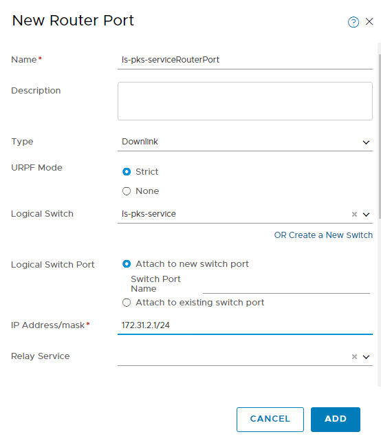</details><br>

 8.10 Configure PKS Management T1 Ports and Route Advertisement

- Click on **t1-pks-mgmt** (_Verify that the router name is now listed over 'Overview'_)
- Click on **Configuration** -> **Router Ports**
- Click on **Add**
- Name: `ls-pks-mgmtRouterPort`
- Type: `Downlink`
- Logical Switch: `ls-pks-mgmt`
- IP Address/mask: `172.31.0.1/24`
- Click **Add**

 8.11 Enable T1 Route Advertisement

- Select `t1-pks-mgmt`
- Click on **Routing** -> **Route Advertisement**
- Click on `Edit`
- Enable 
    - Status
    - Advertise All NSX Cnnected Routes
    - Advertise All NAT Routes
    - Click `Save`
    <br>==

<details><summary>Screenshot 8.11</summary>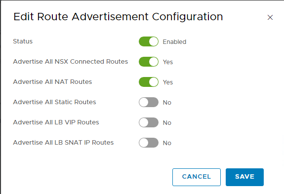</details><br>

- Repeat step 8.11 for router `t1-pks-service`

<br>

## Step 9: Create Network Address Translation Rules

In this step, you create NAT rules to map addresses to/from the PKS and k8s networks and the physica network.

9.1 Define NAT Rules

- Click on **Networking** -> **Routers**
- Select the `t0-pks` Router
- Click on **Services** -> **NAT**
- Click on **Add**
- Action: `SNAT`
- Source IP: `172.31.0.0/24`
- Translated IP: `10.40.14.12`
- Click **Add**

_(NOTE: Leaving an entry blank is the method to set it as **Any**)_

<details><summary>Screenshot 9.1</summary></details><br>

9.2 Repeat 9.1 steps to complete the remaining rules in Screenshot 9.2

<details><summary>Screenshot 9.2</summary>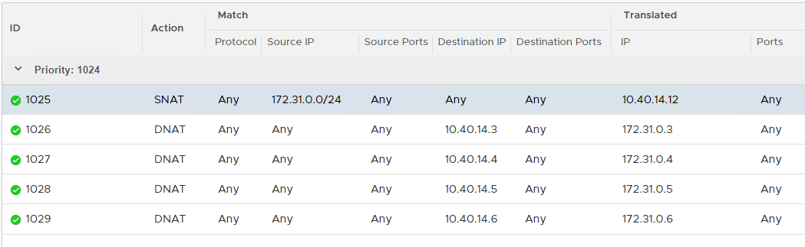</details><br>


## Step 10: Create IP Blocks for PKS Components

IP Blocks are another construct to define IP address ranges. In this case, we will define a range to be applied to PKS node VMs and another to be applied to k8s pods.

 10.1 Create Nodes IP Block

- Click on **Networking** -> **IPAM**
- Click **Add**
- Name: `ip-block-nodes-deployments`
- CIDR: `172.15.0.0/16`

<details><summary>Screenshot 10.1</summary>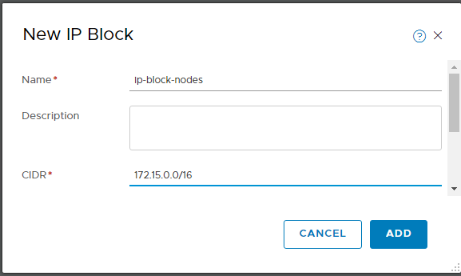</details><br>

 10.2 Create Pods IP Block

- Click **Add**
- Name: `ip-block-pods-deployments`
- CIDR: `172.16.0.0/16`
- Click **Add**

<details><summary>Screenshot 10.2</summary>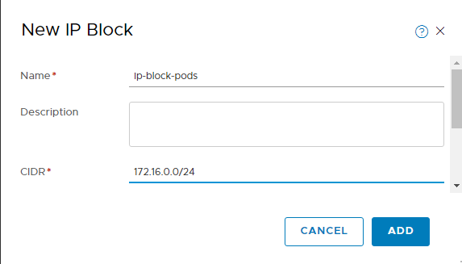</details><br>

## Step 11: Create NSX API Access Certificate

In this final step, you will generate a self-signed certificate for API access to NSX-T. This is required to enable BOSH Director to authenticate to NSX-T Manager. In a production implementation, you would likely opt for a CA signed certificate. Refer to the NSX-T documentation for more detail. To make this step easier, we will set some variables and reuse common command directions from the PKS documentation. 

11.1 From the cli-vm, create a directory to work from

- `mkdir ~/nsx-t-api-cert`
- `cd ~/nsx-t-api-cert`

11.2 Create the nsx-cert.cnf file in your nsx-t-api-cert directory, copy the below contents into it, save and exit.

- `nano nsx-cert.cnf`
- Paste below contents into file, save, exit

```
default_bits = 2048
distinguished_name = req_distinguished_name
req_extensions = req_ext
prompt = no
[ req_distinguished_name ]
countryName = US
stateOrProvinceName = California
localityName = CA
organizationName = NSX
commonName = 192.168.110.42
[ req_ext ]
subjectAltName = @alt_names
[alt_names]
DNS.1 = 192.168.110.42
```

<br>

11.3 Export following variables at your cli-vm commmand line

- `export NSX_MANAGER_IP_ADDRESS=192.168.110.42`
- `export NSX_MANAGER_COMMONNAME=192.168.110.42`

<details><summary>Screenshot 11.3</summary>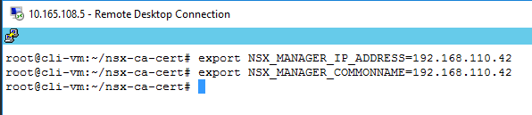</details><br>

11.4  Paste the following command to your cli-vm command line and execute it

```
openssl req -newkey rsa:2048 -x509 -nodes \
 -keyout nsx.key -new -out nsx.crt -subj /CN=$NSX_MANAGER_COMMONNAME \
 -reqexts SAN -extensions SAN -config <(cat ./nsx-cert.cnf \
 <(printf "[SAN]\nsubjectAltName=DNS:$NSX_MANAGER_COMMONNAME,IP:$NSX_MANAGER_IP_ADDRESS")) -sha256 -days 365
```

<br>

11.5 Display contents of .crt and .key files

- `cat nsx.crt`
- `cat nsx.key`
- Copy the contents of `nsx.crt` to your clipboard, beginning with `'-----BEGIN CERTIFICATE'` to the end of `'END CERTIFICATE-----'`


<details><summary>Screenshot 11.5</summary>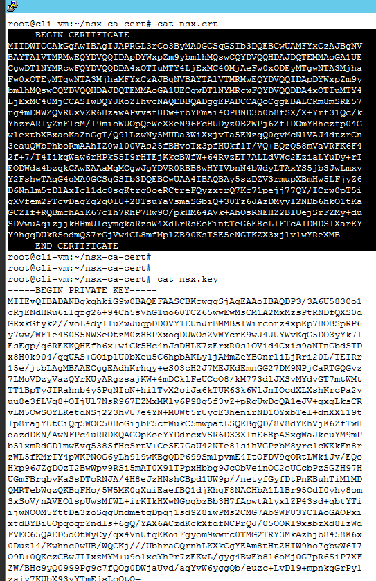</details><br>

11.6 In NSX Manager, click on **System** -> **Trust**

<details><summary>Screenshot 11.6</summary>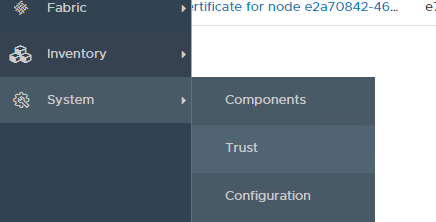</details><br>

11.7 Click on **Certificates** -> **Import** -> **Import Certificate**

<details><summary>Screenshot 11.7</summary></details><br>

11.8 Configure the Import Certificate form as follows

- Name: `NSX-T API CERT`
- Paste the .crt file contents you copies into the `Certificate Contents` field
- Copy and paste the .key file output to the `Private Key` field
- Password: `VMware1!`
- Click **Import**

<details><summary>Screenshot 11.8</summary></details><br>

11.9 Click on the newly imported certificate ID and copy the value to the clipboard

<details><summary>Screenshot 11.9</summary></details><br>

11.10 From your cli-vm command line, export the certificate ID as a variable (Replace with your certificate ID)

- `export CERTIFICATE_ID=<Your Certificate ID>`

<details><summary>Screenshot 11.10</summary></details><br>

11.11 Execute the following command to install the certifcate for API access

```
curl --insecure -u admin:'VMware1!' \
 -X POST \
 "https://$NSX_MANAGER_IP_ADDRESS/api/v1/node/services/http?action=apply_certificate&certificate_id=$CERTIFICATE_ID"
```

<br>

------------------


### You have now completed the NSX-T Installation for PKS lab. Click on the dashboard to check that it matches the image below. It may have some yellow based on your lab CPU activity, but the numbers should match.

>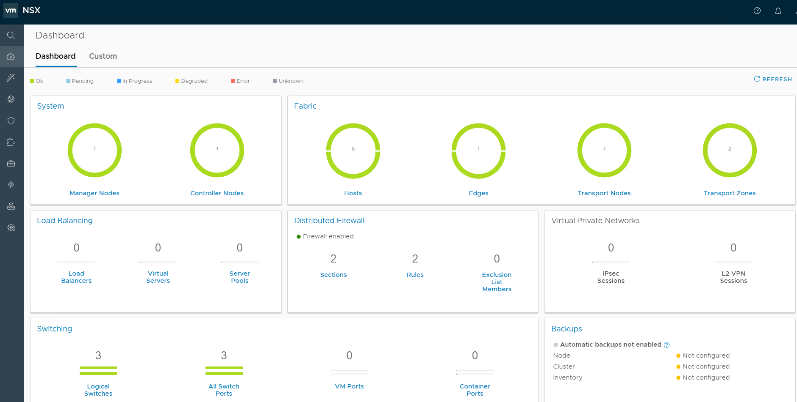
