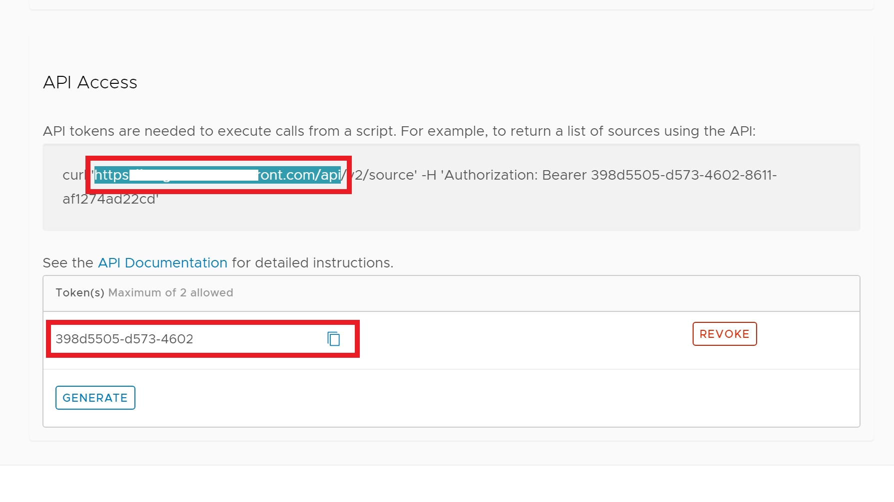
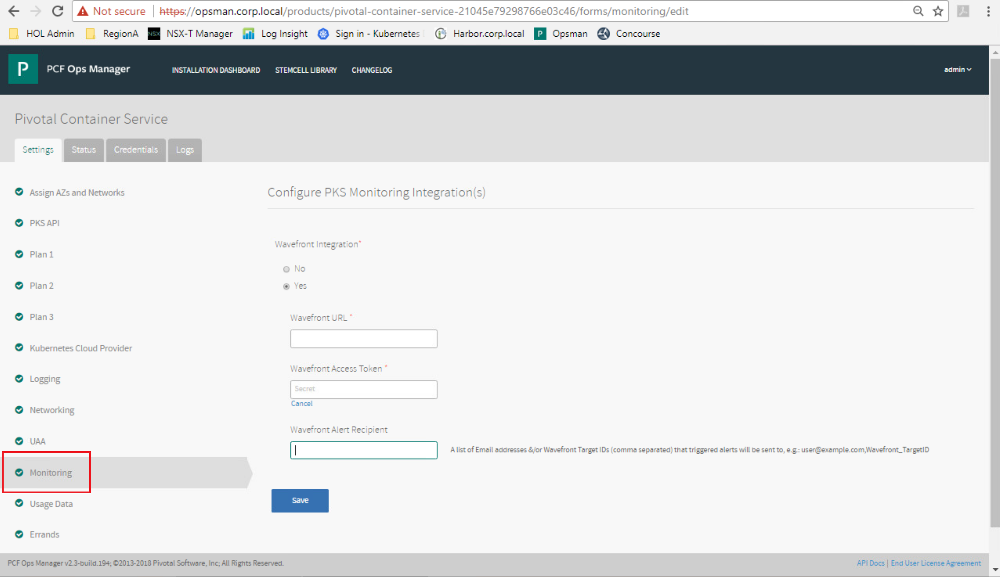
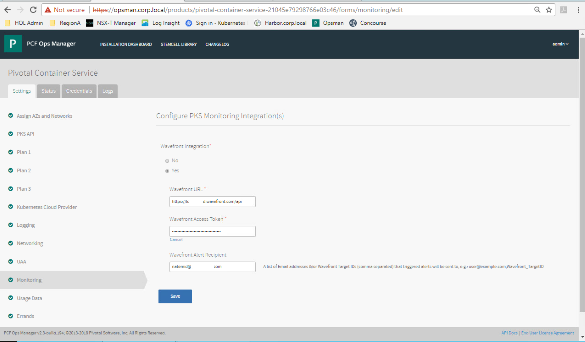
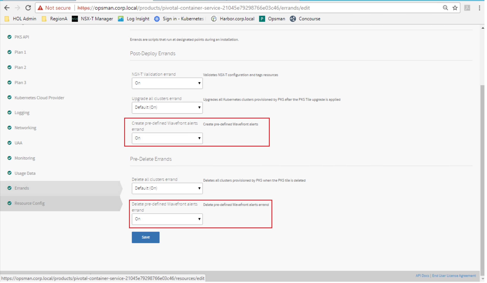

# Lab - PKS / Wavefront Integration
## -- Under Construction -- _Please use proper PR process to contribute to this lab guide. It is recommended that you work on a single section per PR. For file paths, screenshots, URLs, etc., attempt to maintain 'look and feel' of other sections_

**Contents:**

- [Lab Access Instructions](#lab-access-instructions)
- [Step 1: Review Current Cluster Pods](#step-1-review-current-cluster-pods)
- [Step 2: Log into Wavefront and Collect API Info](#step-2-log-into-wavefront-and-collect-api-info)
- [Step 3: Configure PKS Tile for Wavefront Monitoring](#step-3-configure-pks-tile-for-wavefront-monitoring)
- [Step 4: Confirm Wavefront Proxy Deployment](#step-4-confirm-wavefront-proxy-deployment)
- [Step 5: Create a Wavefront Dashboard](#step-5-create-a-wavefront-dashboard)
- [Next Steps](#next-steps)

 

## Lab Access Instructions

For this lab, you will need access to ControlCenter desktop with cli-vm, ops manager via web browser, and an active Wavefront subscription with API access. For this lab, you will need to have already  installed PKS with an operational kubernetes cluster deployed; if not, follow the install PKS and Deploy First Cluster lab guides before continuing.

*If you haven't already, register for a 30 day trial Wavefront subscription at https://www.wavefront.com/sign-up/. (If you are a VMware employee, you will need to provide a personal email address.) The process shold take less than 30 seconds* 

 

## Step 1: Review Current Cluster Pods

1.1 From the ControlCenter desktop, open putty, connect to `cli-vm`, and issue the following command: 

`kubectl get pods -n kube-system

Review the currently running pods in namespace kube-system. We will run this command again after configuring the PKS tile for Wavefront monitoring to observe the addition of the Wavefront proxy pod.

Screenshot 1.1

 

1.2 

1.3 

## Step 2: Log into Wavefront and Collect API Info

2.1 From the ControlCenter desktop, use Chrome to login to your wavefront subscription using your trial account. 

2.2 Click on the gear icon in the upper right corner of the web page and then on your user name to display you profile settings.

Screenshot 2.2

  

2.3 Scroll down to display the `API Access` information for your subscription. Make note of the API URL and access token. Leave this window open for use in the next step.

Screenshot 2.3

 

## Step 3: Configure PKS Tile for Wavefront Monitoring

3.1 From the ControlCenter desktop, use Chrome to connect to https://opsman.corp.local and login with following:

- Username: Admin
- Password: VMware1!

3.2 From the `Installation Dashboard`, click on the `PKS` tile and then the `Monitoring` section of the settings page.

Screenshot 3.2

 

3.3 Configure the Wavefront monitoring integration:

- Select `Yes` for Wavefront Integration.

- Copy the Wavefront API URL from the previous step and paste it into the `Wavefront URL` setting. You will need the URL up to /api (e.g. https://your-tenant-name.wavefront.com/api).

- Copy API Access Token from the previous step and paste it into the `Wavefront Access Token` setting.

- Supply an email address in the `Wavefront Alert Recipient` setting.

- Click `Save` and then on `Installation Dashboard` on the upper menu bar.

Screenshot 3.3

 

3.4 Configure Wavefront Errands

- From the PKS tile, select the `Errands` section of the settings page.

- Set `Create pre-defined Wavefront alerts` to `On`

- Set `Delete predefined Wavefront alerts` to `on`

_Note: These errands simply direct PKS to add Wavefront components on creation of a Kubernetes cluster, and then remove it on deletion of a cluster._

Screenshot 3.4

 

3.5 Click on `Review Pending Changes` and then `Apply Changes`

 _Note: During the "Installing Pivotal Container Service" stage, you should see the Wavefront conifugrations displayed in the verbose output._
    
3.6 Upon completion you should receive the message "Your changes were successfully applied". Click `Return to Dashboard`

## Step 4: Confirm Wavefront Proxy Deployment

## Step 5: Create a Wavefront Dashboard

## Next Steps

### [Please click here to proceed to ..
